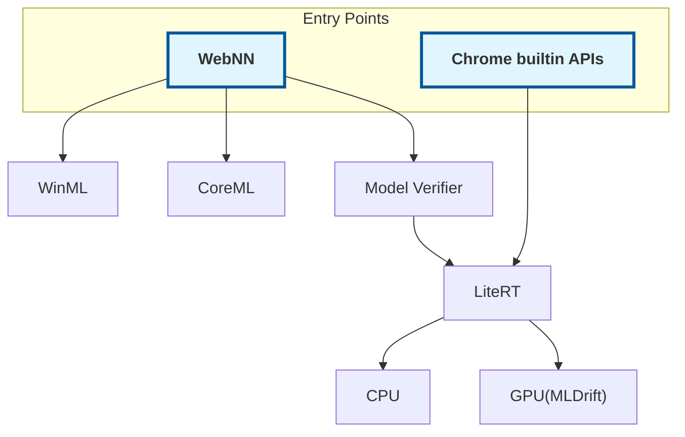
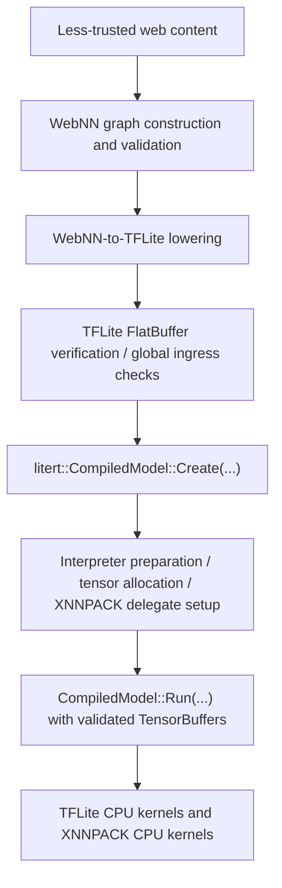

Summary: LiteRT uses the same security model as Tensorflow except for the code
paths that are reachable from WebNN from web browsers. This document defines the
threat model for the usage scenarios that are unique to LiteRT(and Tensorflow
Lite) with special considerations for WebNN.

# TFLite CPU runtime threat model and fuzzing policy

In the past, TFLite was part of the Tensorflow project and they shared the same
[security model](https://github.com/tensorflow/tensorflow/security/policy). It
assumes that TensorFlow(and TFLite) models are programs. Therefore if you need
to run untrusted models, you should execute them inside a sandbox. This document
provides more details on this with special considerations for web use cases, and
enhancements to the security model that can further improve security and
stability in addition to the sandbox protections that web browsers already have.

[WebNN](https://www.w3.org/TR/webnn/) is a proposed web standard designed to
accelerate deep neural networks and machine learning inference using a device's
native hardware directly inside the browser. A WebNN model could be constructed
from javascript based on untrusted input. Then the web browser needs to convert
the WebNN model into another format(TFLite, ONNX, etc). Though the browser can
do some sanitization on the conversion input/output, the converted model still
could retain malicious components that could cause a browser process to crash or
make the user machine unresponsive.

This document is to address this issue by establishing a formal threat model for
LiteRT(and TFLite) for such use cases that may load models from untrusted
sources. The major goal is to clarify security responsibilities between the
layers(the model generator, the runtime framework and the op kernels), and set a
standard for distinguishing whether a reported issue is a security bug or not.
Though WebNN is the main security hardening target that this design doc wants to
address, the design choice is not meant to be WebNN specific.

The structure follows the general threat-modeling workflow described in
[GitHub: What is threat modeling?](https://github.com/resources/articles/what-is-threat-modeling):
model the system, analyze threats, prioritize mitigations, and check whether the
mitigations worked.

## What are we working on?

### Scope

This threat model applies to TFLite CPU runtime code that WebNN can reach
through LiteRT's
[CompiledModel API](https://developers.google.com/edge/litert/next/cpp). WebNN
builds a TFLite FlatBuffer for the requested graph, runs TFLite’s model
verifier, then passes that buffer to `litert::CompiledModel::Create(...)`. Once
a model has passed the verifier, it should not cause any crash or undefined
behavior later. TFLite converter, developer tools(such as benchmark tool,
numeric debugger, etc), samples and demos are not in scope of this security
document.

The WebNN graph builder is the source of the reachable operator, data type,
layout, and CPU execution surface. The TFLite/LiteRT security-relevant runtime
entry point is the `CompiledModel` creation and execution path.

For this WebNN path, relevant code includes:

*   `litert::CompiledModel::Create(litert::Environment&, BufferRef<uint8_t>,
    Options&)` in `litert/cc/litert_compiled_model.h`;
*   the runtime model loading and compilation called from that API, including
    `CreateModelFromBuffer` and `CreateCompiledModel`;
*   TFLite FlatBuffer and model verification through `tflite::Verify(...)`,
    implemented by `tflite/core/tools/verifier.cc`;
*   TFLite interpreter, subgraph, tensor allocation, and tensor resizing code
    that is reachable while preparing or invoking WebNN-supported operators;
*   WebNN-reachable TFLite operator kernels in `tflite/kernels/`;
*   shared kernel helpers used by those ops in `tflite/kernels/internal/`;
*   CPU/GPU execution implementations for WebNN-supported built-in operators,
    including reference kernels, optimized kernels, and the
    [XNNPACK/YNNPack](https://github.com/google/xnnpack) CPU delegate and
    MLDrift delegate. The other TFLite delegates(coreml, flex, the Jet GPU,
    hexagon,etc) are explicitly excluded.

Each TFLite op kernel has a `Prepare()` and `Eval()` function as the main entry
points. Security risks normally occur from these functions, when the op kernel
is doing shape inference, tensor allocation size calculation, index and stride
arithmetic, quantization parameter handling, or threadpool sharding. The default
CPU backend may have three different implementations for one TFLite operator:

1.  Reference kernels, which is easy to understand but not efficient
2.  Optimized kernels
3.  XNNPACK delegate kernels, which is very device specific and may heavily use
    assembly code.

LiteRT does not treat path traversal vulnerabilities as security concerns. These
vulnerabilities should be addressed at a higher level with a sandbox mechanism
such as chroot, docker container or SELinux.

Any application that needs to load models from an untrusted source should use
the TFLite verifier, or implement the equivalent checks on their own.

### System model and data flow

The data flow is as below:

In this flow, WebNN validates and lowers a graph into a TFLite FlatBuffer,
including any required helper operators, layout conversions, activation fusions,
quantization fusions, and external weight sections. Security checks are
performed in various places at different layers. For example, the WebNN to
TFLite lowering checks if the tensor dimensions and ranks are too large. The
TFLite model verifier does global verifications that are backend independent
based on the TFLite IR. For example, the requested output shape for a Reshape
operator may contain at most one \-1 dimension(every other dimension must be
non-negative). Then, in each TFLite delegate the op kernels still need to have
their security checks that cannot be covered by the upper layers. For example,
if the requested shape for a Reshape operator is a dynamic tensor which cannot
be checked at model loading time, then the op kernel needs to handle this.

Additionally, with all the security checks in place, Chrome(and all Chromium
based browsers) still need to put the LiteRT engine in a sandbox. For example,
as part of the render process that acts on behalf of “the web” instead of “the
user”.

### Threat agents and entry points

The primary threat agent for this document is malicious or buggy web content
that can influence a WebNN graph and the tensors supplied to it. This includes
operator choices, operand shapes, ranks, axis and parameter tensors, constants,
external weights, quantization metadata, and runtime input contents when they
can affect shape, allocation, indexing, offsets, loop bounds, or control flow.

The main entry points are:

*   WebNN graph validation and lowering into a TFLite FlatBuffer;
*   TFLite FlatBuffer verification and model loading;
*   LiteRT `CompiledModel` creation and interpreter preparation;
*   tensor binding before `CompiledModel::Run(...)`;
*   CPU kernel execution through reference kernels, optimized kernels, and the
    XNNPACK CPU delegate.

This threat model does not assume arbitrary malicious native application code. A
native application that directly violates documented LiteRT or TFLite API
contracts is outside this WebNN-focused boundary.

The in scope TFLite operators are: \
`ABS, ADD, CAST, CEIL, COS, DEQUANTIZE, DIV, ELU, EQUAL, EXP, FLOOR, GELU,
GREATER, GREATER_EQUAL, HARD_SWISH, LEAKY_RELU, LESS, LESS_EQUAL, LOG,
LOGICAL_AND, LOGICAL_NOT, LOGICAL_OR, LOGISTIC, MAXIMUM, MINIMUM, MUL, NEG,
NOT_EQUAL, POW, PRELU, QUANTIZE, RELU, RELU6, RELU_0_TO_1, RELU_N1_TO_1, ROUND,
SELECT_V2, SIGN, SIN, SQRT, SQUARE, SUB, TANH, ARG_MAX, ARG_MIN,
AVERAGE_POOL_2D, BATCH_MATMUL, BROADCAST_TO, CONCATENATION, CONV_2D, CUMSUM,
DEPTHWISE_CONV_2D, FULLY_CONNECTED, GATHER, GATHER_ND, MAX_POOL_2D, MEAN,
MIRROR_PAD, PAD, PADV2, REDUCE_MAX, REDUCE_MIN, REDUCE_PROD, RESHAPE,
RESIZE_BILINEAR, RESIZE_NEAREST_NEIGHBOR, REVERSE_V2, SCATTER_ND, SLICE,
SOFTMAX, SPLIT_V, SQUEEZE, STRIDED_SLICE, SUM, TILE, TRANSPOSE, TRANSPOSE_CONV`

At this moment, we deliberately make the list short and concrete, because any
bug fix could introduce unexpected breaking changes to our existing customers.
Our aim is to avoid non-essential security patches that lack practical use
cases. For now we do not accept security patches for the other TFLite op
kernels. The list can be extended when a new use scenario arises.

### Model-generation and ingress invariants

Every TFLite model consumed by the runtime is produced by some tool or library.
In the default trusted-model deployment model, that generator is part of the
trusted computing base and is expected to produce a well-formed TFLite model.
When it is not the case, the model generator is responsible for ensuring that
every TFLite model passes an explicit ingress validation step immediately before
litert::CompiledModel::Create(...). After validation, the LiteRT runtime and its
delegates should keep the model metadata and external data immutable for the
lifetime in which the verifier's result is relied upon, or it should keep
validating the invariants. For example, XNNPack may do graph transformations
during model loading, it would be XNNPack’s responsibility to ensure that these
transformations are safe when the input graph is safe.

The required invariants include:

*   the FlatBuffer and model checks covered by `tflite::Verify(const void* buf,
    size_t len, ErrorReporter* error_reporter)`, implemented in
    `tflite/core/tools/verifier.cc`;
*   Application specific operator type inference and compatibility checks;
*   Application specific rank, layout, data type, quantization, constant-buffer,
    external-weight, and helper-operator constraints. For example, the rank of
    each tensor shape is \<=6.

The tflite::Verify() function should do overflow-safe validation of every model
field that identifies data stored outside the FlatBuffer. In particular, the
verifier must reject a Buffer.offset and Buffer.size range, or a
large\_custom\_options\_offset and large\_custom\_options\_size range, unless
the entire range is contained in the model allocation. Since these validations
are not needed for most TFLite use cases that only load trusted models, the
validations should be done in the TFLite model verifier instead of the core
CompiledModel API and Interpreter API.

We assume the output tensor types of each TFLite node in a model graph are
valid. Today tflite::Verify() does not do type inference check, which is
expected to be done during WebNN to TFLite lowering.

We assume that the ranks of all tensor shapes are known at model loading time.
Currently tflite::Verify() does not do tensor rank check. Since LiteRT’s GPU
backend only supports rank \<=5, it is recommended to carry out this validation
during the WebNN to TFLite lowering process.

Therefore, The security responsibility is divided by where an invariant can be
established:

*   The WebNN integration must invoke the required ingress validation and
    prevent the model allocation from being modified afterward.
*   tflite::Verify(...) must validate FlatBuffer integrity, schema version,
    basic graph consistency, tensor validity, and every static model-wide
    invariant that can be established from the serialized model and the complete
    allocation size. This includes all external-data ranges. It should also
    cover op-specific checks that are not backend specific. For example, in a
    grouped convolution, both the number of input channels and the number of
    output channels must be exactly divisible by the number of groups.
    tflite::Verify(...) should do this check if the tensor shapes are statically
    known.
*   Framework and kernel code must validate op-specific relationships, derived
    shapes and allocation sizes, dynamic shapes, runtime parameter values, and
    other invariants that cannot be established by the global verifier.

Code consuming a successfully verified, immutable model may rely on the static
model-wide invariants guaranteed by the verifier and does not need to duplicate
those checks at each point of use. An API that constructs an interpreter from an
unverified model is outside the untrusted-model security boundary unless it
performs equivalent ingress validation itself.

The WebNN-specific type-inference check is part of the intended design, but it
may not be fully implemented yet. For example, the intended ingress validation
should reject a TFLite CUMSUM node configured with input type \==
TENSORTYPE\_INT64 and output type \== TENSORTYPE\_INT8. The detailed type
constraint rules should be specified in TFLite’s MLIR document(in the
tfl\_ops.td file).

TFlite fuzzer should distinguish between bugs reachable after the intended
ingress checks succeed and bugs that would be blocked by those required ingress
checks.

### WebNN build and dispatch invariants

WebNN graph construction is a data-definition phase. It should not execute the
graph. The main runtime attack surface starts when the graph is compiled into a
TFLite model and when actual tensors are bound for execution.

During WebNN build and lowering, before a FlatBuffer is passed to
`litert::CompiledModel::Create(...)`, the WebNN-to-TFLite integration must
establish:

*   WebNN operator data type, rank, shape, broadcast, layout, and option
    constraints;
*   implementation limits for ranks, element counts, tensor byte lengths, and
    tensor counts. The current Chromium TFLite WebNN integration limits
    untrusted WebNN-originated tensors to rank 8 or lower, with many operators
    imposing stricter per-op rank limits;
*   per-operator zero-dimension constraints. Zero-size tensors are allowed when
    the corresponding TFLite operator contract supports them, but support can
    differ by operand. For example, `CONV_2D` may allow an empty input tensor
    while still requiring a non-empty filter tensor. Unsupported zero-size
    operands must be rejected before loading or execution. The official TFLite
    MLIR op definitions should document which operands may be empty or optional;
*   valid constant buffers, external weight sections, quantization metadata, and
    helper operators used by WebNN lowering;
*   immutability and lifetime guarantees for data treated as constant by LiteRT
    or XNNPACK. Constants must be copied, transferred, snapshotted, or otherwise
    made stable for the compiled graph lifetime;
*   TFLite structural invariants at least as strong as `tflite::Verify(...)`, or
    an explicit verifier call before loading.

During WebNN dispatch, before calling `CompiledModel::Run(...)`, the WebNN
integration must validate the actual tensor bindings against the graph
descriptors finalized at build time:

*   the graph belongs to the dispatch context and has not been destroyed;
*   every required input and output name is present, and no unexpected binding
    is supplied;
*   input and output tensors belong to the same WebNN context as the graph;
*   destroyed tensors are rejected;
*   the same tensor is not bound more than once across inputs and outputs;
*   constant tensors are not used as dispatch inputs or outputs;
*   each bound tensor's data type and shape exactly match the corresponding
    graph descriptor;
*   each bound buffer's byte length exactly matches the descriptor byte length;
*   LiteRT `TensorBuffer` objects are created only from the validated
    descriptors and validated storage.

The LiteRT CPU runtime and XNNPACK/YNNPACK/MLDrift execution paths remain
accountable for validating op-specific, derived, dynamic, and execution-time
invariants that cannot be established during ingress validation. Invariants
provided during WebNN build and dispatch do not allow kernel code to execute
unchecked arithmetic on these parameters. On the other hand, for immutable
models, the runtime can depend on the static, serialized invariants already
verified by the mandatory verifier.

### Out of scope

This document does not cover:

*   general TFLite model loading outside WebNN-reachable execution paths, where
    the default trusted-model assumption applies;
*   TFLite built-in operators, data types, layouts, or CPU execution paths that
    WebNN cannot trigger;
*   non-CPU delegate paths;
*   malicious host application code that violates documented interpreter API
    contracts;
*   custom ops and custom delegates;
*   model conversion and training-time tooling, except where runtime kernel
    behavior depends on converted metadata;
*   model authenticity, signing, distribution policy, or vulnerability
    disclosure policy.

For vulnerability reporting policy, see `SECURITY.md`.

### Security boundary

TFLite runs in the host application process. The runtime is not a sandbox. In
the general TFLite security model, the application is expected to load trusted
model files. For WebNN-reachable runtime paths, the stricter assumption is that
the graph or model description may be loaded or constructed by less-trusted web
content.

Therefore, the primary boundary for this document is between WebNN-controlled
model or graph data and the process memory of the component executing the TFLite
runtime.

The following inputs must be treated as adversarial when they can originate from
a WebNN graph, WebNN-lowered model, or WebNN-fed tensor:

*   FlatBuffer model metadata;
*   Tensor ranks and dimensions;
*   Axis tensors and other parameter tensors;
*   Quantization parameters;
*   Sparsity metadata;
*   Dynamic tensor shapes;
*   Input tensor contents when they affect indexing, shape, allocation, or
    control flow.

### Assets and security properties

Kernel security reviews should preserve application process memory integrity and
confidentiality, control-flow integrity, clean rejection of unsupported or
invalid models with `kTfLiteError`, deterministic behavior across supported
32-bit and 64-bit environments, and reasonable availability for valid inputs
within documented resource expectations.

### Platform assumptions

TFLite must support both 32-bit and 64-bit environments. 32-bit Android remains
important.

Therefore, kernel code must not assume that:

*   `size_t` is wider than 32 bits;
*   a pointer-sized type can hold every shape product present in a model;
*   `int` can hold an element count, byte count, or flattened index without an
    explicit checked conversion;
*   high tensor rank is invalid solely because it is inconvenient for one
    helper.

Though practically most models do not have high rank tensors that rank\>6, the
situation can change over time. Therefore, when writing kernels, rank limits
should be derived from an actual API, storage, XNNPACK, or kernel algorithm
constraint. Avoid adding broad defensive rank limits when checked arithmetic and
clean error handling can support existing models.

Since TFLite could be delivered to applications through system updates(including
Google Play framework update), maintaining backward compatibility is still a top
priority. Breaking backwards compatibility should be avoided if at all possible.
The only exception is if the old behaviour was clearly a bug, and even then,
only if we're confident that existing apps aren't depending on the buggy
behaviour. Therefore we should avoid adding new assumptions(such as tensor
rank\<=6) to the existing op kernel code. These checks should be done at a
higher level, such as in WebNN.

### Memory buffer alignment and arithmetic trap assumptions

Alignment is a mandatory API and memory-safety invariant, not merely a
performance recommendation since some supported targets may trap on unaligned
memory access. Every pointer accessed as an object of type T must satisfy
alignof(T). Constructing or dereferencing a pointer that does not meet the
type’s required alignment is undefined behavior in C and C++, including on
hardware that supports unaligned loads. Runtime and kernel code must not
construct or dereference misaligned typed pointers.

For the WebNN-reachable LiteRT CPU path, every bound input, output, constant,
and external-weight buffer must satisfy all applicable LiteRT buffer
requirements before dispatch. Host-memory LiteRtTensorBuffer objects must
satisfy LITERT_HOST_MEMORY_BUFFER_ALIGNMENT, currently 64 bytes. Contiguity and
natural type alignment do not establish this requirement. Delegate-specific
trailing-padding requirements, such as XNN_EXTRA_BYTES, are separate and must
also be satisfied.

Integrations must allocate through LiteRT managed-buffer APIs, copy into
conforming storage, or validate the address, size, alignment, padding, lifetime,
and mutability of imported storage before dispatch. Public APIs that wrap
external storage must reject nonconforming buffers before execution and should
report the violated requirement explicitly. Once a buffer has been accepted as
conforming, downstream runtime and kernel code may rely on that contract but
must still validate any derived pointer or offset.

Signed integer overflow is split into two cases:

*   Metadata and memory-access arithmetic must not overflow unless the value is
    already covered by a documented model-generation or verifier invariant. This
    includes element counts, byte sizes, allocation sizes, shapes, offsets,
    strides, flattened indexes, loop bounds, shard ranges, and pointer
    arithmetic. These values can affect memory safety and must use checked or
    widened arithmetic when they are computed from dynamic inputs, op
    parameters, shape tensors, or other values not already proven safe by
    ingress validation.
*   Tensor-value arithmetic is not normally memory-safety-critical. TFLite
    graphs do not use runtime tensor output values to allocate new buffers or
    resize tensors. Therefore, overflow while computing tensor values, such as
    integer `SUM` reduction accumulation, is not a security issue under this
    threat model when the result cannot affect indexing, allocation, or control
    flow.

If an operator intentionally permits wrapping tensor-value arithmetic, make that
behavior explicit where practical, or use a narrow sanitizer suppression(i.e.
TFLITE\_NO\_SANITIZE\_INTEGER\_OVERFLOW). A sanitizer finding in tensor-value
arithmetic should be triaged as correctness or sanitizer-noise unless the value
can influence memory access, allocation, loop bounds, or control flow.

For statically shaped graphs, the global verifier can check tensor ranks,
dimensions, element counts, and byte lengths once at model ingress. Per-op
kernels should not duplicate those exact checks when they consume
already-validated tensor metadata. Add a duplicate per-op check only when a
fuzzing test or unit test demonstrates that the global verifier does not cover
that path. Per-op or shared runtime checks are still required for dynamic
shapes, shape tensors, output shapes computed by an op, and any intermediate
arithmetic that transforms validated metadata into new allocation, indexing, or
loop-bound values.

Fuzzers that test this boundary may generate TFLite models directly and use
`tflite::Verify(...)` as the reference implementation for the model-level global
checks; they do not need to go through the converter or WebNN lowering path.

## What can go wrong?

### Background: how TFLite memory planning works

A TFLite model describes graph-visible tensors such as model inputs, constants,
intermediate results, and model outputs. Before executing a statically shaped
graph, AllocateTensors() calls each operator's Prepare function in execution
order. Prepare validates the operator, derives its output shapes, and resizes
its output tensors. Resizing a tensor turns its element type and dimensions into
a required byte count.

An operator may also create tensors that are not visible in the model. These are
temporary or scratch tensors used only to implement the operator. A scratch
tensor has no graph-level meaning and is not an additional model input or
output. It is a workspace in which a kernel can rearrange data, store partial
results, or hold a representation required by an optimized implementation.
TFLite kernels can represent this workspace as temporary TfLiteTensor objects
attached to a node, as the convolution kernels do, or request raw scratch
buffers through the runtime scratch-buffer API.

Once the available operators have been prepared, the arena memory planner
assigns storage to their tensors. Most writable inputs, outputs, intermediates,
and temporary tensors use the non-persistent arena. Data that must survive
across invocations uses a persistent arena, while fixed read-only constants
generally refer to their model storage. The planner records the first and last
operator that need each arena tensor. Two tensors whose lifetimes do not overlap
may use the same region of the arena. A temporary tensor needed by only one
operator can therefore reuse memory that another operator needed earlier or will
need later.

The planner separates planning from allocation. It first determines tensor
lifetimes and opportunities for reuse. It then reserves enough arena memory for
the current tensor byte sizes and resolves each tensor to an offset in the
arena. If an arena has to grow, its base address may change and the runtime must
resolve tensor pointers again. Kernels must not retain stale pointers across
such a reallocation.

Dynamic tensors make this process incremental. If an operator cannot know an
output shape during Prepare, TFLite prepares and allocates the known portion of
the graph. After an operator produces or resizes a dynamic tensor during Eval,
the runtime prepares the affected downstream operators and updates the
allocation plan. Consequently, a check performed only during the initial Prepare
is insufficient for a shape or parameter value that becomes known at invocation
time.

The memory planner is not an operator verifier. It trusts the dimensions and
byte counts recorded on tensors; it does not know whether a convolution's
channel relationships are valid or whether a mirror-padding offset can point
outside its input. Safe execution requires agreement among the shape derived by
Prepare or dynamic-shape handling, the byte count given to the memory planner,
and the strides, flattened indexes, and loop bounds used by Eval.

An overflow, unchecked narrowing conversion, or inconsistent calculation in any
one of these stages can make the planner reserve less memory than the kernel
accesses. Conversely, a correctly checked allocation size does not make
execution safe if a downstream helper later flattens the same shape into a
narrower integer type.

### High-priority security threats

Treat the following as security-relevant unless proven otherwise:

*   unchecked integer overflow in element counts, byte counts, allocation sizes,
    flattened indexes, strides, offsets, or loop bounds that are dynamic,
    derived inside the runtime, or not already covered by documented ingress
    validation;
*   shape normalization overflow, including intermediate products for tensors
    with zero total elements;
*   out-of-bounds reads or writes caused by inconsistent tensor metadata and
    data buffers;
*   null data pointer use when the logical access count is nonzero;
*   use-after-free or stale tensor pointer use after reallocation;
*   inconsistent validation between Prepare and Eval;
*   inconsistent validation between reference, optimized, and XNNPACK CPU paths;
*   thread sharding arithmetic that can produce invalid ranges or skip required
    bounds checks;
*   quantized multiplier, shift, zero-point, or accumulator math that can affect
    memory access, indexing, or allocation.

### Common kernel implementation pitfalls

The following categories are recurring ways in which otherwise reasonable kernel
code becomes memory-unsafe. They are not an inventory of individual bugs. The
operator-specific cases are examples intended to help authors recognize the same
pattern in new kernels and helpers. A case is security-relevant under this
threat model when WebNN-controlled data can reach it after the required ingress
checks.

#### Treat every derived shape as a new untrusted calculation

Validating the tensors stored in a model does not validate shapes that a kernel
derives from them. Output tensors, temporary tensors, packed weights,
accumulator buffers, and per-thread workspaces all introduce new sums and
products. Each derived shape needs the same checked arithmetic and range
analysis as a model-provided shape.

Convolution's im2col workspace is a useful example. A spatial convolution
applies a filter to one receptive field of the input at a time. The im2col
transformation, short for "image to columns," gathers every filter-sized input
patch into a temporary matrix. The convolution can then use a matrix
multiplication between those gathered patches and a reshaped filter matrix.
Reference kernels and some specialized optimized paths do not need this
transformation, but many general optimized paths do.

The temporary matrix has one patch for every batch and output location. Each
patch contains roughly filter\_height \* filter\_width \*
filter\_input\_channels values. Neighboring patches overlap, so input values may
be copied into the workspace many times. The resulting scratch tensor can be
much larger than the input or output. Conv3D adds another spatial dimension, and
transpose convolution may create a corresponding col2im workspace.

Other derived buffers follow the same pattern. A kernel may transpose weights
into the layout expected by a matrix-multiplication routine, quantize a
floating-point input into temporary storage, or allocate scaling factors,
offsets, row sums, and accumulators for hybrid execution. None of these complete
shapes necessarily appears in the FlatBuffer, so a global model verifier cannot
prove that they are representable.

For every such value, check the complete element-count expression, then check
the separate conversion from elements to bytes. Also check any shape stored in a
TfLiteIntArray and every narrower range required by a downstream consumer. Do
this before registering the temporary with the memory planner or using the
result as an allocation size.

#### Validate relationships, not only individual tensors

A tensor can be structurally valid while its relationship to another operand is
impossible. Kernel authors must identify the equalities, divisibility rules,
rank relationships, and type combinations on which their loops rely. A model
verifier that checks each tensor independently cannot establish these
operator-specific invariants.

For example, convolution requires compatible input, filter, bias, and output
channel counts. Grouped convolution requires channels to divide cleanly among
groups, and depthwise convolution requires an integral depth multiplier. A zero
channel count must be rejected before it reaches division or remainder.
Otherwise the kernel can derive a truncated group size or iterate over a
different number of channels than the allocation contains.

Shape tensors need the same semantic validation. A transpose-convolution
output-shape tensor may contain non-negative, representable dimensions and still
disagree with the batch, channels, or spatial size implied by the input, filter,
stride, and padding. Allocating the requested shape does not make it consistent
with the algorithm that later writes the output.

Perform these checks before deriving loop bounds, allocation sizes, or
quantization arrays from the relationship. When possible, place the invariant in
a shared validation helper so reference and optimized implementations cannot
interpret it differently.

#### Make integer domains and narrowing conversions explicit

TFLite dimensions are commonly stored as signed int, arena and tensor byte sizes
use size\_t, some flattened-shape helpers return signed 32-bit values, and an
optimized kernel may store a parameter in an even narrower type. A calculation
that is valid in one of these domains is not automatically valid in the next.

Promote operands before multiplication or addition, use checked arithmetic in
the promoted type, and check the destination range before narrowing. Casting an
already overflowed value to a wider type is too late. Likewise, computing a
correct size\_t allocation does not justify an unchecked conversion to int for a
loop bound or flat index.

Stride and dilation calculations illustrate this mistake. For one spatial
dimension, the effective filter size is conceptually (filter\_size \- 1\) \*
dilation \+ 1. Output-size and total-padding calculations perform more additions
and multiplications involving the stride. These intermediate results can
overflow even when the final dimension would appear small. An optimized path may
also require the stride or dilation to fit a signed 16-bit representation even
though the model stores it in a wider field.

Document the integer range required by each consumer and reject values that
cannot survive the full chain. Do not rely on the presence of a zero dimension
to make unchecked intermediate arithmetic harmless; validate each factor before
treating the final element count as zero.

#### Keep allocation and access calculations consistent

The calculation used to allocate a tensor and the calculation used to access it
form one safety invariant. It is unsafe for Prepare to calculate bytes one way
while Eval independently calculates flattened indexes, copy sizes, or loop
limits another way. A difference in integer width, factor order, or special-case
handling can make both calculations look locally reasonable while causing the
kernel to access beyond the planned allocation.

Padding illustrates the pattern without being unique. For each dimension, PAD
adds the input size and its before and after padding, then multiplies the output
dimensions into a total element count. Eval fills that output and copies the
input into an offset region. If the output dimension or element product wraps
during allocation but the fill or copy uses the intended value, the arena
contains less memory than the kernel writes.

Prefer a shared checked shape result that both allocation and execution consume.
Keep element counts and byte counts distinct, and check the conversion between
them. If execution must recompute a stride or flat size, it should use the same
checked helper and accepted integer range as allocation. The memory planner
cannot detect a disagreement because it sees only the final tensor byte count.

#### Validate values in the phase where they become available

Prepare can validate model metadata, operator options, constant parameter
tensors, and shapes derived from them. It cannot validate the contents of a
dynamic parameter tensor that will be supplied or produced only during
invocation. Checks must run after all of their inputs are known and before the
first allocation, resize, index calculation, or pointer access that uses them.

For example, constant PAD paddings are available during Prepare, but dynamic
paddings are runtime input data. Eval must validate the padding matrix, derive
the output shape with checked arithmetic, resize the dynamic output, and obtain
the current tensor pointers before filling or copying. Validation only in
Prepare leaves the dynamic path unprotected.

The same rule applies when an upstream operator resizes an intermediate tensor,
when a shape tensor controls an output, or when invocation-time data selects an
axis or range. Do not assume that a successful earlier AllocateTensors() proves
properties of values that did not exist at that time. After a resize, do not
continue using tensor pointers or cached shape information obtained before the
memory plan was updated.

#### Bounds-check offsets, strides, indexes, and work ranges

A valid total allocation size does not prove that every access falls inside it.
Kernels commonly derive row strides, flat indexes, initial offsets, subtensor
bounds, copy lengths, and thread-sharding ranges after the tensor has been
allocated. Every sum and product in those calculations needs checked arithmetic,
followed by a bounds check against the actual tensor extent.

MIRROR\_PAD illustrates a semantic bound that becomes an indexing bound. In
REFLECT mode the edge element is not repeated, so padding on either side must
not exceed input\_size \- 1. In SYMMETRIC mode the edge is repeated, so padding
may be at most input\_size. Exceeding those limits makes the coordinate
reflection produce an index outside the input even if the output tensor itself
was allocated correctly.

Cropping and strided-copy implementations add another form of this problem.
StableHLO padding can combine positive edge padding, negative edge padding that
crops the input, and interior padding between elements. The kernel derives input
and output strides and then computes the starting offsets of the regions to
copy. It must check the stride products, the offset calculations, and the entire
copy range. Checking only the output shape does not prove that the starting
pointer or final copied element is in bounds.

Thread partitioning must preserve the same guarantee. Converting an element
count into a number of tasks, computing each task's start and end, or
multiplying a shard index by a stride can overflow or create overlapping,
skipped, or out-of-range work. Validate the partition before worker threads
receive pointers and bounds.

#### Zero-element tensors and null data pointers

TFLite permits tensors with a zero dimension. Their total byte count is zero,
and a zero-sized arena allocation may resolve to a null data pointer. This is
valid as long as no element is read or written. Rejecting every null pointer
would therefore reject valid zero-element graphs, while dereferencing every
tensor pointer unconditionally would be unsafe.

Padding makes the distinction especially important. An empty one-dimensional
input can receive positive padding on both sides and produce a non-empty output
containing only the padding value. The kernel must allocate and fill the output
but skip the input-copy operation. If both input and output remain empty, an
optimized implementation must not require a non-null pointer for a copy that has
no elements.

A zero dimension also must not short-circuit validation of the other dimensions.
A shape can have a total element count of zero while another dimension, stride,
or offset is outside the supported range. Treating the product as zero before
validating its factors can allow an invalid value to reach later shape or
pointer arithmetic.

#### Keep all execution paths under one validation contract

Reference, optimized, multithreaded, quantized, and delegated implementations
may use different temporary tensors, integer widths, layouts, and indexing
strategies. A model accepted by shared preparation must still satisfy the
stricter requirements of the selected path. Conversely, changing which path is
selected must not accidentally bypass a validation step.

Put common operator invariants before implementation dispatch. Add path-specific
checks where an implementation has a real additional limit, such as a narrower
parameter type or a scratch tensor that another path does not require. If an
oversized workspace causes a fallback to a lower-memory algorithm, recompute and
validate the assumptions of the fallback rather than continuing with a state
prepared for the original path.

Keep error propagation consistent as well. A failed resize, checked calculation,
temporary allocation, or worker task must stop the operator before another path
can use a partially prepared state. Tests should make the selected
implementation observable and cover the same boundary cases across reference,
optimized, and XNNPACK CPU execution where those paths are WebNN-reachable.

### Robustness and correctness issues

The following are usually not security issues by themselves, but they should be
fixed or documented when practical:

*   numerical precision differences that do not affect memory safety. For
    example, the built-in CPU kernel and XNNPack kernel may have elementwise
    off-by-one differences when producing quantized outputs.
*   NaN and infinity propagation differences that match the operator contract.
    For example, when sorting a floating point array that may contain NaNs,
    whether the NaNs should be put in the front or back of the output array.
*   tensor value overflow for integer SUM, PROD, or similar arithmetic when the
    result is explicitly defined as wrapping or implementation-defined value
    behavior and cannot affect indexing, allocation, or control flow. In machine
    learning, numeric overflows are very common.
*   invalid models that are rejected cleanly;
*   resource exhaustion from very large valid models within documented behavior.
    The issue can be mitigated by providing a pluggable allocator interface which
    allows the application to fine control memory usage.
*   multithreading issues that could cause lost-of-update but do not affect
    memory safety.

## What are we going to do about it?

### Coding requirements

Kernel hardening changes should follow these rules:

*   Validate ranks, dimensions, axes, quantization parameters, and data pointer
    availability before loops that consume them, unless these invariants can be
    assured by TFLite model verifier at model loading time.
*   Use existing checked helpers before adding new helpers. Prefer
    `CheckedNumElements`, `CheckedInt`, and safe integer helpers from
    `kernel_util.h` where they fit the operation.
*   prefer signed integer types for representing numeric values as described in
    [Google C++ coding style](https://google.github.io/styleguide/cppguide.html).
    Signed integer overflow is undefined behavior that can be captured by
    fuzzing tests with UBSan, but unsigned integers cannot be protected from
    overflow.
*   Use `size_t` for element counts and byte counts when those values may exceed
    `int`, then use checked narrowing only at APIs that require `int`.
*   Use checked arithmetic for every product or sum that contributes to shape,
    allocation, index, offset, stride, or loop-bound values.
*   Keep zero-element tensors explicit. A null data pointer is acceptable only
    when no element is accessed.
*   Keep 32-bit behavior explicit. Avoid disabling a test for 32-bit only.
*   Avoid divergent validation between reference, optimized, and XNNPACK CPU
    paths. Shared validation belongs in shared helpers when possible.

### Unit test requirements

All fuzzing tests will be run in a smoke mode in CI pipelines for every new code
change.

Every security or hardening bug found by fuzzing should get a normal unit test
when the reproducer is small and deterministic. Unit tests should be cheap
enough to run for every pull request.

Prefer tests that cover:

*   WebNN-reachable rank boundaries, including the current maximum untrusted
    WebNN rank of 8 and any stricter per-op rank limit. High-rank direct TFLite
    tests, such as rank 33 or rank 64, are still useful robustness tests, but
    findings from those tests are not WebNN security issues unless a supported
    untrusted LiteRT entry point can reach them;
*   duplicate, negative, empty, dynamic, and unsorted axes;
*   zero-element tensors, including shapes with huge dimensions and a zero
    dimension;
*   checked 32-bit overflow boundaries, not only 64-bit host boundaries;
*   reference and optimized kernels when both exist;
*   XNNPACK and non-XNNPACK CPU paths when XNNPACK behavior is in scope;
*   quantized and floating-point behavior when the operator supports both.

### Fuzzing policy

Fuzzers should state which contract they test:

*   model loading and validation;
*   CPU reference kernel execution;
*   CPU optimized kernel execution;
*   XNNPACK CPU delegate execution.

Therefore, per op fuzz harnesses should use parameterized
fuzztest::ElementOf\<KernelType\> domains sweeping all registered variants
(Register\_REF, Register\_GENERIC\_OPT, Register\_MULTITHREADED\_OPT, and
XNNPACK) in the same fuzz target.

Fuzz inputs should include both valid and invalid models. Invalid models should
return a clean error rather than crash, trigger sanitizer findings, or rely on
undefined behavior.

Treat the following fuzzer results as bugs:

*   crashes, sanitizer findings, null dereferences, out-of-bounds accesses,
    use-after-free, or memory leaks reachable from model-controlled input;
*   undefined behavior in shape, indexing, allocation, or control-flow math;
*   different validation behavior between reference and optimized paths that can
    lead to memory-unsafe execution;
*   successful execution after a failed required validation step.

Fuzzers should be built and run with sanitizers where practical. When adding a
new fuzzer, run it long enough to exercise the generated input space, and use
project-specific requirements for minimum runtime. Reproducers from fuzzing
should be minimized and promoted to normal unit tests when they cover a stable
edge case.

Fuzzers and tests should make their intended CPU execution path observable, so
coverage gaps are visible when reference, optimized, or XNNPACK paths diverge.

Fuzzing tests that run at the op kernel level should generally target small
input tensors only, as large tensors(for example, a tensor with 2 billion
elements) may greatly slow down the fuzzing process by more than 100x which
makes the fuzzer ineffective. To cover the edge cases, separated fuzzing tests
can be added to the smaller individual internal C/C++ functions.

### 32-bit coverage

Shape, index, and allocation code should be tested in a 32-bit configuration
when it changes. Developers can test the code locally in by using:

*   32-bit Android emulator execution for runtime kernel tests;
*   32-bit cross-build coverage for compile-time portability;
*   targeted unit tests that force 32-bit overflow boundaries even on a 64-bit
    host.

Host-only 64-bit tests are useful, but they do not fully validate code that uses
`size_t`, pointer-sized types, or checked narrowing differently on 32-bit
targets.

## Did we do a good job?

Use this checklist before landing kernel hardening changes:

*   Did the review identify which model-controlled fields cross the trust
    boundary?
*   Are all element count, byte count, shape product, offset, stride, and loop
    bound calculations checked?
*   Are all checked values narrowed only through checked conversions?
*   Do zero-element tensors avoid data access while still validating metadata
    that affects later arithmetic?
*   Do high-rank tensors work when the operator contract allows them?
*   If a hard rank limit is introduced, is it required by a real implementation
    constraint and documented?
*   Are reference, optimized, and XNNPACK implementations consistent where they
    share an operator contract?
*   Do tests cover 32-bit-sensitive boundaries?
*   Did each fuzz-found bug get a small normal unit test when feasible?

## Triage guide

Use this guide for initial severity classification. Final security triage still
belongs to the project security process.

| Finding                              | Default classification                |
| :----------------------------------- | :------------------------------------ |
| Out-of-bounds read or write from     | Security bug                          |
: model-controlled metadata            :                                       :
| Use-after-free from model-controlled | Security bug                          |
: execution                            :                                       :
| Integer overflow in allocation size, | Security hardening bug; security bug  |
: shape product, offset, stride,       : if memory access can be affected      :
: flattened index, or loop bound       :                                       :
| Undefined behavior in shape, index,  | Security hardening bug; security bug  |
: allocation, or control-flow math     : if memory access can be affected      :
| Null data pointer access for a       | Security bug or denial-of-service bug |
: nonzero logical access count         : depending on reachability             :
| Integer tensor-value overflow with   | Correctness or sanitizer-noise issue  |
: explicit wrapping semantics and no   :                                       :
: memory-safety impact                 :                                       :
| Invalid model rejected with          | Expected behavior                     |
: `kTfLiteError`                       :                                       :
| Numerical precision or NaN/Inf       | Correctness issue                     |
: behavior difference within operator  :                                       :
: contract                             :                                       :
| Invalid model causes CHECK failure   | Denial-of-service bug                 |

When in doubt, first determine whether the value can influence memory access,
allocation, loop bounds, or control flow. That determines whether an arithmetic
bug is security-relevant or primarily a numerical correctness issue.

The above are for the LiteRT project only. A security bug in LiteRT is not
necessarily a security bug in Chromium, since Chromium has additional security
checks on top of LiteRT (for example, sandboxing and input sanitization).

## References

[1]. Barth, Adam, et al. "The security architecture of the chromium browser."
Technical report. Stanford University, 2008. \
[2]. Rebert, Alex, and Christoph Kern. "Secure by design: Google's perspective
on memory safety." (2024).
