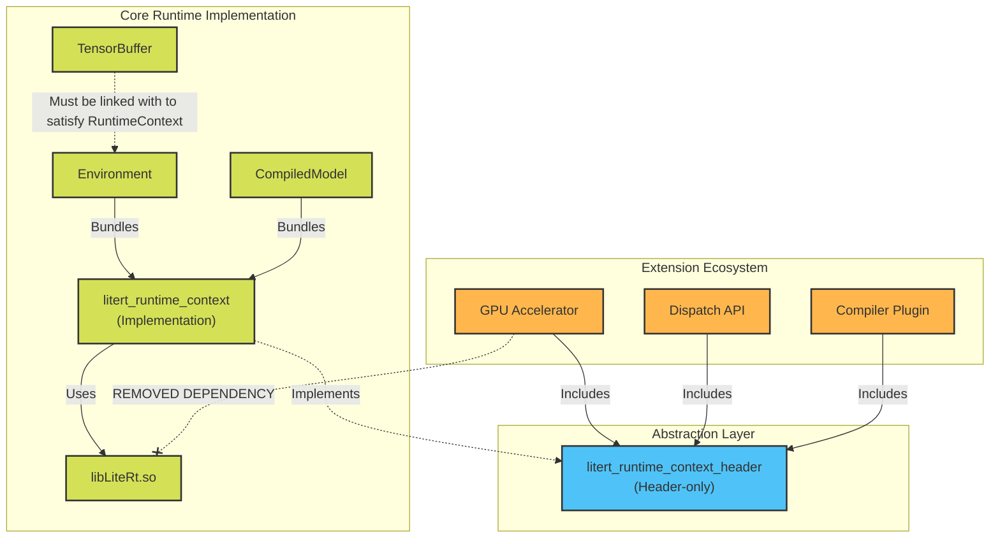

# LiteRT Runtime Decoupling with RuntimeContext

## Background

Hardware accelerator components previously relied heavily on the core LiteRT
runtime library (`libLiteRt.so`) to access executing state.

This architectural setup mandated that delegates pull in large runtime
dependencies and dynamic symbols to operate correctly, creating an unwanted
reverse dependency where discrete backend components (such as GPU Accelerators,
Dispatch APIs) relied on the core executing framework.

While this documentation focuses on the GPU Accelerator as the initial
implementation, **Dispatch APIs** and **Compiler Plugins** suffer from the same
reverse dependency issues. This document serves as a guide for decoupling them
as well.

## Goal

Decouple Accelerator components from the LiteRT Runtime C API (`libLiteRt.so`)
and standard LiteRt Runtime APIs (`litert/runtime/*`) by utilizing
`RuntimeContext` and opaque pointer abstractions to pass execution state. This
effectively eliminates the dependency on `libLiteRt.so` for extension plugins.

## Refactored Custom Tensor Buffer Handlers

Custom tensor buffer handlers have been refactored so they no longer depend on
LiteRT C APIs.

As an implementation detail, memory buffer handlers across all target backends
no longer require a `LiteRtEnvironment` parameter to derive underlying device
and command queue primitives:

-   **Refactoring Signatures:** We removed the `LiteRtEnvironment` arguments
    from all custom tensor buffer function signatures (e.g., Create, Lock,
    Unlock, Clear, Destroy) within specific backend wrapper implementations.
-   **Opaque Injection:** Function parameters representing the structural
    execution scope (e.g., `device_id` and `queue_id`) have been fully converted
    to opaque `void*` pointers. By relying on generic `void*` arguments,
    backend-specific handlers can receive their required memory allocations and
    queue handlers directly from the instantiating caller without needing to
    query standard runtime APIs.

## Introduction to RuntimeContext

`RuntimeContext` is fundamentally designed as a virtual function table (a C
struct housing function pointers) that encapsulates the subset of LiteRT C APIs
required by Accelerators.

### Structure Overview

The core interface, `LiteRtRuntimeContext` (defined dynamically via headers),
acts as a structural adapter containing pointers for operations including:

-   **Tensor Buffers:** Creating, locking, unlocking, and parsing memory
    primitive handles.
-   **External Buffers:** Registering and unregistering external buffer
    contexts.
-   **Environment Context:** Parsing arbitrary opaque options and verifying GPU
    runtime environments.
-   **Event Synchronization:** Creating, polling, and waiting on custom
    execution events (e.g., `LiteRtClEvent`).

Note: The structure will be ABI stable. b/498295744 - Add details.

### Decoupling Mechanism

Instead of an Accelerator component forcing symbol resolution against
`libLiteRt.so` at compile or load time, the host populates and supplies a
`LiteRtRuntimeContext` struct instance. The external components then seamlessly
invokes the runtime APIs securely through the struct's function pointers,
achieving total decoupling from the compiled dynamic library API.

## Architecture Diagram

<!-- disableFinding(SNIPPET_INVALID_LANGUAGE) -->

## Transitioning to RuntimeContext

To guarantee that Accelerators can operate without compiling against the Runtime
C API:

-   **Dependency Inversion via `RuntimeContext`:** Instead of an accelerator
    invoking standard runtime APIs to extract the active environment variables,
    the necessary low-level execution context primitives are provided explicitly
    via the abstraction interface.
-   **Build Target Decoupling:** `//litert/c:litert_runtime_c_api_shared_lib`
    has been completely purged from the BUILD dependencies of the accelerator
    modules.
-   **Target Cleanup:** We removed all `_runtimecapi` targets since all
    components no longer use LiteRT C APIs. This allows them to cleanly compile
    using semantic header boundaries.

## RuntimeContext Targets

`RuntimeContext` is broken down into two separate targets to cleanly enforce
decoupling and prevent cyclic dependencies:

1.  `litert_runtime_context_header`

    -   **Type:** Header-only target.
    -   **Usage:** This target is used by the **Accelerator**, **Dispatch API**,
        and **CompilerPlugin**. It provides the lightweight abstraction
        interface needed for these components to interoperate without pulling in
        runtime symbols.

2.  `litert_runtime_context`

    -   **Type:** Implementation target.
    -   **Usage:** This target contains the actual LiteRT C API implementation
        and is bundled into the core CompiledModel and Environment components.

### Implementation Caveat: TensorBuffer Circular Dependencies

To break a known circular dependency, the core TensorBuffer component does
**not** link against the `litert_runtime_context` implementation.

**Client Usage Impact:** If a client wishes to use the TensorBuffer C API
(`//litert/c:litert_tensor_buffer`), they **must** explicitly link the
Environment dependency (`//litert/c:litert_environment`) to satisfy the
underlying runtime context requirements.
