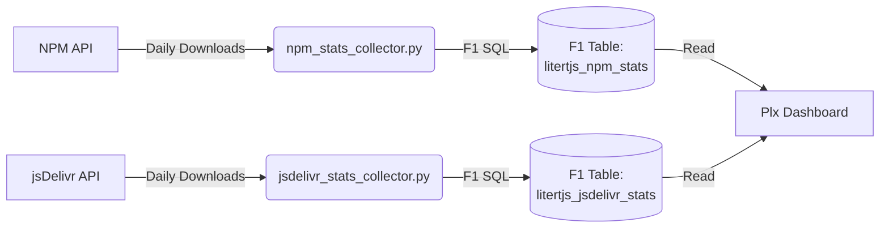

# LiteRT.js Analytics Tools

This directory contains standalone data collectors and BigQuery/F1 table
initializers for the LiteRT.js Public Usage Dashboard.

## Architecture



Instead of staging through CNS, these collectors write directly to
`tflite_usage_dashboard` Plx sequence storage datasets using the native
internal F1 SQL connector.

This means you can run these collectors ad-hoc from Cloudtop or schedule them
via Datascape PyApps.

## Running the Data Collectors

The `blaze run` commands below fetch daily download history from the NPM and
jsDelivr APIs for a given period (e.g., `last-month`) and securely write them
into the F1 DB. Standard duplication is avoided by automatically comparing
against existing records and upserting the missing payload iteratively.

```bash
blaze run //dashboards/js_stats:npm_stats_collector -- --period=last-month
blaze run //dashboards/js_stats:jsdelivr_stats_collector -- --period=last-month
```

## Adding New Packages
Simply open the `*_collector.py` source files and append new package names to
the `*_PACKAGES` arrays at the top of the file!
