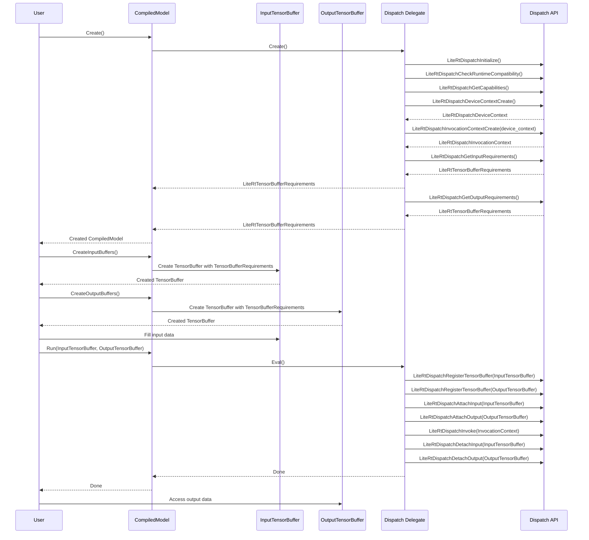
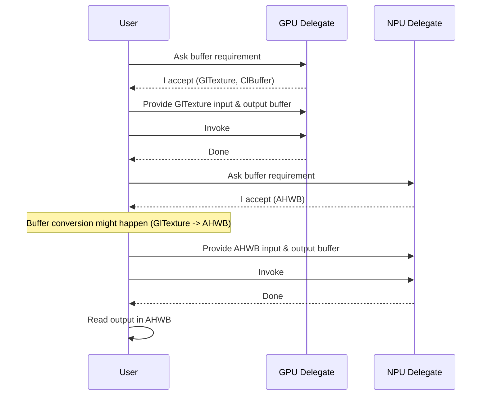

# Dispatch API

## Background

The Dispatch API is an interface used within LiteRT for NPU acceleration. It works in conjunction with the CompilerPlugin to execute the binary blobs generated by the plugin on the NPU.

The Dispatch API is intended to replace the existing TFLite Delegate. It enables features previously unsupported by the Delegate, such as buffer handshaking, hardware buffer support, and asynchronous execution.

| Feature                        | TFLite Delegate                                                                                                         | LiteRT Dispatch                                                                                           |
| :----------------------------- | :---------------------------------------------------------------------------------------------------------------------- | :-------------------------------------------------------------------------------------------------------- |
| HW Buffer                      | Via TensorBufferHandle. The way of creating the handle depends on Delegate implementation and it’s not standardized  | Via TensorBuffer                                                                                          |
| Buffer requirement handshaking | N/A                                                                                                                     | TensorBufferRequirements                                                                                  |
| ABI Stable                     | Via OpaqueDelegate (But most clients still use C++ Delegate interface which is not ABI stable)                       | Yes                                                                                                       |
| JIT / AOT                      | Delegate is responsible for JIT. AOT flow is not standardized                                                       | Dispatch API handles both JIT and AOT. NPU Compiler interface is also standardized via CompilerPlugin |
| Async Execution                | N/A                                                                                                                     | Supported                                                                                                 |

## APIs

They’re all C APIs for ABI compatibility.

Here is a snippet of Dispatch API. Full APIs are defined in [vendors/c/litert_dispatch.h](./vendors/c/litert_dispatch.h).

```c
// Initialize the Dispatch API runtime.
LITERT_CAPI_EXPORT LiteRtStatus
LiteRtDispatchInitialize(LiteRtEnvironment environment, LiteRtOptions options);

// Return the version of the Dispatch API runtime.
LITERT_CAPI_EXPORT LiteRtStatus
LiteRtDispatchGetApiVersion(LiteRtApiVersion* api_version);

// Return the vendor id of the Dispatch API runtime.
LITERT_CAPI_EXPORT LiteRtStatus
LiteRtDispatchGetVendorId(const char** vendor_id);
```

## How is it used?

In LiteRT, the Dispatch API is used through the `NpuAccelerator` within the `CompiledModel`. This process internally creates a `DispatchDelegate`, which utilizes the Dispatch API to leverage the NPU embedded in the current hardware. It provides a TFLite Delegate interface to interact with the Interpreter class managed by the `CompiledModel`.

## Dispatch API Components

The basic data types used in the Dispatch API are as follows:

  - `DispatchDeviceContext`
    Used to manage memory for NPU execution on the device.
  - `DispatchGraph` (optional)
    A graph used to represent how multiple executables for NPU execution on the device are connected with specific inputs and outputs. This is optional and not used for single model execution.
  - `DispatchInvocationContext`
    A handle for executing the model by linking actual input and output memory to the NPU binaries represented by `LiteRtMemBuffer`.
  - `LiteRtTensorBuffer`
    LiteRT abstraction of various hardware buffers including AHardwareBuffer, Ion, FastRpc, etc.
  - `LiteRtTensorBufferRequirements`
    LiteRT abstraction on required buffer specification for target NPU.

### Dispatch API Flow




## Implementation Guide

### Repo for Vendor Implementation

Each vendor implements their own Dispatch APIs. Currently 4 SoC implementations exist:

  - `litert/vendors/google_tensor/dispatch/`
  - `litert/vendors/intel_openvino/dispatch/`
  - `litert/vendors/mediatek/dispatch/`
  - `litert/vendors/qualcomm/dispatch/`

### LiteRtDispatchInitialize

This is the first function called for Dispatch API. Vendor needs required initialization. The location of Dispatch Library is passed by `kLiteRtEnvOptionTagDispatchLibraryDir` via `LiteRtEnvironmentOptions`. The logic will lookup the information and load necessary libraries.

Also each NPU vendor can define their own options via `LiteRtOptions`. These options can be delivered by `CompiledModel::Create()` and `CompiledModel::Run()` API calls from users.

### Vendor Options

As mentioned above, each NPU vendor can define their own options via `LiteRtOptions`. Each NPU option is delivered via `LiteRtOptions` using `LiteRtOpaqueOptions`.

The following repo has C and C++ API implementation:

  - `litert/c/options/`
  - `litert/cc/options/`

Check [LiteRT OpaqueOptions with TOML](https://github.com/google-ai-edge/LiteRT/blob/main/g3doc/apis/opaque_options_toml.md) for details.

### LiteRtDispatchDeviceContextCreate

This is a function that creates an opaque `LiteRtDispatchDeviceContext` object. Each NPU vendor will use their own SDK to create a mapped object that is used for inference of each model. That object type is `LiteRtDispatchDeviceContextT` which is a concrete type inside of the vendor's Dispatch API implementation. And returned as an opaque object `LiteRtDispatchDeviceContext`.

### LiteRtDispatchInvocationContextCreate

```c
LITERT_CAPI_EXPORT LiteRtStatus LiteRtDispatchInvocationContextCreate(
    LiteRtDispatchDeviceContext device_context,
    LiteRtDispatchExecutableType exec_type,
    const LiteRtMemBuffer* exec_bytecode_buffer, const char* function_name,
    int num_inputs, int num_outputs,
    LiteRtDispatchInvocationContext* invocation_context);
```

This is a function that creates an opaque `LiteRtDispatchInvocationContext` object with the given model byte codes. Vendor is responsible for creating its own concrete object `LiteRtDispatchInvocationContextT` to maintain the invocation information internally.

The returned `LiteRtDispatchInvocationContext` object is used for the following invocation related APIs.

```c
// Given a tensor type for an invocation context input, obtain the attributes
// the HW requires for the associated tensor buffer.
LITERT_CAPI_EXPORT LiteRtStatus LiteRtDispatchGetInputRequirements(
    LiteRtDispatchInvocationContext invocation_context, int input_index,
    const LiteRtRankedTensorType* tensor_type,
    LiteRtTensorBufferRequirements* tensor_buffer_requirements);

// Given a tensor type for an invocation context output, obtain the attributes
// the HW requires for the associated tensor buffer.
LITERT_CAPI_EXPORT LiteRtStatus LiteRtDispatchGetOutputRequirements(
    LiteRtDispatchInvocationContext invocation_context, int output_index,
    const LiteRtRankedTensorType* tensor_type,
    LiteRtTensorBufferRequirements* tensor_buffer_requirements);

LITERT_CAPI_EXPORT LiteRtStatus LiteRtDispatchInvocationContextDestroy(
    LiteRtDispatchInvocationContext invocation_context);

LITERT_CAPI_EXPORT LiteRtStatus LiteRtDispatchAttachInput(
    LiteRtDispatchInvocationContext invocation_context, int graph_input_index,
    LiteRtTensorBufferHandle tensor_buffer_handle);

LITERT_CAPI_EXPORT LiteRtStatus LiteRtDispatchAttachOutput(
    LiteRtDispatchInvocationContext invocation_context, int graph_output_index,
    LiteRtTensorBufferHandle tensor_buffer_handle);

LITERT_CAPI_EXPORT LiteRtStatus
LiteRtDispatchInvoke(LiteRtDispatchInvocationContext invocation_context);
```

### TensorBuffer and TensorBufferRequirements

`TensorBuffer` is a memory representation in LiteRT APIs. It can be used for various memory types such as CPU, OpenCL memory, AHardwareBuffer, FastRpc, DmaBuf, etc. If NPU requires a new data type, they can extend LiteRT `TensorBuffer` by providing `CustomBuffer` handlers.

Each NPU requires a different type of `TensorBuffer`. To create the proper `TensorBuffer` for each NPU, the Dispatch APIs are responsible for returning `TensorBufferRequirements` which specify required buffer types, size, stride, alignment.

This information allows the `CompiledModel` runtime to create the proper `TensorBuffer` which NPU Acceleration is used.

The following `InvocationContext` related APIs are responsible for returning proper `TensorBufferRequirements` for the given inputs and outputs of the model.

```c
// Given a tensor type for an invocation context input, obtain the attributes
// the HW requires for the associated tensor buffer.
LITERT_CAPI_EXPORT LiteRtStatus LiteRtDispatchGetInputRequirements(
    LiteRtDispatchInvocationContext invocation_context, int input_index,
    const LiteRtRankedTensorType* tensor_type,
    LiteRtTensorBufferRequirements* tensor_buffer_requirements);

// Given a tensor type for an invocation context output, obtain the attributes
// the HW requires for the associated tensor buffer.
LITERT_CAPI_EXPORT LiteRtStatus LiteRtDispatchGetOutputRequirements(
    LiteRtDispatchInvocationContext invocation_context, int output_index,
    const LiteRtRankedTensorType* tensor_type,
    LiteRtTensorBufferRequirements* tensor_buffer_requirements);
```


#### Buffer Requirement Handshaking



### LiteRtDispatchInvoke

This is a function that triggers NPU inference. The vendor implements execution of the model with the provided inputs in input `LiteRtTensorBufferHandle` and generates outputs in the given output `LiteRtTensorBufferHandle`.

### TensorBuffer Binding

The user-facing `CompiledModel::Run()` API looks like the following:

```cpp
/// @brief Runs the model for the default signature synchronously with the
/// provided input/output `TensorBuffer`s.
Expected<void> Run(absl::Span<const TensorBuffer> input_buffers,
                   absl::Span<const TensorBuffer> output_buffers) const
```

As you can see, users will provide input and output `TensorBuffer`s. These given `TensorBuffer`s will be delivered to users by registering and attaching `TensorBuffer`.

```c
// Registers a buffer with the given device context.
LITERT_CAPI_EXPORT LiteRtStatus LiteRtDispatchRegisterTensorBuffer(
    LiteRtDispatchDeviceContext device_context,
    LiteRtTensorBuffer tensor_buffer,
    LiteRtTensorBufferHandle* tensor_buffer_handle);

// Unregisters the registered buffer associated with the given
// `LiteRtTensorBufferHandle`.
LITERT_CAPI_EXPORT LiteRtStatus LiteRtDispatchUnregisterTensorBuffer(
    LiteRtDispatchDeviceContext device_context,
    LiteRtTensorBufferHandle tensor_buffer_handle);
```

*Note: You may have noticed that TensorBuffer binding is DeviceContext API while TensorBuffer attaching is InvocationContext. This design exists because users may use different TensorBuffers for each invocation. Consequently, TensorBuffer registration is handled in the DeviceContext, while binding is performed in the InvocationContext.*

## Resources


## An example NPU inference with Dispatch API

As stated previously, you won't need to use the Dispatch API directly since it's
called via the DispatchDelegate. The following example, however, helps
illustrate how it operates.

```

  LITERT_ASSERT_OK_AND_ASSIGN(auto env, CreateDefaultEnvironment());
  LITERT_ASSERT_OK_AND_ASSIGN(auto options, ::litert::Options::Create());

  ASSERT_EQ(LiteRtDispatchInitialize(env.Get(), options.Get()),
            kLiteRtStatusOk);

  const char* vendor_id;
  EXPECT_EQ(LiteRtDispatchGetVendorId(&vendor_id), kLiteRtStatusOk);
  ABSL_LOG(INFO) << "vendor_id: " << vendor_id;

  const char* build_id;
  EXPECT_EQ(LiteRtDispatchGetBuildId(&build_id), kLiteRtStatusOk);
  ABSL_LOG(INFO) << "build_id: " << build_id;

  LiteRtApiVersion api_version;
  EXPECT_EQ(LiteRtDispatchGetApiVersion(&api_version), kLiteRtStatusOk);
  ABSL_LOG(INFO) << "api_version: " << api_version.major << "."
                 << api_version.minor << "." << api_version.patch;

  int capabilities;
  EXPECT_EQ(LiteRtDispatchGetCapabilities(&capabilities), kLiteRtStatusOk);
  ABSL_LOG(INFO) << "capabilities: " << capabilities;

  LiteRtDispatchDeviceContext device_context = nullptr;
  EXPECT_EQ(LiteRtDispatchDeviceContextCreate(&device_context),
            kLiteRtStatusOk);
  ABSL_LOG(INFO) << "device_context: " << device_context;

  auto model_file_name =
      litert::testing::GetTestFilePath(kGoogleTensorModelFileName);
  auto model = litert::internal::LoadBinaryFile(model_file_name);
  EXPECT_TRUE(model) << model.Error();
  ABSL_LOG(INFO) << "Loaded model " << model_file_name << ", " << model->Size()
                 << " bytes";

  // ///////////////////////////////////////////////////////////////////////////
  // Set up an invocation context for a given model.
  // ///////////////////////////////////////////////////////////////////////////

  LiteRtMemBuffer exec_bytecode_buffer = {/*.fd=*/-1,
                                          /*.base_addr=*/model->Data(),
                                          /*.offset=*/0,
                                          /*.size=*/model->Size()};
  LiteRtDispatchInvocationContext invocation_context = nullptr;
  EXPECT_EQ(LiteRtDispatchInvocationContextCreate(
                device_context, kLiteRtDispatchExecutableTypeMlModel,
                &exec_bytecode_buffer, /*function_name=*/nullptr,
                /*num_inputs=*/2, /*num_outputs=*/1, &invocation_context),
            kLiteRtStatusOk);
  ABSL_LOG(INFO) << "Invocation context: " << invocation_context;

  // ///////////////////////////////////////////////////////////////////////////
  // Determine tensor buffer requirements.
  // ///////////////////////////////////////////////////////////////////////////

  int num_tensor_buffer_types;
  LiteRtTensorBufferRequirements input_0_tensor_buffer_requirements;
  EXPECT_EQ(LiteRtDispatchGetInputRequirements(
                invocation_context, /*input_index=*/0, &kInput0TensorType,
                &input_0_tensor_buffer_requirements),
            kLiteRtStatusOk);
  EXPECT_EQ(LiteRtGetNumTensorBufferRequirementsSupportedBufferTypes(
                input_0_tensor_buffer_requirements, &num_tensor_buffer_types),
            kLiteRtStatusOk);
  EXPECT_GE(num_tensor_buffer_types, 1);
  LiteRtTensorBufferType input_0_tensor_buffer_type;
  EXPECT_EQ(LiteRtGetTensorBufferRequirementsSupportedTensorBufferType(
                input_0_tensor_buffer_requirements, /*type_index=*/0,
                &input_0_tensor_buffer_type),
            kLiteRtStatusOk);
  EXPECT_EQ(input_0_tensor_buffer_type, kLiteRtTensorBufferTypeAhwb);
  size_t input_0_tensor_buffer_size;
  EXPECT_EQ(
      LiteRtGetTensorBufferRequirementsBufferSize(
          input_0_tensor_buffer_requirements, &input_0_tensor_buffer_size),
      kLiteRtStatusOk);
  EXPECT_GE(input_0_tensor_buffer_size, sizeof(kTestInput0Tensor));

  LiteRtTensorBufferRequirements input_1_tensor_buffer_requirements;
  EXPECT_EQ(LiteRtDispatchGetInputRequirements(
                invocation_context, /*input_index=*/1, &kInput1TensorType,
                &input_1_tensor_buffer_requirements),
            kLiteRtStatusOk);
  EXPECT_EQ(LiteRtGetNumTensorBufferRequirementsSupportedBufferTypes(
                input_1_tensor_buffer_requirements, &num_tensor_buffer_types),
            kLiteRtStatusOk);
  EXPECT_GE(num_tensor_buffer_types, 1);
  LiteRtTensorBufferType input_1_tensor_buffer_type;
  EXPECT_EQ(LiteRtGetTensorBufferRequirementsSupportedTensorBufferType(
                input_1_tensor_buffer_requirements, /*type_index=*/0,
                &input_1_tensor_buffer_type),
            kLiteRtStatusOk);
  EXPECT_EQ(input_1_tensor_buffer_type, kLiteRtTensorBufferTypeAhwb);
  size_t input_1_tensor_buffer_size;
  EXPECT_EQ(
      LiteRtGetTensorBufferRequirementsBufferSize(
          input_1_tensor_buffer_requirements, &input_1_tensor_buffer_size),
      kLiteRtStatusOk);
  EXPECT_GE(input_1_tensor_buffer_size, sizeof(kTestInput1Tensor));

  LiteRtTensorBufferRequirements output_tensor_buffer_requirements;
  EXPECT_EQ(LiteRtDispatchGetOutputRequirements(
                invocation_context, /*output_index=*/0, &kOutputTensorType,
                &output_tensor_buffer_requirements),
            kLiteRtStatusOk);
  EXPECT_EQ(LiteRtGetNumTensorBufferRequirementsSupportedBufferTypes(
                output_tensor_buffer_requirements, &num_tensor_buffer_types),
            kLiteRtStatusOk);
  EXPECT_GE(num_tensor_buffer_types, 1);
  LiteRtTensorBufferType output_tensor_buffer_type;
  EXPECT_EQ(LiteRtGetTensorBufferRequirementsSupportedTensorBufferType(
                output_tensor_buffer_requirements, /*type_index=*/0,
                &output_tensor_buffer_type),
            kLiteRtStatusOk);
  EXPECT_EQ(output_tensor_buffer_type, kLiteRtTensorBufferTypeAhwb);
  size_t output_tensor_buffer_size;
  EXPECT_EQ(LiteRtGetTensorBufferRequirementsBufferSize(
                output_tensor_buffer_requirements, &output_tensor_buffer_size),
            kLiteRtStatusOk);
  EXPECT_GE(output_tensor_buffer_size, sizeof(kTestOutputTensor));

  // ///////////////////////////////////////////////////////////////////////////
  // Allocate tensor buffers.
  // ///////////////////////////////////////////////////////////////////////////

  LiteRtTensorBuffer input_0_tensor_buffer;
  LITERT_EXPECT_OK(LiteRtCreateManagedTensorBuffer(
      env, input_0_tensor_buffer_type, &kInput0TensorType,
      input_0_tensor_buffer_size, &input_0_tensor_buffer));

  LiteRtTensorBuffer input_1_tensor_buffer;
  LITERT_EXPECT_OK(LiteRtCreateManagedTensorBuffer(
      env, input_1_tensor_buffer_type, &kInput1TensorType,
      input_1_tensor_buffer_size, &input_1_tensor_buffer));

  LiteRtTensorBuffer output_tensor_buffer;
  LITERT_EXPECT_OK(LiteRtCreateManagedTensorBuffer(
      env, output_tensor_buffer_type, &kOutputTensorType,
      output_tensor_buffer_size, &output_tensor_buffer));

  // ///////////////////////////////////////////////////////////////////////////
  // Register tensor buffers.
  // ///////////////////////////////////////////////////////////////////////////

  LiteRtTensorBufferHandle input_1_handle;
  LITERT_EXPECT_OK(LiteRtDispatchRegisterTensorBuffer(
      device_context, input_1_tensor_buffer, &input_1_handle));

  LiteRtTensorBufferHandle input_0_handle;
  LITERT_EXPECT_OK(LiteRtDispatchRegisterTensorBuffer(
      device_context, input_0_tensor_buffer, &input_0_handle));

  LiteRtTensorBufferHandle output_handle;
  LITERT_EXPECT_OK(LiteRtDispatchRegisterTensorBuffer(
      device_context, output_tensor_buffer, &output_handle));

  // ///////////////////////////////////////////////////////////////////////////
  // Attach tensor buffers.
  // ///////////////////////////////////////////////////////////////////////////

  LITERT_EXPECT_OK(LiteRtDispatchAttachInput(invocation_context,
                                             /*graph_input_index=*/0,
                                             input_0_handle));
  LITERT_EXPECT_OK(LiteRtDispatchAttachInput(invocation_context,
                                             /*graph_input_index=*/1,
                                             input_1_handle));
  LITERT_EXPECT_OK(LiteRtDispatchAttachOutput(invocation_context,
                                              /*graph_output_index=*/0,
                                              output_handle));

  // ///////////////////////////////////////////////////////////////////////////
  // Fill the input buffers with data.
  // ///////////////////////////////////////////////////////////////////////////

  {
    ABSL_LOG(INFO) << "Filling inputs with data";
    void* host_mem_addr;

    ASSERT_EQ(LiteRtLockTensorBuffer(input_0_tensor_buffer, &host_mem_addr,
                                     kLiteRtTensorBufferLockModeWrite),
              kLiteRtStatusOk);
    std::memcpy(host_mem_addr, kTestInput0Tensor, sizeof(kTestInput0Tensor));
    ASSERT_EQ(LiteRtUnlockTensorBuffer(input_0_tensor_buffer), kLiteRtStatusOk);

    ASSERT_EQ(LiteRtLockTensorBuffer(input_1_tensor_buffer, &host_mem_addr,
                                     kLiteRtTensorBufferLockModeWrite),
              kLiteRtStatusOk);
    std::memcpy(host_mem_addr, kTestInput1Tensor, sizeof(kTestInput1Tensor));
    ASSERT_EQ(LiteRtUnlockTensorBuffer(input_1_tensor_buffer), kLiteRtStatusOk);
  }

  // ///////////////////////////////////////////////////////////////////////////
  // Execute model.
  // ///////////////////////////////////////////////////////////////////////////

  ABSL_LOG(INFO) << "Invoking execution...";
  EXPECT_EQ(LiteRtDispatchInvoke(invocation_context), kLiteRtStatusOk);

  // ///////////////////////////////////////////////////////////////////////////
  // Check output for correctness.
  // ///////////////////////////////////////////////////////////////////////////

  {
    ABSL_LOG(INFO) << "Checking output...";
    void* host_mem_addr;
    ASSERT_EQ(LiteRtLockTensorBuffer(output_tensor_buffer, &host_mem_addr,
                                     kLiteRtTensorBufferLockModeRead),
              kLiteRtStatusOk);
    auto output = absl::MakeSpan(static_cast<const float*>(host_mem_addr),
                                 kTestOutputSize);
    for (auto i = 0; i < kTestOutputSize; ++i) {
      ABSL_LOG(INFO) << output[i] << "\t" << kTestOutputTensor[i];
    }
    EXPECT_THAT(output, Pointwise(testing::FloatNear(1e-3), kTestOutputTensor));
    ASSERT_EQ(LiteRtUnlockTensorBuffer(output_tensor_buffer), kLiteRtStatusOk);
  }

  // ///////////////////////////////////////////////////////////////////////////
  // Clean up resources.
  // ///////////////////////////////////////////////////////////////////////////
  EXPECT_EQ(LiteRtDispatchDetachInput(invocation_context,
                                      /*graph_input_index=*/0, input_0_handle),
            kLiteRtStatusOk);
  EXPECT_EQ(LiteRtDispatchDetachInput(invocation_context,
                                      /*graph_input_index=*/1, input_1_handle),
            kLiteRtStatusOk);
  EXPECT_EQ(LiteRtDispatchDetachOutput(invocation_context,
                                       /*graph_output_index=*/0, output_handle),
            kLiteRtStatusOk);
  EXPECT_EQ(LiteRtDispatchUnregisterTensorBuffer(device_context, output_handle),
            kLiteRtStatusOk);
  EXPECT_EQ(
      LiteRtDispatchUnregisterTensorBuffer(device_context, input_1_handle),
      kLiteRtStatusOk);
  EXPECT_EQ(
      LiteRtDispatchUnregisterTensorBuffer(device_context, input_0_handle),
      kLiteRtStatusOk);
  LiteRtDestroyTensorBuffer(output_tensor_buffer);
  LiteRtDestroyTensorBuffer(input_1_tensor_buffer);
  LiteRtDestroyTensorBuffer(input_0_tensor_buffer);
  EXPECT_EQ(LiteRtDispatchInvocationContextDestroy(invocation_context),
            kLiteRtStatusOk);
  EXPECT_EQ(LiteRtDispatchDeviceContextDestroy(device_context),
            kLiteRtStatusOk);
```
