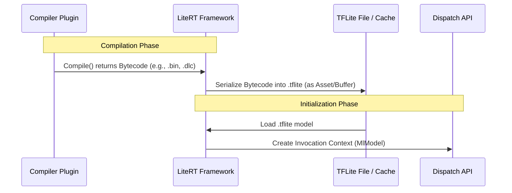
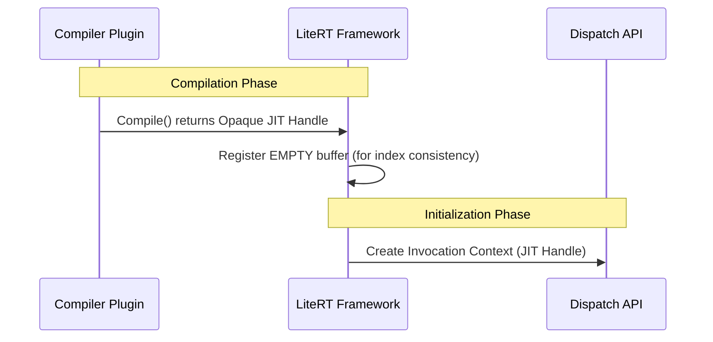

# JIT Compilation in LiteRT

## Overview

Just-In-Time (JIT) compilation in LiteRT is an in-memory compilation flow that
allows NPU compiler plugins to pass compiled executable handles directly to the
dispatch runtime. This bypasses the traditional flow of serializing the compiled
bytecode into the `.tflite` model file and deserializing it at startup.

This feature is particularly useful for:

  *   **Reducing Startup Latency**: Skipping serialization and deserialization
     significantly reduces the time it takes to initialize the model.

  *   **Supporting Non-Serializable Backends**: Some vendor SDKs or hardware
     frameworks do not support serializing compiled graphs to disk, or only
     support it optionally. JIT compilation enables acceleration on these
     backends.

---

## Standard Flow vs. JIT Flow

To understand JIT compilation, it is helpful to contrast it with the standard
Ahead-Of-Time (AOT) or serialized JIT compilation flow.

### Standard Serialized Flow

In the standard flow, compilation and execution are decoupled by serialization:



1.  **Compiler Plugin** compiles the partitioned subgraphs and returns the
    hardware-specific bytecode as a raw memory buffer.
2.  **LiteRT Framework** registers this bytecode in the model's buffers and
    serializes it into the final `.tflite` file.
3.  At runtime, the **Dispatch Delegate** loads the bytecode from the model and
    passes it to the **Dispatch API** via
    `LiteRtDispatchInvocationContextCreate` with type
    `kLiteRtDispatchExecutableTypeMlModel`.

### JIT (In-Memory) Flow

In the JIT flow, the compiled executable is kept in memory:



1.  **Compiler Plugin** compiles the partitions and returns an **opaque JIT
    executable handle** instead of (or in addition to) bytecode.
2.  **LiteRT Framework** registers an *empty* buffer in the model to keep
    indices consistent but does not serialize any bytecode.
3.  The framework stores the JIT handle in `DispatchDelegateOptions`.
4.  At runtime, the **Dispatch Delegate** retrieves the JIT handle and passes
    it directly to the **Dispatch API** via
    `LiteRtDispatchInvocationContextCreate` with type
    `kLiteRtDispatchExecutableTypeJitHandle`.

---

## Implementing JIT Support in Compiler Plugins

To support JIT compilation, a compiler plugin must implement the optional
`LiteRtGetCompiledResultHandle` API.

### 1. Export the API

The plugin must export the symbol `LiteRtGetCompiledResultHandle` defined in [litert_compiler_plugin.h](./vendors/c/litert_compiler_plugin.h):

```c
LITERT_CAPI_EXPORT LiteRtStatus LiteRtGetCompiledResultHandle(
    LiteRtCompiledResult compiled_result,
    LiteRtParamIndex call_idx,
    LiteRtJitExecutable* handle);
```

### 2. Implement the Logic

When `LiteRtCompilerPluginCompile` is called, the plugin should prepare the
in-memory executable (e.g., QNN Graph, OpenCL program, etc.) and store it in its
internal `LiteRtCompiledResult` structure.

When the framework calls `LiteRtGetCompiledResultHandle`, the plugin returns the
opaque pointer to this executable:

```cpp
// Example from [example_plugin.cc](./vendors/examples/example_plugin.cc)
LiteRtStatus LiteRtGetCompiledResultHandle(LiteRtCompiledResult compiled_result,
                                           LiteRtParamIndex call_idx,
                                           LiteRtJitExecutable* handle) {
  if (!compiled_result) {
    return kLiteRtStatusErrorInvalidArgument;
  }
  if (!compiled_result->global_graph) {
    *handle = nullptr;
    return kLiteRtStatusOk;
  }
  // Return the pointer to the in-memory graph representation
  *handle = reinterpret_cast<LiteRtJitExecutable>(
      compiled_result->global_graph.get());
  return kLiteRtStatusOk;
}
```

If the plugin yields a JIT handle, the framework will automatically skip
serializing the bytecode for that partition, saving disk space and
serialization time.

---

## Implementing JIT Support in Dispatch API

The Dispatch API must be prepared to receive the JIT handle instead of raw
bytecode.

### 1. Handle the JIT Executable Type

In `LiteRtDispatchInvocationContextCreate`, the vendor implementation must
check the `exec_type` parameter. If it is
`kLiteRtDispatchExecutableTypeJitHandle`, the `exec_bytecode_buffer` will
contain the JIT handle instead of bytecode.

```c
LITERT_CAPI_EXPORT LiteRtStatus LiteRtDispatchInvocationContextCreate(
    const LiteRtRuntimeContext* runtime_context,
    LiteRtDispatchDeviceContext device_context,
    LiteRtDispatchExecutableType exec_type,
    const LiteRtMemBuffer* exec_bytecode_buffer,
    const char* function_name,
    int num_inputs,
    int num_outputs,
    LiteRtDispatchInvocationContext* invocation_context);
```

### 2. Extract and Use the Handle

When `exec_type` is `kLiteRtDispatchExecutableTypeJitHandle`, the JIT handle is
passed in `exec_bytecode_buffer->base_addr`. The Dispatch API implementation
should cast this address back to the concrete vendor-specific structure and
retrieve the executable graph.

```cpp
// Example conceptual implementation for Qualcomm QNN Dispatch
if (exec_type == kLiteRtDispatchExecutableTypeJitHandle) {
  // Cast base_addr back to the structure defined by the compiler plugin
  auto jit_graph = reinterpret_cast<const litert::qnn::QnnJitGraph*>(
      exec_bytecode_buffer->base_addr);

  if (!jit_graph) {
    return kLiteRtStatusErrorInvalidArgument;
  }

  // Use QNN APIs to retrieve the graph directly from the context handle
  Qnn_GraphHandle_t graph_handle;
  auto status = qnn.Api()->graphRetrieve(jit_graph->context_handle,
                                         jit_graph->graph_name.c_str(),
                                         &graph_handle);
  if (status != QNN_SUCCESS) {
    return kLiteRtStatusErrorRuntimeFailure;
  }

  // Create the invocation context using the retrieved graph handle...
}
```

---

## Enabling JIT Compilation

JIT compilation is typically enabled optionally via vendor-specific options
passed during model initialization.

For example, in the Qualcomm implementation, JIT is enabled by setting the
`enable_just_in_time` option to `true` in the Qualcomm options:

```toml
# Qualcomm Options TOML
enable_just_in_time = true
```

Or programmatically:

```cpp
LrtQualcommOptionsSetEnableJustInTime(options, true);
```

### Interaction with Caching

Since JIT compilation relies on in-memory handles that exist only during the
lifetime of the compiler plugin and the runtime process, **JIT compilation
cannot be cached**.

If JIT execution handles are detected, LiteRT will automatically disable model
caching for that run and log:

```
JIT execution handles detected. Disabling JIT model caching.
```

Even if the user has configured a compilation cache directory, it will be
bypassed for JIT-enabled models.
