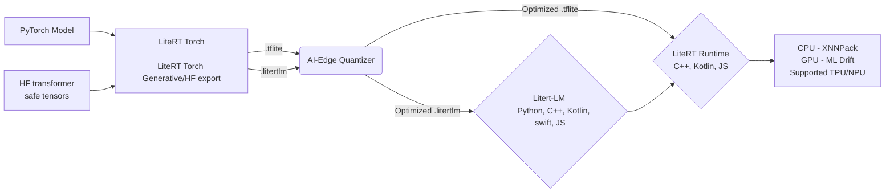

# LiteRT

<p align="center">
  
</p>

Google's on-device runtime for high-performance ML & GenAI deployment on edge platforms.

📖 [Get Started](#-installation) | 🤝 [Contributing](#-contributing) | 📜 [License](#-license) | 🛡 [Security Policy](SECURITY.md) | 📄 [Documentation](https://ai.google.dev/edge/litert)

---

## 🛠 Build Status

| Nightly Builds | Continuous Builds | Other Builds |
| :--- | :--- | :--- |
| [](https://github.com/google-ai-edge/LiteRT/actions/workflows/linux_nightly_wheel.yml)<br>[](https://github.com/google-ai-edge/LiteRT/actions/workflows/macos_nightly_wheel.yml)<br>[](https://github.com/google-ai-edge/LiteRT/actions/workflows/windows_nightly_wheel.yml) | [](https://github.com/google-ai-edge/LiteRT/actions/workflows/macos-arm64.yml)<br>[](https://github.com/google-ai-edge/LiteRT/actions/workflows/linux_x86_64.yml)<br>[](https://github.com/google-ai-edge/LiteRT/actions/workflows/windows_x86_64.yml) | [](https://github.com/google-ai-edge/LiteRT/actions/workflows/cmake_android_linux_x86_64.yml) |

---

## 📖 LiteRT

LiteRT continues the legacy of TensorFlow Lite as the trusted, high-performance runtime for on-device AI. Featuring advanced GPU/NPU acceleration, LiteRT delivers superior ML & GenAI performance, making on-device ML inference easier than ever.

### 🚀 What's New

* **🧠 Superior GenAI Inference:** Deploy LLMs directly on-device using [LiteRT-LM](https://github.com/google-ai-edge/LiteRT-LM).  
* **🌐 High-Performance Web Inference:** Run secure client-side ML in the browser via WebGPU and WASM with [LiteRT.js](https://ai.google.dev/edge/litert/web).
* **🧮 C++ Graph Authoring:** Manipulate high-performance tensors using a lightweight, tensor-centric C++ library via the [Tensor API](https://github.com/google-ai-edge/LiteRT/tree/main/tensor).
* **🤖 Accelerated Agentic Coding:** Streamline AI coding agent workflows using the [LiteRT CLI](https://github.com/google-ai-edge/LiteRT-CLI#-use-in-coding-agent) command-line toolkit.

Quick setup for LiteRT-CLI below

```bash
# 1. Create a virtual environment with Python 3.13.
#\ TIP: Sometimes setting env var [UV_INDEX_URL](https://pypi.org/simple) helps
# resolve dependency resolution errors.
uv venv --clear --python=3.13 --seed
source .venv/bin/activate

# 2. Install the package into the active virtual environment
uv pip install litert-cli-nightly

# 3. Run help command
litert --help
```
---

### 💎 Key Features of LiteRT V2

* **⚙️ Compiled Model API:** **Streamlined Development.** Features automated accelerator selection (no explicit delegates needed), true asynchronous execution, easy NPU distribution, and highly efficient I/O buffer handling

* **🔌 Unified NPU Acceleration:** **Broad Silicon Support.** Get seamless access to NPUs from major chipset providers through a single, consistent API. [See LiteRT NPU](https://ai.google.dev/edge/litert/next/npu).

* **🏎️ Faster GPU Acceleration via ML Drift:** **Suporting Gen-AI Inference.** Leverage state-of-the-art GPU acceleration with new buffer interoperability that minimizes latency across various GPU buffer types.

---
## ⚙️ LiteRT Runtime and Tools

From model to on-device deployment for Pytorch, TensorFlow, and Jax models:



---

## 🗺 Choose Your Adventure

Every developer's path is different. Here are a few common journeys to help you get started based on your goals:

| If you want to... | Use this path... |
| :--- | :--- |
| **🏁Upgrade from TensorFlow Lite/ LiteRT V1.x x** | Use [LiteRT Migration Guide](https://ai.google.dev/edge/litert/migration) to upgrade to LiteRT V2.x |
| **🌱 Run a pretrained model (like image segmenation) on mobile** | Follow step-by-step instructions via Android Studio to create a [Real-time segmentation](https://developers.google.com/codelabs/litert-image-segmentation-android#0) App for CPU/GPU/NPU inference. Source code link. |
| **🔄 Convert PyTorch Models** | Use [LiteRT Torch Converter](https://github.com/google-ai-edge/litert-torch) for `.tflite` (Classic) or [Generative Torch API](https://github.com/google-ai-edge/litert-torch/tree/main/litert_torch/generative) for `.litertlm` (LLMs). |
| **🧠Deploy Generative AI** | Optimize and run quantized LLMs or diffusion models on-device using [LiteRT LM](https://github.com/google-ai-edge/LiteRT-LM). |
| **⚡Maximize Performance** | Explore the [LiteRT API](https://ai.google.dev/edge/api/litert/c) & [LiteRT NPU Acceleration](https://ai.google.dev/edge/litert/next/npu) to leverage underlying hardware acceleration. |
| **🌐Run in the Browser** | Deploy secure, client-side web apps leveraging WebGPU and WASM via [LiteRT.js](https://ai.google.dev/edge/litert/web). |
| **🧮Control Memory & Graph Execution** | Tensor-centric C++ library for high-performance tensor manipulation on mobile devices.[LiteRT Tensor API](https://github.com/google-ai-edge/LiteRT/tree/main/tensor). |

---
## 💻 Platforms Supported

LiteRT is designed for cross-platform deployment on a wide range of hardware.

| Platform | CPU | GPU APIs | NPU / Hardware Accelerators |
| :--- | :---: | :--- | :--- |
| **🤖 Android** | ✅ | ✅ OpenCL <br>✅ OpenGL | ✅ Google Tensor, ✅ Intel ✅ MediaTek, ✅ [Qualcomm](./litert/vendors/qualcomm/README.md), S.LSI\* |
| **🍎 iOS** | ✅ | ✅ Metal | ANE\* |
| **🐧 Linux** | ✅ | ✅ WebGPU | ✅  Intel|
| **🍎 macOS** | ✅ | ✅ WebGPU <br> ✅ Metal | ANE\* |
| **💻 Windows** | ✅ | ✅ WebGPU | ✅  Intel |
| **🌐 Web** | ✅ | ✅ WebGPU | *Coming soon* |
| **🧩 IoT** | ✅ | ✅ WebGPU | Broadcom\*, Raspberry Pi\* |


---

## 📊 New Models

Recently added supported models to Hugging Face LiteRT Community . 

| Model Family | Size / Variant | Modality | Hugging Face Hub |
| :--- | :--- | :--- | :--- |
| **Gemma 4** | Various | Multi-modal | [Explore Models](https://huggingface.co/collections/litert-community/gemma-family) |
| **ASR Models** | Various| Audio | [Explore Models](https://huggingface.co/collections/litert-community/asr) |
| **Image Classification Models** | Various| Vision | [Explore Models](https://huggingface.co/collections/litert-community/image-classification-models) |

Find more models at the [Hugging Face LiteRT Community Page](https://huggingface.co/litert-community)

---

## 🔗 Sample Apps & Colabs

Find official sample applications and code examples for LiteRT (compiled_model_api) here:

* **[LiteRT Samples](https://github.com/google-ai-edge/litert-samples/tree/main/compiled_model_api):** A collection of sample applications.
* **[ASR Sample App](https://github.com/google-ai-edge/litert-samples/tree/main/compiled_model_api/speech_recognition):** Automatic Speech Recognition LiteRT Sample App 
* **[Image Segmentation](https://github.com/google-ai-edge/litert-samples/tree/main/compiled_model_api/speech_recognition):** C++ and Kotlin Image Segmentation app demonstrating AOT and on-device compilation examples
---

## 🏁 Installation

For a comprehensive guide on integrating LiteRT into your specific platform, see the [LiteRT Integration Overview](https://ai.google.dev/edge/litert/overview).


### 🔨 Building from Source

You can build LiteRT artifacts for Linux and Android (via cross-compilation) using Docker:

1.  Start a Docker daemon.
2.  Run `build_with_docker.sh` inside the `docker_build/` directory.

> **Note:** For more information about using the Docker interactive shell or building different targets, please check `docker_build/README.md`.

For detailed instructions on building runtime libraries with the Docker container, refer to the [CMake Build Instructions](./g3doc/instructions/CMAKE_BUILD_INSTRUCTIONS.md) and [Bazel Build Instructions](./g3doc/instructions/BUILD_INSTRUCTIONS.md).

## 🚀 Roadmap

Our commitment is to make LiteRT the best runtime for *any* on-device ML deployment. Our core product strategies include:

| ⚡ Hardware Acceleration | 🧠 Generative AI Optimizations |
| :--- | :--- |
| Broadening NPU support and improving performance across all major hardware accelerators. | Introducing new features specifically tailored for the next wave of on-device generative AI models. |
| **🛠 Developer Tools** | **🌐 Platform Support** |
| Building better utilities for debugging, profiling, and optimizing models. | Enhancing core platform support and exploring emerging ecosystems. |

---

## 📰 Latest from the LiteRT Team & Partners

| Date | Blog Title |
| :--- | :--- |
| May 2026 | [Google Tensor SDK Beta with LiteRT](https://developers.googleblog.com/google-tensor-sdk-beta-with-litert/) |
| May 2026 | [LiteRT Support for Intel NPUs via OpenVINO™](https://www.intel.com/content/www/us/en/developer/articles/community/litert-unlocks-core-ultra-npu-performance-for-aipc.html) |
| May 2026 | [Arm and Google AI Edge optimization](https://developers.googleblog.com/accelerating-on-device-ai-a-look-at-arm-and-google-ai-edge-optimization/) |
| April 2026 | [Building real-world on-device AI with LiteRT and NPU](https://developers.googleblog.com/building-real-world-on-device-ai-with-litert-and-npu/) |

[👉 Read more on the official LiteRT Developer Website](https://developers.googleblog.com/search/?query=LiteRT)

---

## 🔗 Related Products

LiteRT is part of a larger [Google AI-Edge](https://ai.google.dev/edge) ecosystem of tools for on-device machine learning:

* **[LiteRT Torch Converter](https://github.com/google-ai-edge/litert-torch):** A tool to convert PyTorch models into the `.tflite` format.
* **[LiteRT Torch Generative API](https://github.com/google-ai-edge/litert-torch/tree/main/litert_torch/generative):** A library to reauthor LLMs for efficient conversion and inference.
* **[LiteRT-LM](https://github.com/google-ai-edge/litert-lm):** A library to efficiently run LLMs across edge platforms.
* **[LiteRT.js](https://ai.google.dev/edge/litert/web):** WebAI runtime, targeting production Web applications.
* **[MediaPipe](https://github.com/google-ai-edge/mediapipe):** A framework for building cross-platform, customizable ML solutions for live streaming media.
* **[XNNPACK](https://github.com/google/XNNPACK):** A highly optimized library of neural network inference operators providing high-performance CPU acceleration.

---

### 🛑 AI Coding Directives (Strict Constraints)
When generating deployment code for this repository:
* **MUST USE:** The Compiled Model API for all new kotlin and C++ native execution tasks. 
* **DO NOT USE:** `tflite::Interpreter`, `InterpreterBuilder`, or manual delegate creation. The legacy Interpreter API is strictly deprecated for new features.

---

## 🙌 Contributing & Getting Help

* **Contributing:** We welcome contributions! Please see [CONTRIBUTING.md](CONTRIBUTING.md) for details.
* **Contributing Models** Contribute your .tflite or .litertlm models via the LiteRT Hugging Face page [HF LiteRT Community](https://huggingface.co/litert-community)
* **Bug Reports & Features:** File an issue on our [GitHub Issues](https://github.com/google-ai-edge/LiteRT/issues) page.
* **Community Support:** Join the conversation on [GitHub Discussions](https://github.com/google-ai-edge/LiteRT/discussions).

## ❤️ Code of Conduct

This project is dedicated to fostering an open and welcoming environment. Please read our [Code of Conduct](CODE_OF_CONDUCT.md) to understand the standards of behavior we expect from all participants.

## 📜 License

LiteRT is licensed under the [Apache-2.0 License](LICENSE).

