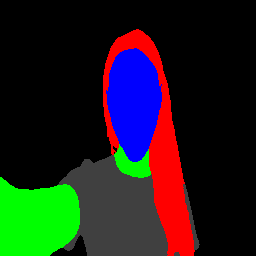

# LiteRT Rust example: image segmentation

A small command line program that runs a multiclass image segmentation model
through the LiteRT Rust bindings. It is a simplified port of the C++ sample in
[`tensor/examples/segmentation`](../../../tensor/examples/segmentation), and it
loads a `.tflite` model, preprocesses an input image to a `256x256` RGB tensor,
runs inference on the CPU, and writes a colour mapped segmentation mask as a
PNG.

## Prerequisites

The binding's build script (`../build/build.rs`) downloads the prebuilt LiteRT
C++ SDK and compiles a small static library with CMake, so the following must be
available:

- A C/C++ toolchain (`clang`/`clang++`)
- `cmake`
- Network access on the first build (the SDK and runtime are downloaded)

### macOS toolchain note

The CMake build links static archives with `ar` and indexes them with
`ranlib`. If your `PATH` mixes archivers from different toolchains (for example
Homebrew `binutils` providing `ar`/`ranlib` while Homebrew `llvm` provides
`llvm-ranlib`), CMake can create an archive with one toolchain and index it with
the other. On the empty `libabsl_crc_cpu_detect.a` archive this fails with:

```
llvm-ranlib: error: libabsl_crc_cpu_detect.a: '__.SYMDEF': The end of the file was unexpectedly encountered
```

The fix is to give the build a single consistent toolchain. Apple's native
tools handle this correctly, so build with a `PATH` that does not place
Homebrew's `binutils` or `llvm` `bin` directories ahead of `/usr/bin`:

```bash
PATH="$HOME/.cargo/bin:/usr/bin:/bin:/usr/sbin:/sbin:/opt/homebrew/bin" \
LIBCLANG_PATH="/opt/homebrew/opt/llvm/lib" \
  cargo build --bin segmentation
```

`LIBCLANG_PATH` points `bindgen` at a `libclang` for header parsing; adjust it
if your `libclang` lives elsewhere.

## Model and input image

Both assets are already in this repository, next to the C++ sample this example
was ported from:

- Model: [`tensor/examples/segmentation/selfie_multiclass_256x256.tflite`](../../../tensor/examples/segmentation/selfie_multiclass_256x256.tflite)
- Input image: [`tensor/examples/segmentation/image.jpeg`](../../../tensor/examples/segmentation/image.jpeg)

## Build and run

From this directory (`litert/rust/example`):

```bash
# Build (see the macOS toolchain note above for the PATH/LIBCLANG_PATH prefix)
cargo build --bin segmentation
```

The build produces the LiteRT runtime as a dynamic library under the crate's
build output directory. The example links it by `@rpath`, so the dynamic loader
needs to be told where it is at run time. Locate it and run:

```bash
# Find the directory containing the built runtime library
SDK_DIR=$(dirname "$(find "$HOME/.cargo/target" "$(pwd)/target" \
  -name libLiteRt.dylib -path '*google-ai-edge-litert*' 2>/dev/null | head -1)")

DYLD_LIBRARY_PATH="$SDK_DIR" cargo run --bin segmentation -- \
  --model-path=../../../tensor/examples/segmentation/selfie_multiclass_256x256.tflite \
  --input-image-path=../../../tensor/examples/segmentation/image.jpeg \
  --output-image-path=/tmp/out.png
```

> On Linux the runtime is `libLiteRt.so`; search for that name and set
> `LD_LIBRARY_PATH` instead of `DYLD_LIBRARY_PATH`.

## Expected output

The program prints the model's signature and tensor information, then writes a
`256x256` RGBA PNG to the `--output-image-path` you supplied. Each pixel is
coloured by its predicted class (background, hair, skin, and so on), giving a
segmentation mask of the input portrait.

Running the command above on the bundled `image.jpeg` produces:


