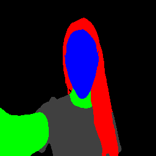

# LiteRT Rust example: image segmentation

A small command line program that runs a multiclass image segmentation model
through the LiteRT Rust bindings. It is a simplified port of the C++ sample in
[`tensor/examples/segmentation`](../../../tensor/examples/segmentation), and it
loads a `.tflite` model, preprocesses an input image to a `256x256` RGB tensor,
runs inference on the CPU, and writes a colour mapped segmentation mask as a
PNG.

## Prerequisites

The binding's build script (`../build/build.rs`) downloads the prebuilt LiteRT
C++ SDK and compiles a small static library with CMake, so the following must be
available:

- A C/C++ toolchain (`clang`/`clang++`)
- `cmake`
- Network access on the first build (the SDK and runtime are downloaded)

### macOS toolchain note

CMake picks `ar` and `ranlib` separately from your `PATH`. On Homebrew setups
this can give GNU `ar` with LLVM `llvm-ranlib`, and the abseil build then fails
with:

```
llvm-ranlib: error: libabsl_source_location.a: '__.SYMDEF': The end of the file was unexpectedly encountered
```

The build script prevents this. It gives CMake the `ar`/`ranlib` pair from the
same folder as `clang`, so you do not need to change your `PATH`.

## Model and input image

Both assets are already in this repository, next to the C++ sample this example
was ported from:

- Model: [`tensor/examples/segmentation/selfie_multiclass_256x256.tflite`](../../../tensor/examples/segmentation/selfie_multiclass_256x256.tflite)
- Input image: [`tensor/examples/segmentation/image.jpeg`](../../../tensor/examples/segmentation/image.jpeg)

## Build and run

From this directory (`litert/rust/example`):

```bash
cargo build --bin segmentation
```

The build produces the LiteRT runtime as a dynamic library under the crate's
build output directory. The example links it by `@rpath`, so the dynamic loader
needs to be told where it is at run time. Locate it and run:

```bash
# Find the directory containing the built runtime library
SDK_DIR=$(dirname "$(find "$HOME/.cargo/target" "$(pwd)/target" \
  -name libLiteRt.dylib -path '*google-ai-edge-litert*' 2>/dev/null | head -1)")

DYLD_LIBRARY_PATH="$SDK_DIR" cargo run --bin segmentation -- \
  --model-path=../../../tensor/examples/segmentation/selfie_multiclass_256x256.tflite \
  --input-image-path=../../../tensor/examples/segmentation/image.jpeg \
  --output-image-path=/tmp/out.png
```

> On Linux the runtime is `libLiteRt.so`; search for that name and set
> `LD_LIBRARY_PATH` instead of `DYLD_LIBRARY_PATH`.

The `segmentation_async` binary runs the same model with the async API. It
takes the same flags: use `--bin segmentation_async` in the commands above.

## Expected output

The program prints the model's signature and tensor information, then writes a
`256x256` RGBA PNG to the `--output-image-path` you supplied. Each pixel is
coloured by its predicted class (background, hair, skin, and so on), giving a
segmentation mask of the input portrait.

Running the command above on the bundled `image.jpeg` produces:


