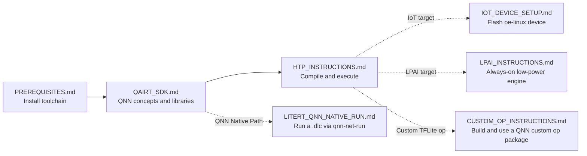

# LiteRT Qualcomm Integration

The LiteRT integration for Qualcomm AI Engine Direct (QAIRT), offloading models
to Qualcomm NPUs, GPUs, and DSPs for accelerated inference. It has two
components:

*   **Compiler Plugin**: legalizes and compiles LiteRT graphs into QNN graphs
    (online and offline compilation).
*   **Dispatch API**: manages execution of the compiled QNN graphs on device.

## Getting Started 🚀

The build and run docs live in [doc/](./doc/). Read them in this order:

| Doc | Type | What it covers |
|-----|------------------|----------------|
| [PREREQUISITES.md](./doc/PREREQUISITES.md) | Always | Install the toolchain. Skip if already installed. |
| [QAIRT_SDK.md](./doc/QAIRT_SDK.md) | Always | QNN backends, platforms, and how to locate the QNN libraries (`.so`), plus QAIRT native tools. |
| [HTP_INSTRUCTIONS.md](./doc/HTP_INSTRUCTIONS.md) | Always | Compile and run a model: AOT on host (Bazel / CMake) and JIT on device. |
| [IOT_DEVICE_SETUP.md](./doc/IOT_DEVICE_SETUP.md) | Conditional | Flash an IoT device (e.g. IQ-8275 / QCS8275, oe-linux or Ubuntu), then follow [Run on device (IoT device with oe-linux)](./doc/HTP_INSTRUCTIONS.md#run-on-device-iot-device-with-oe-linux) in HTP_INSTRUCTIONS.md. |
| [LPAI_INSTRUCTIONS.md](./doc/LPAI_INSTRUCTIONS.md) | Conditional | Target the LPAI (Low Power AI) backend for always-on embedded use cases. |
| [CUSTOM_OP_INSTRUCTIONS.md](./doc/CUSTOM_OP_INSTRUCTIONS.md) | Conditional | Build a QNN custom op package and run TFLite custom ops on the NPU. |
| [LITERT_QNN_NATIVE_RUN.md](./doc/LITERT_QNN_NATIVE_RUN.md) | Conditional | Compile a `.tflite` to a `.dlc` with LiteRT, then run the QNN graph natively through the QAIRT native tools (`qnn-context-binary-generator` → `qnn-net-run`) on host or device. |
| [OPTIONS_REFERENCE.md](./doc/OPTIONS_REFERENCE.md) | Reference | Every `--qualcomm_*` option: values, defaults, compile vs. dispatch, and how to set it from CLI / TOML / C / C++. |

## Debug Features 🐞

Three compile-time knobs emit QNN native artifacts during AOT compilation:

| Flag | Emits |
|------|-------|
| `--qualcomm_saver_output_dir` | Saver Backend: records QNN API calls as `saver_output.c` + `params.bin` for offline replay. |
| `--qualcomm_ir_json_dir` | Dumps the composed QNN graph as `<graph>.json` for quick inspection. |

See [DEBUG_FEATURES.md](./doc/DEBUG_FEATURES.md) for full usage and details.

## Supported Devices 📱

LiteRT supports a wide range of Qualcomm SoCs through the QNN SDK. Top tier:

*   **Snapdragon 8 Gen 5** (SM8850)
*   **Snapdragon 8 Elite** (SM8750)
*   **Snapdragon 8 Gen 3** (SM8650)

For a complete and up-to-date list of supported devices, please refer to
[supported_soc.csv](./supported_soc.csv).

## Tooling 🛠️

*   **Optrace Profiling**: See [optrace_profiling](./debugger/optrace_profiling)
    for details on debugging and profiling.
*   **LiteRT Tools**: Refer to `litert/tools` for general LiteRT tools.
*   **QAIRT Native Tools**: You can also use the native tools that ship with the
    Qualcomm AI Runtime (QAIRT) SDK. See [QAIRT_SDK.md](./doc/QAIRT_SDK.md).

## References & Links 🔗

*   **Detailed Compiler Info**: See
    [Qualcomm_QNN_Compiler.md](./compiler/Qualcomm_QNN_Compiler.md) for
    supported ops and data types.
*   **Google Dev Site**:
    [LiteRT Qualcomm Documentation](https://ai.google.dev/edge/litert/next/qualcomm)
*   **Blog Posts**:
    1.  [Bring state-of-the-art agentic skills to the edge with Gemma 4](https://developers.googleblog.com/bring-state-of-the-art-agentic-skills-to-the-edge-with-gemma-4/) (April 2, 2026)
    2.  [Unlocking Peak Performance on Qualcomm NPU with LiteRT](https://developers.googleblog.com/unlocking-peak-performance-on-qualcomm-npu-with-litert/) (November 24, 2025)
    3.  [Building Real-World On-Device AI with LiteRT and NPU](https://developers.googleblog.com/building-real-world-on-device-ai-with-litert-and-npu/) (April 23, 2026)
*   **Partner Library Documentation**:
    [LiteRT LM NPU Qualcomm](https://ai.google.dev/edge/litert/next/litert_lm_npu#qualcomm)
