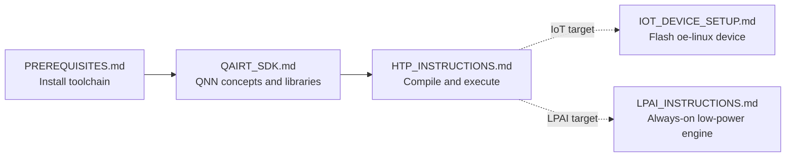

# LiteRT Qualcomm Integration 🚀

This directory contains the LiteRT integration for Qualcomm AI Engine Direct (QAIRT)
accelerators. It enables LiteRT to offload machine learning models to Qualcomm
NPUs, GPUs, and DSPs for hardware-accelerated inference.

## Overview ℹ️

The LiteRT Qualcomm integration consists of two main components: 1. **Compiler
Plugin**: Legalizes and compiles LiteRT graphs into QNN graphs, supporting both
online and offline compilation. 2. **Dispatch API**: Manages the execution of
compiled QNN graphs on the target device.

By using this integration, developers can leverage the high performance and
energy efficiency of Qualcomm NPUs in their LiteRT applications.

## Getting Started 🚀

The build and run docs live in [doc/](./doc/). Read them in this order:

-   [PREREQUISITES.md](./doc/PREREQUISITES.md): read once when setting up a new
    host. Skip if your toolchain is already installed.
-   [QAIRT_SDK.md](./doc/QAIRT_SDK.md): read to understand QNN backends,
    platforms, and how to locate the required QNN libraries. Refer back to it
    whenever you need to find a specific shared library(`.so`).
-   [HTP_INSTRUCTIONS.md](./doc/HTP_INSTRUCTIONS.md): the main guide for
    compiling and running a model. Covers AOT on the host (Bazel and CMake) and
    JIT on the device (Real JIT and On-device AOT).
-   [IOT_DEVICE_SETUP.md](./doc/IOT_DEVICE_SETUP.md): only when targeting an IoT
    device (e.g. IQ-8275 / QCS8275) with either oe-linux or Ubuntu images. Flash
    the device first, then follow
    [Run on device (IoT device with oe-linux)](./doc/HTP_INSTRUCTIONS.md#run-on-device-iot-device-with-oe-linux)
    in HTP_INSTRUCTIONS.md.
-   [LPAI_INSTRUCTIONS.md](./doc/LPAI_INSTRUCTIONS.md): only when targeting the
    LPAI (Low Power AI) backend, a low-power ML engine for always-on embedded
    use cases.

## Debug Features 🐞

Three compile-time knobs emit QNN native artifacts during AOT compilation:

*   `--qualcomm_saver_output_dir`: Use the **Saver Backend** to record QNN API
    calls as `saver_output.c` + `params.bin` for offline replay.
*   `--qualcomm_ir_json_dir`: Dump the composed QNN graph as `<graph>.json` for
    quick inspection.
*   `--qualcomm_dlc_dir`: Use the **IR Backend** to produce Qualcomm `.dlc`
    files consumable by QNN native tools.

See [DEBUG_FEATURES.md](./doc/DEBUG_FEATURES.md) for full usage and details.

## Supported Devices 📱

LiteRT supports a wide range of Qualcomm SoCs through the QNN SDK.

### Top-Tier Supported SoCs:

*   **Snapdragon 8 Gen 5** (SM8850)
*   **Snapdragon 8 Elite** (SM8750)
*   **Snapdragon 8 Gen 3** (SM8650)

For a complete and up-to-date list of supported devices, please refer to
[supported_soc.csv](./supported_soc.csv).

## Configuration Options ⚙️

You can configure the Qualcomm backend using `LrtQualcommOptions`. Below are the
available options defined in
[litert_qualcomm_options.h](../../c/options/litert_qualcomm_options.h).

### General Settings

*   **Log Level**: Set the logging level for Qualcomm SDK libraries.

### Compilation Options

*   **Use INT64 Bias as INT32**: Convert bias tensors from `int64` to `int32`
    for `FullyConnected` and `Conv2D` ops. Defaults to `true`.
*   **Enable Weight Sharing**: Allow different subgraphs to share weight tensors
    (supported on x86 AOT).
*   **Use Conv HMX**: Enable short convolution HMX for better performance (may
    affect accuracy).
*   **Use Fold ReLU**: Enable folding ReLU operations into convolutions.
*   **VTCM Size**: Configure Vector Tightly Coupled Memory size.
*   **Num HVX Threads**: Set the number of HVX threads.
*   **Optimization Level**: Set optimization level for inference or prepare.

### Dispatch Options

*   **Backend**: Select the target backend (`GPU` (not yet supported), `HTP`,
    `DSP`, `IR`).
*   **HTP/DSP Performance Mode**: Configure for performance or power efficiency.
*   **Profiling**: Set profiling level (Off, Basic, Detailed, Linting, Optrace).
*   **Graph Priority**: Set execution priority for the graph.

## Tooling 🛠️

*   **Optrace Profiling**: See [optrace_profiling](./debugger/optrace_profiling)
    for details on debugging and profiling.
*   **LiteRT Tools**: Refer to `litert/tools` for general LiteRT tools.
*   **QAIRT Native Tools**: You can also use native tools provided by the
    Qualcomm AI Rule Toolkit (QAIRT).

## References & Links 🔗

*   **Detailed Compiler Info**: See
    [Qualcomm_QNN_Compiler.md](./compiler/Qualcomm_QNN_Compiler.md) for
    supported ops and data types.
*   **Google Dev Site**:
    [LiteRT Qualcomm Documentation](https://ai.google.dev/edge/litert/next/qualcomm)
*   **Blog Posts**:
    *   [Unlocking Peak Performance on Qualcomm NPU with LiteRT](https://developers.googleblog.com/unlocking-peak-performance-on-qualcomm-npu-with-litert/)
    *   [Building Real-World On-Device AI with LiteRT and NPU](https://developers.googleblog.com/building-real-world-on-device-ai-with-litert-and-npu/)
*   **Partner Library Documentation**:
    [LiteRT LM NPU Qualcomm](https://ai.google.dev/edge/litert/next/litert_lm_npu#qualcomm)
