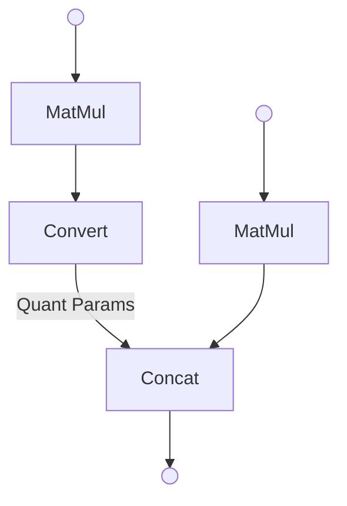
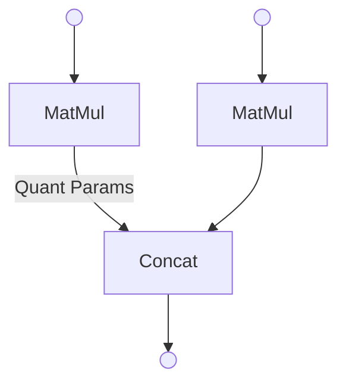
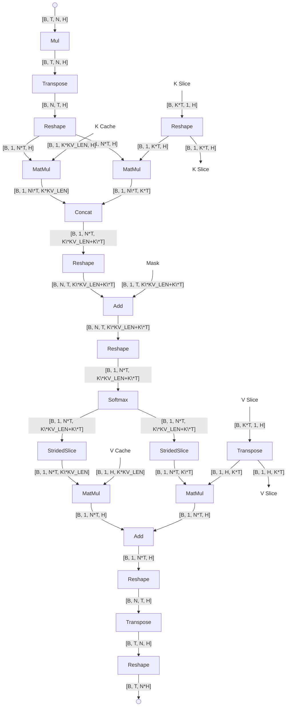
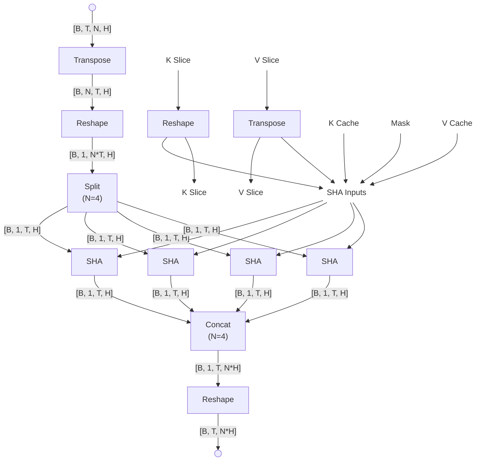
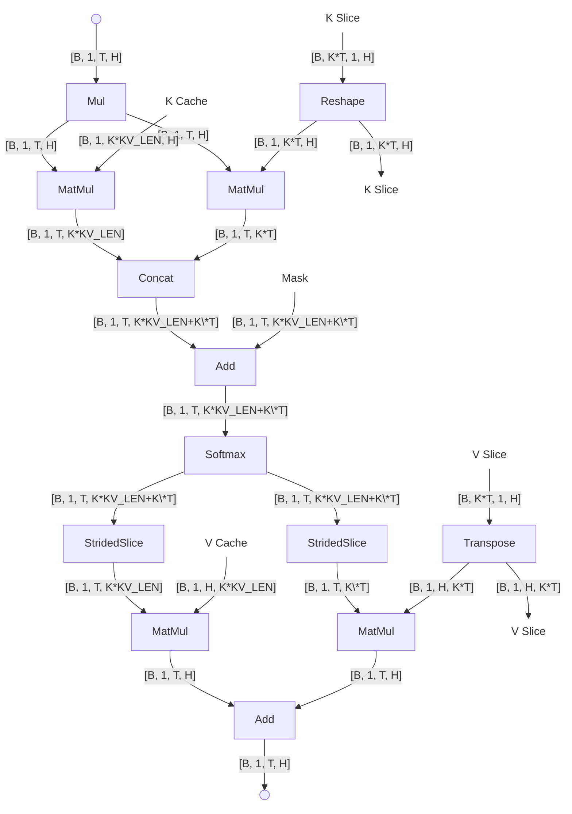
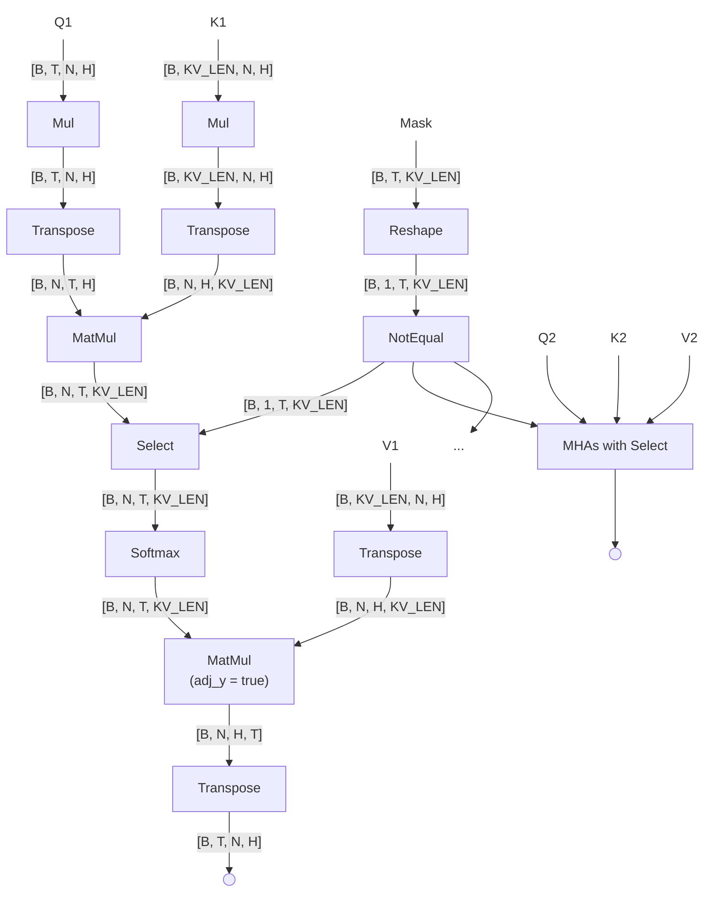
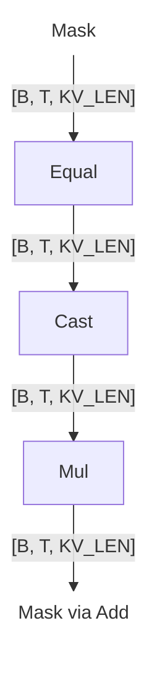
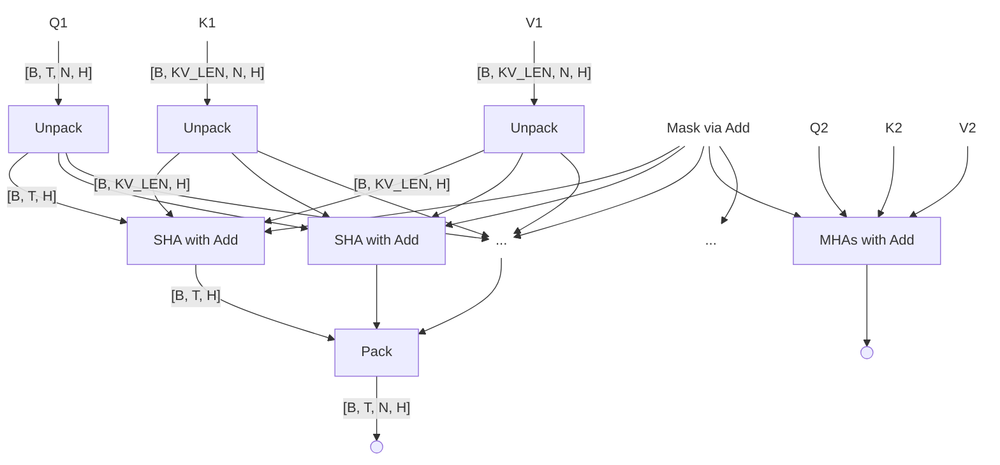
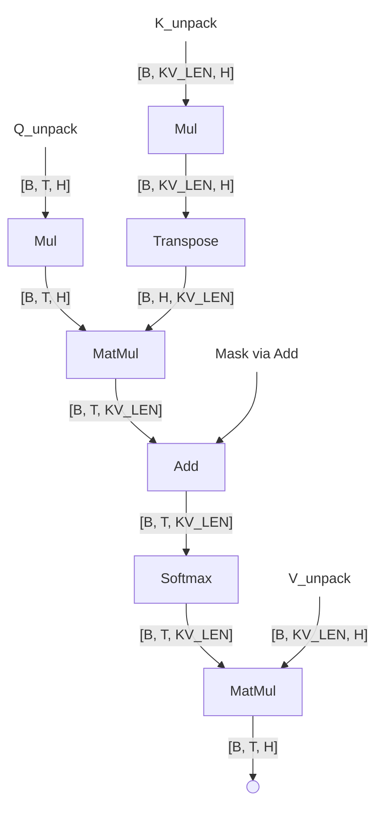

# Graph-to-graph Transformation
## Matmul-convert Fusion
Original graph:

The updated computational graph after the transformation is shown below.

## Multi-head Attention Optimization
| Dimension	 | Description	   | Example (Gemma3 1B)           |
|:-----------|----------------:|------------------------------:|
| B          | Batch size      | 1                             |
| T          | Sequence length | 128 for prefill/ 1 for decode |
| N          | Number of heads | 4                             |
| K          | Number KV heads | 1                             |
| H          | Head size       | 256                           |
| KV_LEN     | KV Cache Length | 1280                          |
* Notation reference: [AI Edge Torch](https://github.com/google-ai-edge/ai-edge-torch)

### Gemma3 (Prefill)
Original MHA (Multi-head Attention) in Gemma3 prefill graph

The updated computational graph after the transformation is shown below.

with the following four SHA (Single-head Attention), based on the number of heads in MHA.

### Multi-head Attention with MaskedSoftmax via Select
The figure below shows multi-head attention with `MaskedSoftmax` implemented using `Select`. All MHAs with `Select` share the same structure and use the same `NotEqual` output as input to their `Select` operations.

The `Reshape → NotEqual → Select` pattern can be optimized through the following operations. It is important to note that the mask produced by the `Mul` operation is reused by all subsequent SHAs involving `Add` for `MaskedSoftmax`.

With `Mask via Add`, the overall multi-head attention can be transformed to the following SHAs

with `SHA with add` below.
