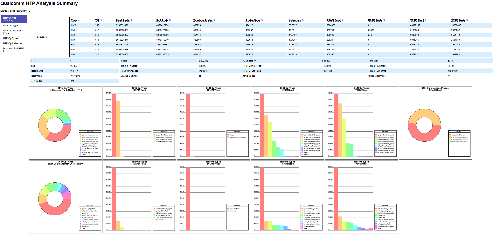
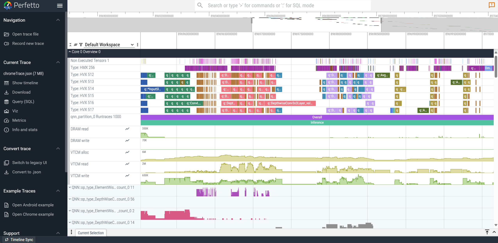

# QC LiteRt Debug Tools

## Overview

QAIRT provides a set of serial tools that help users optimize their graphs. This
page explains how to use these tools, integrated with a Python script and
LiteRt, to identify performance bottlenecks or accuracy issues.

## QNN HTP Optrace Profiling

`run_optrace_profiling.py` help identify NPU performance bottlenecks using QNN HTP Analysis Summary (QHAS).

### Usage

To run LiteRT compilation and QAIRT profiling tools, execute the following
command:
```
python3 run_optrace_profiling.py \
        --model path/to/model.tflite \
        --soc_model <SoC model, e.g., SM8650> \ 
        --hostname <hostname> \
        --serial <serial number> \
        --htp_arch <HTP architecture, e.g., V75> \
        --output_dir path/to/output_dir
```

The `path/to/output_dir` directory contains a QNN HTP Analysis Summary (QHAS)
HTML file and a Chrometrace JSON file.

*   `chromeTrace_qnn_htp_analysis_summary.html` 
*   `chromeTrace.json` on [Perfetto](https://www.ui.perfetto.dev/)
    

> [!NOTE]
> There may be duplicate analysis results because the dependent tool `extract_bytecode` in `litert/tools` generates a context binary for each graph, while `run_optrace_profiling.py` analyzes all graphs in the context binaries directly. To avoid duplicate analysis, use the `--ctx_bins` option to specify the context binary generated by extract_bytecode.

## Accuracy Debugger

`run_acc_debugger.py` compares NPU per-layer outputs with CPU per-layer outputs.

### Usage

Generate input files in `.npy` format and store them in `input_dir`. Each file should be named using the pattern `<tensor_index>.npy`.

To run LiteRT compilation and analyze accuracy issues, execute the following
command:
```
python3 run_acc_debugger.py \
        --model path/to/model.tflite \
        --soc_model <SoC model, e.g., SM8650> \ 
        --hostname <hostname> \
        --serial <serial number> \
        --htp_arch <HTP architecture, e.g., V75> \
        --output_dir path/to/output_dir \
        --input_dir path/to/input_dir
```

This script will generate CSV and JSON output files:
- CSV: for parsing or sorting tensor indices and metrics
- JSON: for uploading to Model Explorer (see [linked documentation](https://github.com/google-ai-edge/model-explorer/wiki/2.-User-Guide#custom-node-data) for details)
  

## Tools Reference

*   [QNN HTP Optrace Profiling](https://docs.qualcomm.com/bundle/publicresource/topics/80-63442-50/htp_backend.html#qnn-htp-optrace-profiling)
*   [qnn-net-run](https://docs.qualcomm.com/bundle/publicresource/topics/80-63442-50/tools.html#qnn-net-run)
*   [qnn-profile-viewer](https://docs.qualcomm.com/bundle/publicresource/topics/80-63442-50/tools.html#qnn-profile-viewer)
*   [qnn-context-binary-utility](https://docs.qualcomm.com/bundle/publicresource/topics/80-63442-50/tools.html#qnn-context-binary-utilityqnn-context-binary-utility)
