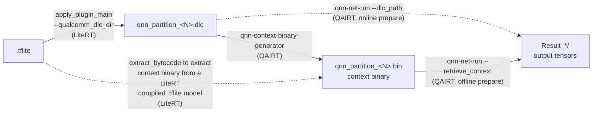

# LiteRT Compile + QNN Native Execution

This page walks through compiling a `.tflite` model with LiteRT into a Qualcomm
**DLC** (Deep Learning Container) and then running that graph **natively** with
the QAIRT native tools (`qnn-context-binary-generator`, `qnn-net-run`) on the
x86 host and on an Android (aarch64) device. Use it when you want to run a model
through the QNN native path but still benefit from LiteRT's compile-time graph
optimizations: LiteRT lowers the `.tflite` to a `.dlc`, and from there the
standard QNN tools take over.



| Step | Tool | Owner | Input | Output | Notes |
| ---- | ---- | ----- | ----- | ------ | ----- |
| 1 | `apply_plugin_main --qualcomm_dlc_dir` | LiteRT | `.tflite` | `qnn_partition_<N>.dlc` | Compiles the graph into a `.dlc`. |
| 2 | `qnn-context-binary-generator` *or* `extract_bytecode` | QAIRT *or* LiteRT | `.dlc` (from step 1) *or* a LiteRT-compiled `.tflite` ([HTP_INSTRUCTIONS.md](./HTP_INSTRUCTIONS.md)) | `qnn_partition_<N>.bin` (context binary) | Two ways to reach the same context binary. The `extract_bytecode` path skips step 1 if you already have a LiteRT-compiled `.tflite`. |
| 3 | `qnn-net-run` | QAIRT | context binary (`--retrieve_context`) or `.dlc` (`--dlc_path`) | `Result_*/` (output tensors) | Run the pre-built binary (solid path), or prepare the `.dlc` online (dotted path). |

Once LiteRT has compiled the `.dlc`, the whole QNN/QAIRT toolchain is open to
you: the `.dlc` is a standard Qualcomm artifact, so in principle every QNN
feature applies, including any backend (CPU / GPU / HTP / DSP), quantization,
graph inspection, context-binary caching, profiling, weight sharing, and custom
op packages. This page covers only the run path above. For everything else the
QNN tools can do with a `.dlc`, see the official QNN documentation:
<https://docs.qualcomm.com/doc/80-63442-10/topic/index_QNN.html>.

--------------------------------------------------------------------------------

## Prerequisites

Before you start, make sure the toolchain in
[PREREQUISITES.md](./PREREQUISITES.md) is installed and the QNN concepts and
libraries in [QAIRT_SDK.md](./QAIRT_SDK.md) are understood.

The commands below refer to the following `${}` variables. Configure them for
your environment before running any step.

Variable                | Description
----------------------- | -----------
`${LITERT}`             | The path of the LiteRT source code.
`${QAIRT}`              | The root of the unzipped QAIRT SDK (holds `bin/`, `lib/`). For example `${LITERT}/third_party/qairt/latest`.
`${SOURCE_MODEL_PATH}`  | The input `.tflite` model to compile.
`${DLC_DIR}`            | Host directory where LiteRT writes the `.dlc` files (also used here to hold the raw input tensors and input list).
`${SOC_MODEL}`          | Target SoC, e.g. `SM8850`.
`${HTP_ARCH}`           | HTP architecture of `${SOC_MODEL}`. Used in two casings: uppercase in QNN library names (`${HTP_ARCH}` = `V81`) and lowercase in the `hexagon-vXX` directory name (`${HEXAGON_ARCH}` = `v81`). See [QAIRT_SDK.md → Hexagon Arch](./QAIRT_SDK.md#hexagon-arch) for how to look this up.
`${TEST_FOLDER}`        | Working directory on the device, e.g. `/data/local/tmp/qnn_native`. Only needed for the [Android device run](#android-device-aarch64).
`${COMPILED_MODEL_PATH}` | A `.tflite` produced by a LiteRT compile (`apply_plugin`, no `--qualcomm_dlc_dir`). Only needed for the [extract_bytecode path](#from-a-litert-compiled-tflite-with-extract_bytecode) in §2.
`${EXTRACTED_BYTECODE_DIR}` | Output directory for the extracted context binaries. Only needed for the [extract_bytecode path](#from-a-litert-compiled-tflite-with-extract_bytecode) in §2.

LiteRT names each compiled partition `qnn_partition_0`, `qnn_partition_1`, … The
examples below use `qnn_partition_0` (a single-partition model). Substitute the
relevant partition name if your model splits into several.

--------------------------------------------------------------------------------

## 1. Compile the .tflite to a .dlc with LiteRT

`--qualcomm_dlc_dir=<dir>` makes LiteRT switch to the QNN **IR Backend** at
compile time and serialize each composed graph to a `.dlc` in that directory.
The flag takes a **directory**. If empty (the default), the feature is off.

```bash
cd ${LITERT}

bazel build -c opt --cxxopt=--std=c++17 --nocheck_visibility //litert/tools:apply_plugin_main
bazel build -c opt --cxxopt=--std=c++17 --nocheck_visibility //litert/vendors/qualcomm/compiler:qnn_compiler_plugin_so

export LD_LIBRARY_PATH=${QAIRT}/lib/x86_64-linux-clang
bazel-bin/litert/tools/apply_plugin_main \
  --cmd apply \
  --model ${SOURCE_MODEL_PATH} \
  --soc_manufacturer Qualcomm --soc_model ${SOC_MODEL} \
  --libs bazel-bin/litert/vendors/qualcomm/compiler \
  -o ${DLC_DIR}/ir_backend_out.tflite \
  --qualcomm_dlc_dir ${DLC_DIR}
```

This writes **one `qnn_partition_<N>.dlc` per partition** into `${DLC_DIR}`. A
model that LiteRT splits into multiple NPU partitions yields multiple `.dlc`
files (one per QNN graph). A single-partition model yields just
`qnn_partition_0.dlc`. Run / inspect each `.dlc` separately in the steps below.

The LiteRT `.dlc` is already a **composed, quantized** graph. Do **not** run it
through `snpe-*-to-dlc` or `snpe-dlc-quantize`. Those steps (seen in generic
QAIRT tutorials) convert a float ONNX/TF source into a DLC and do not apply here.
Start directly from the `.dlc` LiteRT compiled.

> **`--libs` must point at `bazel-bin/`, not the source tree.** The plugin `.so`
> lives under `bazel-bin/litert/vendors/qualcomm/compiler/` after the build
> above. Passing the source path makes `apply_plugin_main` find no `.so`, log
> `Loaded 0 plugins`, and fail at `Select Plugin` with no obvious error.
> (Invoking through `bazel run //litert/tools:apply_plugin_main` instead stages
> the plugin in runfiles. The standalone binary above needs the explicit
> `bazel-bin` path.)

> ⚠️ **Backend override side effect.** When `--qualcomm_dlc_dir` is non-empty, the
> compiler forces the backend to the IR Backend (a warning is logged). The
> resulting `-o` `.tflite` reflects IR-Backend semantics, **not** HTP/CPU/GPU
> execution. This flag is for artifact extraction, not for producing a
> deployable model.

--------------------------------------------------------------------------------

## 2. Build a context binary

For HTP you typically pre-build a **context binary** once and run it on device.
This moves the (slow) graph-prepare step off the device's critical path. There
are two ways to produce the same `.bin`.

| Source you have | Tool | Owner | When to use |
| --------------- | ---- | ----- | ----------- |
| `.dlc` from step 1 | `qnn-context-binary-generator` | QAIRT | You went through step 1 specifically to emit a `.dlc`. |
| A LiteRT-compiled `.tflite` (no `--qualcomm_dlc_dir`) | `extract_bytecode` | LiteRT | You already have a LiteRT-compiled model and want the embedded context binary, no need to recompile. |

### From a .dlc with qnn-context-binary-generator

Use this when you produced a `.dlc` in step 1.

```bash
${QAIRT}/bin/x86_64-linux-clang/qnn-context-binary-generator \
  --backend     ${QAIRT}/lib/x86_64-linux-clang/libQnnHtp.so \
  --model       ${QAIRT}/lib/x86_64-linux-clang/libQnnModelDlc.so \
  --dlc_path    ${DLC_DIR}/qnn_partition_0.dlc \
  --binary_file qnn_partition_0
```

`--backend` is the QNN backend the context is prepared for (`libQnnHtp.so`).
`--model libQnnModelDlc.so` is the generic **DLC loader** library (required to
read a `.dlc`, not your graph). The output lands at
`./output/qnn_partition_0.bin` by default.

You can skip this step entirely and let `qnn-net-run` prepare the `.dlc` online
(see the x86 host run in §3), but for device HTP runs the pre-built context
binary is the common path.

### From a LiteRT-compiled .tflite with extract_bytecode

Use this when you already have a `.tflite` **compiled by LiteRT**
(`apply_plugin` output, no `--qualcomm_dlc_dir`). See
[HTP_INSTRUCTIONS.md](./HTP_INSTRUCTIONS.md) for how to produce one. Such a
`.tflite` already embeds the QNN context binary inside its dispatch op, so step
1 is not needed.

Build with Bazel:

```bash
cd ${LITERT}

bazel build -c opt --cxxopt=--std=c++17 --nocheck_visibility //litert/tools:extract_bytecode

bazel-bin/litert/tools/extract_bytecode \
  --model_path ${COMPILED_MODEL_PATH} \
  --output_dir ${EXTRACTED_BYTECODE_DIR}
```

Or with CMake:

```bash
cd ${LITERT}/litert

cmake --build cmake_build --target extract_bytecode -j8

cmake_build/tools/extract_bytecode \
  --model_path ${COMPILED_MODEL_PATH} \
  --output_dir ${EXTRACTED_BYTECODE_DIR}
```

`${COMPILED_MODEL_PATH}` is a `.tflite` from a LiteRT compile (see
[HTP_INSTRUCTIONS.md](./HTP_INSTRUCTIONS.md)). The tool writes one
`<name>_<index>.bin` per dispatch op into `${EXTRACTED_BYTECODE_DIR}`. Feed each
`.bin` to `qnn-net-run --retrieve_context` exactly as in §3.

--------------------------------------------------------------------------------

## 3. Run natively with qnn-net-run

`qnn-net-run` loads the graph in two ways: from a `.dlc` (online prepare) or
from a pre-built context binary (offline prepare). **Both work on both x86 and
Android.** The choice is about *when* the graph is prepared, not *where* it
runs. The x86 and device sections below are example environments, not a
restriction.

| Input flag | Prepare | Typical use |
| ---------- | ------- | ----------- |
| `--dlc_path <dlc>` (with `--model libQnnModelDlc.so`) | Online, at load | Convenient on the host |
| `--retrieve_context <bin>` | Offline (step 2), pre-built | On-device HTP, to skip the slow prepare at run |

Also pass these so raw tensors keep the graph's **native** dtype. Without them
`qnn-net-run` reads inputs as float32 and writes float32 outputs, silently
misreading a quantized (`uint8` / `int8`) graph.

| Flag | Effect |
| ---- | ------ |
| `--use_native_input_files` | Read input `.raw` in the graph's native dtype |
| `--use_native_output_files` | Write output `.raw` in the graph's native dtype |

### x86 host

Use `libQnnHtp.so` for the HTP x86 reference, or `libQnnCpu.so` for a pure-CPU
reference run. This example prepares the `.dlc` online. To run a pre-built
context binary instead, replace `--model ... --dlc_path ...` with
`--retrieve_context ${DLC_DIR}/qnn_out/qnn_partition_0.bin`.

```bash
${QAIRT}/bin/x86_64-linux-clang/qnn-net-run \
  --backend    ${QAIRT}/lib/x86_64-linux-clang/libQnnHtp.so \
  --model      ${QAIRT}/lib/x86_64-linux-clang/libQnnModelDlc.so \
  --dlc_path   ${DLC_DIR}/qnn_partition_0.dlc \
  --input_list ${DLC_DIR}/input_list.txt \
  --output_dir ${DLC_DIR}/qnn_out \
  --use_native_input_files --use_native_output_files
```

Outputs are written under `--output_dir` (default `./output`), one `Result_N/`
per inference line in the input list. See [§4](#4-inputs-and-outputs) for the
input / output file formats.

### Android device (aarch64)

The example uses **`${HTP_ARCH}` = `V81`** (SM8850). Substitute the values for
your SoC from the Prerequisites table. It runs the pre-built context binary from
step 2. To prepare the `.dlc` online on device instead, push the `.dlc` and swap
`--retrieve_context ./qnn_partition_0.bin` for
`--model ./libQnnModelDlc.so --dlc_path ./qnn_partition_0.dlc`.

```bash
adb shell "mkdir -p ${TEST_FOLDER}"

# Tool + DLC loader + backend (ARM side)
adb push ${QAIRT}/bin/aarch64-android/qnn-net-run                  ${TEST_FOLDER}/
adb push ${QAIRT}/lib/aarch64-android/libQnnModelDlc.so            ${TEST_FOLDER}/
adb push ${QAIRT}/lib/aarch64-android/libQnnHtp.so                 ${TEST_FOLDER}/
adb push ${QAIRT}/lib/aarch64-android/libQnnHtp${HTP_ARCH}Stub.so  ${TEST_FOLDER}/
adb push ${QAIRT}/lib/aarch64-android/libQnnHtpPrepare.so          ${TEST_FOLDER}/
adb push ${QAIRT}/lib/aarch64-android/libQnnSystem.so              ${TEST_FOLDER}/

# DSP-side skel (unsigned build for a dev device)
adb push ${QAIRT}/lib/hexagon-${HEXAGON_ARCH}/unsigned/libQnnHtp${HTP_ARCH}Skel.so ${TEST_FOLDER}/

# Artifacts: context binary (from step 2) + inputs
adb push ./output/qnn_partition_0.bin        ${TEST_FOLDER}/
adb push ${DLC_DIR}/input0.raw        ${TEST_FOLDER}/
adb push ${DLC_DIR}/input_list.txt    ${TEST_FOLDER}/

adb shell "
  cd ${TEST_FOLDER}
  LD_LIBRARY_PATH=${TEST_FOLDER} ADSP_LIBRARY_PATH=${TEST_FOLDER} \
  ./qnn-net-run \
    --backend          ./libQnnHtp.so \
    --retrieve_context ./qnn_partition_0.bin \
    --input_list       ./input_list.txt \
    --output_dir       ./qnn_out \
    --use_native_input_files --use_native_output_files"

adb pull ${TEST_FOLDER}/qnn_out ./qnn_out_device
```

- `LD_LIBRARY_PATH` must include the ARM-side libs. `ADSP_LIBRARY_PATH` must
  include the dir holding the Hexagon skel.
- The `input_list.txt` pushed to the device must contain **on-device** paths
  (e.g. `${TEST_FOLDER}/input0.raw`), not host paths.

> Verified end-to-end on an SM8850 (Hexagon v81): the device HTP output matched
> the x86 HTP output exactly for the same input. The push manifest above is the
> exact set of libraries needed, no more and no less.

--------------------------------------------------------------------------------

## 4. Inputs and outputs

**`--input_list`** is plain text, one inference per line. Each line lists the
raw input file(s) for that inference, space-separated, one entry per graph
input. Use **absolute paths** (relative paths resolve against the tool's working
dir, which differs on device).

```
/abs/path/inputs/input0_0.raw
/abs/path/inputs/input0_1.raw
```

Each `.raw` is the raw little-endian bytes of one input tensor in the graph's
expected dtype and layout (e.g. quantized `uint8` / `int8`, or `float32`). This
is the format the native-dtype flags in [§3](#3-run-natively-with-qnn-net-run)
expect. Inspect the expected I/O with `qairt-dlc-info`
([§5](#5-inspecting-a-dlc-and-further-reading)) to get each tensor's exact
shape and dtype, then write a matching `.raw`. For example, for a
`float32 [1,64,128]` input:

```bash
python3 -c "import numpy as np; \
  np.random.rand(1,64,128).astype(np.float32).tofile('${DLC_DIR}/input0.raw')"
echo ${DLC_DIR}/input0.raw > ${DLC_DIR}/input_list.txt
```

`qnn-net-run` writes one subdirectory per inference under `--output_dir`
(`Result_0/`, `Result_1/`, …), each holding one `.raw` per output tensor (named
after the graph output, e.g. `StatefulPartitionedCall_0.raw`). For accuracy
validation, run the **same** input through two paths and diff the output `.raw`.
The x86 HTP run and the device HTP run should match closely. The x86
`libQnnCpu.so` run or LiteRT's `npu_numerics_check` give an independent CPU
reference.

--------------------------------------------------------------------------------

## 5. Inspecting a .dlc and further reading

The `qairt-dlc-*` inspection tools are Python and need the SDK's Python modules
on `PYTHONPATH` (otherwise they fail with `No module named 'qti'`):

```bash
export PYTHONPATH=${QAIRT}/lib/python:$PYTHONPATH

qairt-dlc-info    -i ${DLC_DIR}/qnn_partition_0.dlc   # graph structure, tensor shapes,
                                               # dtypes, quantization encodings,
                                               # and the network input/output list
qairt-dlc-to-json -i ${DLC_DIR}/qnn_partition_0.dlc   # dump the .dlc to JSON
```

Use the input/output table `qairt-dlc-info` prints to get each input's exact
name, dimensions, and dtype before writing the `.raw` files in
[§4](#4-inputs-and-outputs).

For deeper QNN-side detail, the QAIRT SDK docs (under
`${QAIRT}/docs/QAIRT-Docs/`) include the "Utilizing DLCs" tutorial
(`QNN/general/tutorial5.html`) and the full tool reference
(`QNN/general/tools.html`).

> The newer QAIRT wrappers `qairt-net-run` / `qairt-dlc-prepare` cover the same
> flow (see `QAIRT-API/migration-guide.html`). This page uses the `qnn-*` tools,
> which are the most widely documented.
