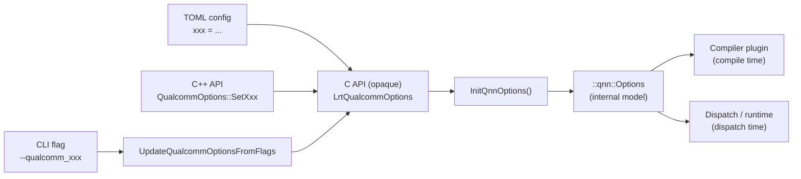
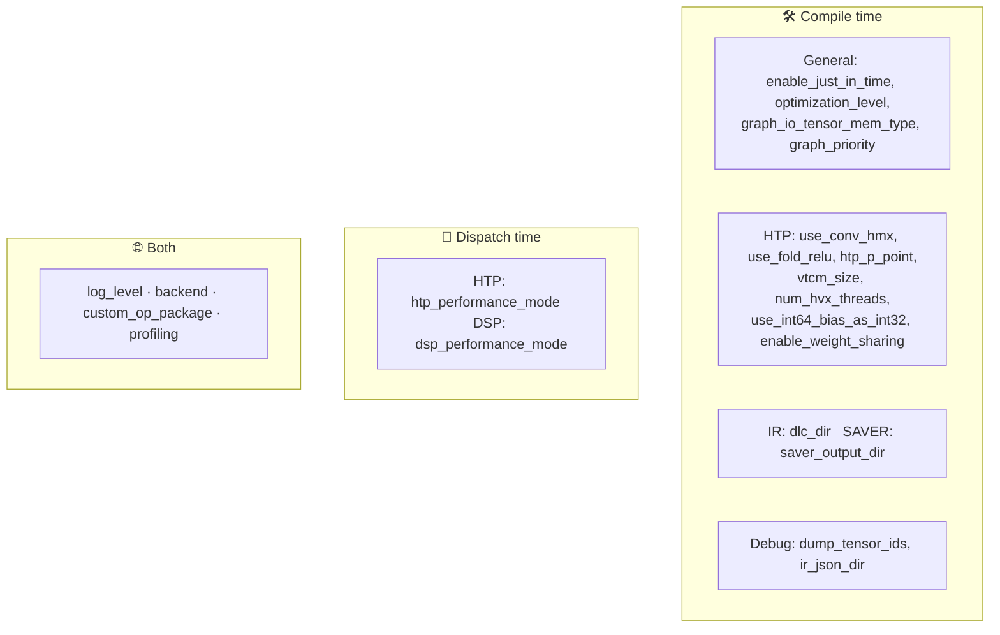

# LiteRT Qualcomm Options Reference

A friendlier, more complete reference than `--help` for every user-settable
Qualcomm (`--qualcomm_*`) option in LiteRT. Covers what each option does, its
valid values and default, **when** it takes effect (compile time vs. dispatch
time), **which backend** it applies to, and how to set it from each surface (CLI
flag, TOML config, C API, C++ API).

> Every option here is publicly settable — exposed as a CLI flag with a matching
> TOML key and C / C++ API. Internal-only knobs that have no public surface are
> omitted, since you cannot set them.

---

## 1. How an option flows through the stack



Every option ultimately lands in the internal `::qnn::Options` object, which is
consumed at two distinct moments:

| Phase | Who reads it | Examples |
|-------|--------------|----------|
| **Compile time** | Compiler plugin (`apply_plugin_main`, AOT / JIT graph build) | `use_conv_hmx`, `optimization_level`, `vtcm_size`, `graph_priority` |
| **Dispatch time** | Runtime dispatcher (on-device execution) | `htp_performance_mode` |

(`profiling` is read at both compile and dispatch time.)

---

## 2. Categories at a glance

| Category | Options |
|----------|---------|
| **General / SDK** | `log_level`, `backend`, `graph_priority`, `custom_op_package`, `enable_just_in_time`, `optimization_level`, `graph_io_tensor_mem_type`, `profiling` |
| **HTP** | `use_conv_hmx`, `use_fold_relu`, `htp_p_point`, `htp_performance_mode`, `vtcm_size`, `num_hvx_threads`, `use_int64_bias_as_int32`, `enable_weight_sharing` |
| **DSP** | `dsp_performance_mode` |
| **IR** | `dlc_dir` |
| **SAVER** | `saver_output_dir` |
| **Debug** | `dump_tensor_ids`, `ir_json_dir` |

### A note on surfaces

Every option in the tables below is settable from **all four surfaces** — CLI
flag, TOML key, C API, and C++ API. The tables list the CLI flag name; the TOML
key and the C / C++ setters follow the same name (see §11 for examples), with
**two exceptions** where the TOML key differs from the flag:

| CLI flag | TOML key |
|----------|----------|
| `--qualcomm_backend` | `qnn_backend` |
| `--qualcomm_num_hvx_thread` | `num_hvx_threads` |

The deprecated options in §9 are retired no-ops.

The **Phase** column says when the option is consumed: `compile` (compiler
plugin / `apply_plugin_main`), `dispatch` (on-device runtime / `run_model`), or
`both`.

---

## 3. General / SDK options

| Option | CLI flag (`--qualcomm_…`) | Default | Phase | Values / notes |
|--------|------|---------|-------|----------------|
| Log level | `log_level` | `info` | both | `off` · `error` · `warn` · `info` · `verbose` · `debug`. SDK libs only — not LiteRT's own logging. |
| Backend | `backend` | `htp` | both | `gpu` · `htp` · `dsp` · `ir`. **TOML key: `qnn_backend`.** |
| Graph priority | `graph_priority` | `default` | compile | `default` · `low` · `normal` · `normal_high` · `high`. `default` = `QNN_PRIORITY_DEFAULT` (= NORMAL). Applied at graph creation (`QNN_GRAPH_CONFIG_OPTION_PRIORITY`). |
| Just-In-Time | `enable_just_in_time` | `false` | compile | Pass QNN context plugin→dispatcher in-memory, skipping finalization + serialization. |
| Optimization level | `optimization_level` | `O3` | compile | `O1` (inference) · `O2` (prepare) · `O3` (inference, aggressive). |
| Graph I/O mem type | `graph_io_tensor_mem_type` | `memhandle` | compile | `raw` · `memhandle`. Mem type for graph I/O tensors at graph-creation. |
| Profiling | `profiling` | `off` | both | `off` · `basic` · `detailed` · `linting` · `optrace`. Higher = more detailed report. Read at compile (context creation) and dispatch (graph execution). |
| Custom op package | `custom_op_package` | *(empty)* | both | See note below. |

### `custom_op_package` details

Registers a custom QNN op package. The value is a `;`-separated list of
`key:value` pairs, with these keys:

| Key | Meaning |
|-----|---------|
| `name` | Op package name |
| `interface_provider` | Interface provider symbol |
| `compile_package_path` | `.so` used at compile time |
| `dispatch_package_path` | `.so` used at dispatch time |
| `target` | QNN backend — **must** match `backend` (`HTP`, `GPU`, …) |

```bash
--qualcomm_custom_op_package="\
name:TestPackage;\
interface_provider:Provider;\
compile_package_path:libQnnTestPackage.so;\
dispatch_package_path:libQnnTestPackage.so;\
target:HTP"
```

---

## 4. HTP options

| Option | CLI flag (`--qualcomm_…`) | Default | Phase | Values / notes |
|--------|------|---------|-------|----------------|
| Short Conv HMX | `use_conv_hmx` | `true` | compile | Faster, but short-depth / non-symmetric weights may be inaccurate. |
| Fold ReLU | `use_fold_relu` | `true` | compile | Faster. Correct only when conv's quant range ⊆ the ReLU's. |
| P-point | `htp_p_point` | `0` | compile | **Experimental** (HTP + `O3` only). Predefined configs trading latency vs. DRAM bandwidth. |
| HTP perf mode | `htp_performance_mode` | `default` | dispatch | `default` · `sustained_high_performance` · `burst` · `high_performance` · `power_saver` · `low_power_saver` · `high_power_saver` · `low_balanced` · `balanced` · `extreme_power_saver`. |
| VTCM size | `vtcm_size` | `0` (=max) | compile | VTCM size (MB) of target device. `0` → device max. |
| HVX threads | `num_hvx_thread` | `0` (=max) | compile | HVX threads for target device. `0` → device max. **TOML key: `num_hvx_threads` (plural).** |
| INT64→INT32 bias | `use_int64_bias_as_int32` | `true` | compile | Convert FullyConnected/Conv2D bias int64 → int32. |
| Weight sharing | `enable_weight_sharing` | `false` | compile | Subgraphs share weight tensors. **x86 AOT only** — unsupported on mobile. |

---

## 5. DSP options

| Option | CLI flag (`--qualcomm_…`) | Default | Phase | Values / notes |
|--------|------|---------|-------|----------------|
| DSP perf mode | `dsp_performance_mode` | `default` | dispatch | Same as `htp_performance_mode` but **no** `extreme_power_saver`. |

---

## 6. IR options

QNN intermediate-representation dumps — diagnostic artifacts emitted at compile time.

| Option | CLI flag (`--qualcomm_…`) | Default | Phase | Values / notes |
|--------|------|---------|-------|----------------|
| DLC dir | `dlc_dir` | *(empty)* | compile | If set, emit QNN graphs as DLC to this dir. |

---

## 7. SAVER options

| Option | CLI flag (`--qualcomm_…`) | Default | Phase | Values / notes |
|--------|------|---------|-------|----------------|
| Saver output dir | `saver_output_dir` | *(empty)* | compile | If set, emit `saver_output.c` + `params.bin` (records all QNN API calls for replay). See QAIRT SDK docs. |

---

## 8. Debug options

| Option | CLI flag (`--qualcomm_…`) | Default | Phase | Values / notes |
|--------|------|---------|-------|----------------|
| Dump tensor IDs | `dump_tensor_ids` | *(empty)* | compile | Comma-separated tensor IDs to mark as extra graph outputs (per-layer dump for the accuracy debugger). `-1` = dump all op outputs. |
| IR JSON dir | `ir_json_dir` | *(empty)* | compile | If set, emit QNN IR as QNN JSON to this dir. |

---

## 9. Deprecated / retired options ⚠️

These remain as **no-ops** purely to preserve the C ABI contract. Setting them
does nothing.

| Option | CLI flag | C API | Status |
|--------|----------|:-----:|--------|
| `use_htp_preference` | `--qualcomm_use_htp_preference` (retired) | ⚠️ no-op | Transform a LiteRT op into the HTP-preferred pattern |
| `use_qint16_as_quint16` | `--qualcomm_use_qint16_as_quint16` (retired) | ⚠️ no-op | Auto-convert quantized int16 model → quint16 |

---

## 10. Quick lookup: phase × backend



---

## 11. Worked examples

> **Verification status.** All four surfaces are verified by unit tests:
> - **CLI** — manually run end-to-end, plus `//litert/tools/flags/vendors:qualcomm_flags_test`.
> - **C API, TOML round-trip, C++ wrapper** — all covered by
>   `//litert/c/options:litert_qualcomm_options_test` (the `SerializeAndParse`
>   helper sets each option via the C API, serializes to TOML, parses it back
>   with `LrtCreateQualcommOptionsFromToml`, and the `CppWrapper` test exercises
>   every C++ Set/Get). Both tests pass.

### CLI — `apply_plugin_main` (✅ verified)

```bash
apply_plugin_main \
    --cmd=apply \
    --model=model.tflite \
    --o=model_compiled.tflite \
    --qualcomm_backend=htp \
    --qualcomm_optimization_level=O3 \
    --qualcomm_use_conv_hmx=true \
    --qualcomm_vtcm_size=8 \
    --qualcomm_htp_performance_mode=burst \
    --qualcomm_profiling=detailed
```

The same `--qualcomm_*` flags also apply to `run_model` for the dispatch-time
options (e.g. `--qualcomm_htp_performance_mode`, `--qualcomm_profiling`).

CLI enum flags take the **string** spellings listed in each option's section
above (e.g. `burst`, `O3`, `detailed`).

### TOML config (✅ verified)

Unlike the CLI, the TOML parser reads enums as **integers** (the enum's
underlying value), *not* their string names — see the `ParseTomlInt` calls in
`litert/c/options/litert_qualcomm_options.cc`. Bools are `true`/`false`. This is
what `LrtCreateQualcommOptionsFromToml` consumes (and what the C API serializes).

```toml
# enum values are integers, see the enum tables in each section
log_level = 3              # info
qnn_backend = 2            # htp   (note the key is qnn_backend, not backend)
optimization_level = 2     # O3 == kOptimizeForInferenceO3
use_conv_hmx = true
vtcm_size = 8
htp_performance_mode = 2   # burst
profiling = 2              # detailed
```

### C++ API (✅ verified)

```cpp
#include "litert/cc/options/litert_qualcomm_options.h"

LITERT_ASSIGN_OR_RETURN(auto opts, litert::qualcomm::QualcommOptions::Create());
opts.SetBackend(litert::qualcomm::QualcommOptions::Backend::kHtp);
opts.SetOptimizationLevel(
    litert::qualcomm::QualcommOptions::OptimizationLevel::kOptimizeForInferenceO3);
opts.SetUseConvHMX(true);
opts.SetVtcmSize(8);
opts.SetHtpPerformanceMode(
    litert::qualcomm::QualcommOptions::HtpPerformanceMode::kBurst);
opts.SetProfiling(litert::qualcomm::QualcommOptions::Profiling::kDetailed);
```

### C API (✅ verified)

```c
#include "litert/c/options/litert_qualcomm_options.h"

LrtQualcommOptions opts;
LrtCreateQualcommOptions(&opts);
LrtQualcommOptionsSetBackend(opts, kLiteRtQualcommBackendHtp);
LrtQualcommOptionsSetOptimizationLevel(opts, kHtpOptimizeForInferenceO3);
LrtQualcommOptionsSetUseConvHMX(opts, true);
LrtQualcommOptionsSetVtcmSize(opts, 8);
LrtQualcommOptionsSetHtpPerformanceMode(
    opts, kLiteRtQualcommHtpPerformanceModeBurst);
LrtQualcommOptionsSetProfiling(opts, kLiteRtQualcommProfilingDetailed);
/* ... use opts ... */
LrtDestroyQualcommOptions(opts);
```
