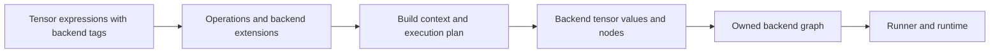

# Tensor backends

Backends translate LiteRT tensor expression graphs into a representation that
a runtime can execute. This tree contains the concrete XNNPACK and TFLite backends,
shared NNPACK graph-conversion infrastructure, and a reusable numerical test
framework. The [runner layer](../runners/README.md) manages execution and
runtime input/output buffers.

## Components

| Directory | Responsibility |
| --- | --- |
| [common_nnpack](common_nnpack/README.md) | Backend-independent graph state, tensor-to-value lookup, retained constant storage, an abstract build context, conversion traversal, inlining helpers, and shared numerical utilities. |
| [xnnpack](xnnpack/README.md) | XNNPACK operation extensions, tensor and quantization conversion, initialization, subgraph ownership, concrete lowering, and integration tests. |
| [tflite](tflite/BUILD) | Converts tensor expressions into TFLite FlatBuffer models; LiteRT runner adapters execute those models. |
| [testing](testing/README.md) | `TestBackendBridge` and `NumericalTestSuite`, which separate operator test expectations from backend initialization, graph building, input binding, execution, and output reads. |

Start with the concrete backend when investigating an operation's behavior.
Read the common infrastructure when changing value registration, storage, or
the build lifecycle. Read the testing framework when adding operator cases
that can be exercised through a backend bridge.

## How lowering works



Public builders in [arithmetic.h](../arithmetic.h) construct operations and
register the extensions selected by the tensor's mixin tags. For XNNPACK,
include its arithmetic header and use `Tensor<XnnpackMixinTag>` before
constructing expressions. Each implemented specialization supplies
`XnnpackOperation::ToXnnpack()` behavior on the operation.

`BuildXnnpackGraph(outputs)` discovers external values and creates an
`XnnpackBuildContext`. The shared conversion flow obtains a dependency-ordered
execution plan, initializes the context, and calls the concrete `LowerOp()`
hook for each operation. Lowerings define values and add backend nodes.
Finalization transfers the graph, its tensor mappings, and retained constant
storage to the caller. `XnnpackRunner::Create()` wraps this flow for callers
who want to execute the resulting graph.

Three boundaries help locate changes:

- The public tensor API and [graph internals](../internal/README.md) define
  expression structure, attributes, metadata inference, and backend extension
  registration.
- Build contexts translate that structure into backend values and nodes.
  Shared lookup returns a value-vector index; the value's `id` identifies it
  to the backend. Graph-owned buffers keep constant data valid after lowering.
- Runners create executable runtimes, bind external data, propagate runtime
  shapes, and invoke the backend. Threading and runtime caches belong there.

Successful expression construction does not establish backend support.
Extensions may be absent, a lowering may reject particular attributes or
datatypes, and runtime preparation can enforce additional constraints. The
XNNPACK README describes current restrictions and quantization paths; use its
numerical tests to validate a new path.

## Testing and extension points

| Change | Relevant tests |
| --- | --- |
| Shared conversion or numerical helper behavior | `common_nnpack` conversion and utility tests. |
| XNNPACK value metadata or an operation's lowering | `xnnpack` conversion and arithmetic tests. |
| Operator results across backend adapters | The shared numerical suite, instantiated by `xnnpack_conversion_numerical_test.cc`. |
| Runtime input/output handling or invocation lifecycle | The [runner tests](../runners/README.md). |

The numerical bridge uses status results to distinguish unsupported operations
from execution failures. Some cases skip when an operation is unavailable,
and the XNNPACK quantized fully connected case is explicitly skipped for known
numerical issues. Inspect skips as well as the target's overall result when
assessing coverage. The numerical bridge suite is separate from the reusable
`NnpackRunnerTest` suite in the runner directories.

To extend XNNPACK, add its operation specialization and lowering, then add
numerical and rejection cases. A new backend needs graph conversion, operation
extensions, and an execution adapter; it can use the common build context when
that value/graph model fits. Add a `TestBackendBridge` implementation and typed
suite instantiation to exercise the reusable numerical tests.

## Build and test

The child directories contain the Bazel packages. Run from the repository root
using the repository's Bazelisk setup:

```sh
bazelisk build //tensor/backends/...
bazelisk test //tensor/backends/... --test_output=errors
```

The common NNPACK package has visibility within `//tensor` and its
subpackages. XNNPACK libraries have public visibility. The testing package's
`:numerical_test_suite` target is a test-only header library; the concrete
backend test executable instantiates and runs it.
