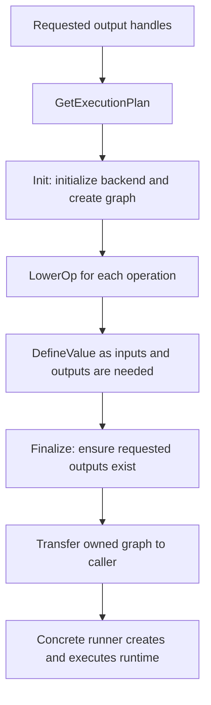

# Shared NNPACK graph conversion

This directory provides the graph representation and conversion machinery used
by NNPACK-style tensor backends. It connects LiteRT's
[expression graph](../../internal/graph.h) to backend value IDs and lowered
operations. The concrete [XNNPACK backend](../xnnpack/README.md) supplies the
backend API calls; the [shared runner](../../runners/common_nnpack/README.md)
consumes the resulting graph to manage runtime inputs, outputs, and execution.

Start with [graph.h](graph.h) for the stored state, then
`BuildNnpackGraph()` and `NnpackBuildContext` in
[conversion.h](conversion.h) and [conversion.cc](conversion.cc) for the build
lifecycle. This package itself has no dependency on XNNPACK's C API.

## Directory structure

| Files | Responsibility |
| --- | --- |
| [graph.h](graph.h), [graph.cc](graph.cc) | Define `NnpackValue`, the movable, non-copyable `NnpackGraph`, tensor lookup, and storage that preserves constant data. |
| [conversion.h](conversion.h), [conversion.cc](conversion.cc) | Define the abstract build context, common graph conversion, value registration and aliases, composite graph inlining, and an INT8-to-FP32 constant helper. |
| [utils.h](utils.h), [utils.cc](utils.cc) | Translate activation bounds, compute convolution padding, convert dimensions, and validate tensor types and constant weights. |
| [conversion_test.cc](conversion_test.cc) | Test dequantization, partial-graph traversal, and rejection of mismatched composite output counts. |
| [utils_test.cc](utils_test.cc) | Test activation bounds, padding and output adjustment, dimension conversion, and weight/type validation. |
| [BUILD](BUILD) | Define `:graph`, `:conversion`, and `:utils` libraries, plus the two test executables. Default visibility is limited to `//tensor` and its subpackages. |

## Graph state and ownership

`NnpackGraph` owns common state and has a virtual destructor so a concrete
subclass can also own backend resources.
[XnnpackGraph](../xnnpack/graph.h), for example, owns an `xnn_subgraph` with a
deleter that calls `xnn_delete_subgraph`.

| State | Meaning |
| --- | --- |
| `values()` | A vector of `NnpackValue` entries. Each contains copied tensor metadata in `info`, a backend `id`, role `flags`, and an optional `LockedBufferSpan<const std::byte>` in `data`. IDs initially default to `UINT32_MAX` until supplied or assigned by the backend. |
| `tensor_index()` | Maps a `graph::Tensor` to an index in `values()`. Multiple tensors can share one index through aliasing. |
| `external_outputs()` | The requested output tensors. The build context uses membership to assign output flags. |
| `constant_buffers()` | Owns byte copies made by `DefineConstant()`, including constants introduced by a lowering rather than an original tensor handle. |
| `dequantized_buffers()` | Owns FP32 arrays produced when a concrete backend needs to dequantize constants. |
| `fp16_buffers()` | Owns FP16 arrays; XNNPACK uses these for converted blockwise quantization scales. |
| `keep_alive_buffers()` | Retains shared buffer references used by backend conversion. XNNPACK adds buffers whose constant data it locks. |

The lookup path is:

```text
TensorHandle -> NnpackGraph::Lookup() -> index in values() -> NnpackValue::id
```

`Lookup()` returns a **vector index**, whereas `DefineValue()` returns a
**backend ID**. Do not substitute one for the other. Lookup uses the original
tensor's group identity and index, not its name or shape; an unknown handle
returns `NotFound`.

The tensor keys retain shared references to their underlying graph groups.
Copying `TensorInformation` copies its name and shape while retaining shared
references to its buffer and quantization metadata. Constant data locks and
owned conversion buffers remain with the graph after the build context gives
up ownership. A retained non-owning buffer still borrows its underlying memory;
see [buffer.h](../../buffer.h) for the buffer and lock contracts.

The mutable accessors expose this state directly. Code using them must preserve
the relationship between tensor indices, values, backend IDs, and data
lifetimes.

## Build lifecycle

A concrete entry point prepares the output handles and any explicit external
ID mapping, constructs its build context, calls `BuildNnpackGraph(ctx)`, and
then calls `ctx.Finalize()`. See
[BuildXnnpackGraph](../xnnpack/conversion.cc) for the implementation that assigns
contiguous external IDs to outputs and reachable runtime inputs.



The stages have distinct responsibilities:

1. `BuildNnpackGraph()` obtains a dependency-ordered operation list from
   [GetExecutionPlan](../../internal/graph_traversal.cc). That traversal shares
   operations across requested outputs and detects cycles.
2. `Init()` calls `EnsureInitialized()`, creates an empty graph, records the
   requested external outputs, and calls `CreateSubgraph()` with the external
   ID map's size and zero flags.
3. `BuildNnpackGraph()` calls `LowerOp()` for each operation. Lowerings normally
   call `DefineValue()` for their inputs and outputs before defining backend
   nodes. A lowering failure is returned with the operation and backend names
   added as context.
4. `Finalize()` defines any requested outputs not already encountered, then
   moves the graph into a `std::unique_ptr<NnpackGraph>` returned to the caller.
   This also handles outputs without a producer operation. `BuildNnpackGraph()`
   does not finalize or return the graph itself.

Treat the context as belonging to one build. `Init()` replaces its graph;
after successful `Finalize()`, it no longer owns one. A failed build can leave
partially registered values and backend nodes, so callers should discard that
context instead of treating the build as transactional.

### Defining values and constants

`DefineValue(tensor)` first returns the cached ID if the tensor already has an
index. Otherwise it reads the tensor metadata, copies any supplied external
ID, determines the role flags, and calls `DefineTensorValue()` to create the
backend value. The index and `NnpackValue` are stored after that hook succeeds.

A tensor is an external input when it has neither a buffer nor a producer.
Any requested output is an external output; the two flags can coexist. The
concrete hook decides how types, quantization, flags, and constant data become
backend values. In XNNPACK, non-external tensors with buffers are locked as
constants and the graph retains the buffer references.

`DefineConstant(data, bytes, datatype, shape)` copies the supplied bytes into
graph-owned storage, calls `DefineConstantTensor()`, and returns the new backend
ID. It does not create a tensor handle, a `tensor_index()` entry, or an entry in
`values()`. This is an extension helper for lowering-created constants; current
XNNPACK lowering code does not call it.

### Inlining an implementation graph

`InlineImplementationGraphFor()` lets a lowering express one operation through
a separate graph of simpler operations. It currently has no production caller
under `tensor`; it provides infrastructure for future composite
lowerings.

The helper checks boundary counts, aliases implementation outputs to the
original operation's outputs, and aliases valid implementation inputs to the
corresponding original inputs. `AliasValue(source, target)` makes the source
use the target's existing value index, defining the target first if needed;
it does not emit a copy operation.

`TopologicalSort()` then walks backward from the implementation outputs,
stopping at the supplied implementation inputs. It uses an explicit stack and
shared visited sets to emit dependency-ordered operations once across those
outputs. Unlike the main execution planner, this helper has no explicit cycle
check; implementation graphs must be acyclic. Each resulting operation is
passed to the same context's `LowerOp()` hook.

After successful lowering, the helper removes the implementation input and
output mappings. `RemoveTensor()` only erases a lookup entry: it does not
remove the corresponding backend value or vector entry. Other implementation
tensor mappings remain in the graph. Errors return immediately without
rolling back aliases or nodes already created.

## Backend hooks

A subclass of `NnpackBuildContext` implements the following contract:

| Hook | Responsibility |
| --- | --- |
| `BackendName()` | Supply the backend name used in conversion errors. |
| `FlagExternalInput()` / `FlagExternalOutput()` | Supply the role bits shared with the corresponding runner. |
| `EnsureInitialized()` | Initialize backend-wide resources or return a status. |
| `CreateEmptyGraph()` | Return a graph subclass that owns the backend's graph resources. A null result is rejected by `Init()`. |
| `CreateSubgraph(external_value_ids, flags)` | Create the backend subgraph with capacity for the requested external IDs. |
| `DefineTensorValue(tensor, value)` | Translate tensor metadata, define a backend value, and populate its ID and any retained constant lock. |
| `DefineConstantTensor(datatype, shape, data, id)` | Define a backend constant from storage already owned by the common graph. |
| `LowerOp(op)` | Dispatch and convert an operation, using the context to obtain value IDs and preserve storage. |

[XnnpackBuildContext](../xnnpack/conversion.h) implements these hooks.
Its `LowerOp()` dispatches through the operation's `XnnpackOperation` backend
extension; actual node definitions live in
[XNNPACK arithmetic lowering](../xnnpack/arithmetic.cc). Keep runtime creation,
buffer binding, and invocation in the
[runner layer](../../runners/common_nnpack/README.md).

## Shared numerical helpers

| Helper | Behavior and constraints |
| --- | --- |
| `DequantizeInt8ConstantTensor()` | Converts 2D signed INT8 weights to FP32, treating rows as output channels: `(value - zero_point[row]) * scale[row]`. Requires affine per-channel quantization and enough raw bytes; an empty zero-point vector means zero. It assumes sufficient scale and nonempty zero-point array lengths, and does not interpret `quantized_dimension` or validate the tensor type. Callers must provide the expected layout and metadata. |
| `GetActivationBounds()` | Returns clamp bounds for no activation, ReLU, ReLU6, or ReLU-N1-to-1. The default branch is unbounded. |
| `ComputePadding()` | Computes explicit SAME padding using input size, stride, and effective dilated kernel size, with any extra padding on the bottom/right. Returns zero padding for other modes. It does not validate convolution dimensions or strides. |
| `ComputeTransposeConvPadding()` | Computes SAME or VALID padding plus output adjustments. Rejects zero input dimensions or strides, outputs below the mode's base size, adjustments at least as large as the stride, and unsupported modes. |
| `ToNnpackDims()` | Converts signed dimensions to `size_t`, rejecting negatives. Zero dimensions pass through. The shared runner uses this for runtime input shapes. |
| `ValidateTensorType()` | Checks a tensor's type against an allowed set and includes the operation name in errors. |
| `ValidateFp32OrQuantizedConstantWeights()` | Requires a non-external tensor with a buffer and type FP32, I8, I4, or I2. It does not validate quantization parameters or promise that every backend operation accepts all of those types. |

The XNNPACK converter uses the INT8 dequantization helper for its per-channel
nonzero-zero-point fallback and retains the resulting array in
`dequantized_buffers()`. Other quantization representation choices remain in
the concrete backend.

## Extending and testing

Put backend-independent graph bookkeeping, traversal, and validation changes
here. Put backend data type decisions, API calls, and operation dispatch in the
concrete backend. New constant storage must remain valid for as long as the
backend graph or runtime can reference it.

Add focused cases to `conversion_test.cc` for dequantization and traversal
changes, or to `utils_test.cc` for numerical utilities and validation. The
conversion test's `DummyBuildContext` is a minimal hook implementation for
testing common behavior without a runtime. Use the concrete backend tests for
lowering integration and the
[XNNPACK runner tests](../../runners/xnnpack/runner_test.cc) for execution.

Run from the repository root:

```sh
bazelisk build //tensor/backends/common_nnpack:graph \
  //tensor/backends/common_nnpack:conversion \
  //tensor/backends/common_nnpack:utils

bazelisk test //tensor/backends/common_nnpack:conversion_test \
  //tensor/backends/common_nnpack:utils_test --test_output=errors

# Exercise conversion together with the XNNPACK runtime.
bazelisk test //tensor/runners/xnnpack:runner_test --test_output=errors
```
