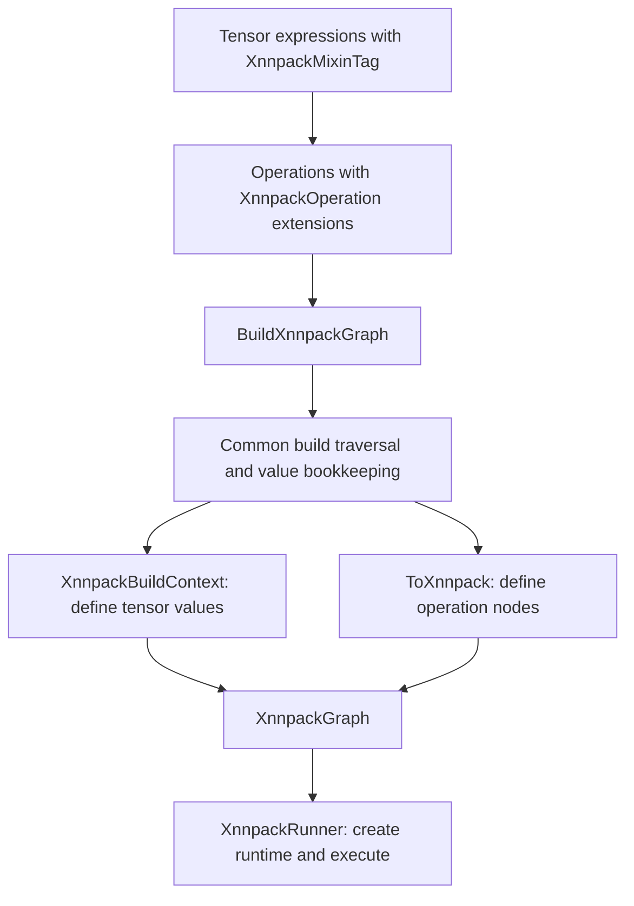

# XNNPACK tensor backend

This directory lowers LiteRT tensor expression graphs into XNNPACK subgraphs.
It supplies the operation extensions selected by `Tensor<XnnpackMixinTag>` and
the `BuildXnnpackGraph()` entry point. The resulting graph contains XNNPACK
nodes, tensor-to-value mappings, and storage needed by constants. Execution,
runtime input/output buffers, and threading are handled by the
[XNNPACK runner](../../runners/xnnpack/README.md).

Start with [conversion.h](conversion.h) for the build interface, then follow
[conversion.cc](conversion.cc) and [arithmetic.cc](arithmetic.cc) for value
definition and operation lowering. The common traversal and bookkeeping live
in [common_nnpack](../common_nnpack/README.md).

## Directory structure

| File | Responsibility |
| --- | --- |
| [arithmetic.h](arithmetic.h) | Declares `XnnpackMixinTag` and `graph::OpMixin<Operation, XnnpackMixinTag>` specializations implementing `XnnpackOperation`. |
| [arithmetic.cc](arithmetic.cc) | Implements `ToXnnpack()` for arithmetic, activations, neural-network operations, and tensor transformations. Defines shared unary/binary helpers and dynamic input quantization. |
| [conversion.h](conversion.h) and [conversion.cc](conversion.cc) | Define the backend extension interface, `XnnpackBuildContext`, initialization, external ID discovery, datatype/quantization conversion, and `BuildXnnpackGraph()`. |
| [graph.h](graph.h) | Adds ownership of an `xnn_subgraph_t` to `NnpackGraph` using a custom `unique_ptr` deleter. |
| [utils.h](utils.h) | Converts XNNPACK statuses to `absl::Status` and adapts them to the tensor error-propagation macros. |
| [conversion_test.cc](conversion_test.cc) | Checks external flags, constant storage, shared-value registration, selected activation graphs, and unsupported normalization. |
| [arithmetic_test.cc](arithmetic_test.cc) | Checks backend-specific lowering restrictions and numerical results through the runner. |
| [xnnpack_conversion_numerical_test.cc](xnnpack_conversion_numerical_test.cc) | Adapts `XnnpackRunner` to the shared numerical test bridge and instantiates its typed suite. |
| [BUILD](BUILD) | Declares the public `:arithmetic`, `:conversion`, `:graph`, and `:utils` libraries and three test targets. |

## From expressions to a subgraph



1. **Attach backend behavior during expression construction.** Include
   `arithmetic.h` from this directory alongside the
   [public arithmetic API](../../arithmetic.h), and build expressions using
   `Tensor<XnnpackMixinTag>`. The public builders call `RegisterMixins()` in
   [arithmetic_helpers.h](../../internal/arithmetic_helpers.h). A specialization
   derived from `graph::BackendExtension` is added to the operation's extension
   list. This registers behavior on each operation when it is constructed;
   `BuildXnnpackGraph()` does not add missing extensions later.
2. **Discover external values.** `BuildXnnpackGraph(outputs)` assigns distinct
   external IDs to requested outputs first. It inspects the execution plan for
   producer-free input tensors without attached buffers and assigns their IDs
   next. Shared tensors reuse their IDs. Buffered inputs are constants.
3. **Initialize and allocate.** `BuildNnpackGraph()` obtains the execution plan
   and initializes `XnnpackBuildContext`. Its `EnsureInitialized()` calls
   `xnn_initialize(nullptr)` through `absl::call_once`; the first result,
   including a failure, is retained for subsequent builds. The context creates
   an `XnnpackGraph` and reserves the external ID count with
   `xnn_create_subgraph()`, using flags of zero.
4. **Lower in dependency order.** The common builder calls `LowerOp()` for
   each operation. It retrieves `op.GetExtension<XnnpackOperation>()` and calls
   `ToXnnpack()`. Lowerings request IDs through `ctx.DefineValue()`, which
   deduplicates tensors and records their metadata and external flags, then
   calls this backend's `DefineTensorValue()`. XNNPACK allocates IDs for
   internal values. The lowering then adds one or more XNNPACK nodes.
5. **Finalize and hand off.** `Finalize()` ensures every requested output has
   a value and transfers the graph out of the build context. The public result
   is `absl::StatusOr<std::unique_ptr<XnnpackGraph>>`. It can be passed to the
   runner's explicit constructor. `XnnpackRunner::Create(outputs)` performs
   this build and transfer for callers who want to execute immediately.

`graph->Lookup(tensor)` returns an index into `graph->values()`; the indexed
`NnpackValue::id` is the XNNPACK ID. These are separate identifiers. A tensor
requested as an output can also carry the external-input flag if it has no
producer or buffer. External values receive runtime storage from the runner;
conversion retains static data only for non-external buffered tensors.

For an expression-building and execution example, see the
[runner example](../../runners/xnnpack/README.md#example). Consumers that create
XNNPACK expressions need the `//tensor/backends/xnnpack:arithmetic`
dependency as well as the public tensor API and runner or conversion targets
whose headers they use.

## Operation lowering

Despite its name, `arithmetic.cc` also contains the neural-network and shape
operation lowerings. Most follow the same pattern: validate inputs, define
input/output values, read operation attributes, and call an `xnn_define_*`
function. `PrepareUnaryIO()` and `PrepareBinaryIO()` share arity checks and ID
lookup. Fused activations and spatial padding use helpers from
[common_nnpack/utils.h](../common_nnpack/utils.h).

| Operation family | Lowering approach |
| --- | --- |
| Elementwise arithmetic and activations | `xnn_define_binary()` or `xnn_define_unary()`, with operator enums and parameters. ReLU/ReLU6 use clamp bounds; casts and dequantization use unary conversion. |
| Pooling, convolution, and transpose convolution | Dedicated XNNPACK nodes with explicit padding, channel counts, strides, and activation bounds where implemented. Spatial input shapes use batch, height, width, channels (BHWC). |
| Fully connected and batch matrix multiplication | Dedicated nodes; eligible quantized weights can introduce a dynamic input conversion or a fully connected replacement for matrix multiplication. |
| Tensor transformations | Static transpose, reduce, slice, concatenate, reshape, broadcast, split, and space/depth rearrangement nodes. Shape-related constant tensors are read during lowering. |
| Resize and rotary embeddings | Bilinear resize and RoPE use dedicated nodes. Nearest-neighbor resize expands to reshape, broadcast, and reshape nodes. |

An operation appearing in the public tensor API does not guarantee a working
XNNPACK lowering. Check its specialization and implementation when adding
models or changing attributes. Current constraints include:

- `Gather` and `L2Normalization` have extensions that return `Unimplemented`.
  Operations without an extension fail `LowerOp()` with `InvalidArgument`.
- `Softmax` requires `beta == 1`. `Tile` uses broadcasting, so a dimension
  repeated more than once must have input size one.
- Transpose permutations, reduction axes, slice offsets/sizes, expand/split
  axes, tile multiples, and resize sizes are read from constants. They cannot
  be supplied as changing runtime parameters. Reshape uses the shape stored
  in the operation attributes; squeeze uses the inferred output shape.
- Nearest-neighbor resize requires positive integer enlargement factors and
  both `align_corners` and `half_pixel_centers` to be false. Its intermediate
  values are explicitly FP32. Bilinear resize rejects enabling both flags
  together.
- The public `TransposeConv()` and `TransposeConv2D()` builders represent bias
  as a separate `Add` node. The lower-level `TransposeConv2DOperation` requires
  constant weights. If constructing that operation directly with a fourth
  bias input, its lowering checks that bias is constant but does not define it;
  the deconvolution call still receives `XNN_INVALID_VALUE_ID` for bias.

XNNPACK may impose further datatype, shape, and operator restrictions when
defining nodes or preparing the runtime. Successful graph construction alone
does not establish that every runtime configuration is supported.

## Datatypes, quantization, and storage

`DefineTensorValue()` selects ordinary, per-tensor, channelwise, or blockwise
XNNPACK value definitions from `TensorInformation::quantization`:

| Metadata | Conversion behavior |
| --- | --- |
| No quantization | Calls `xnn_define_tensor_value()` with the type selected by `GetXnnpackType()`. |
| `PerChannelAffineQuantization` with one scale | Calls `xnn_define_quantized_tensor_value()` using the first zero point, or zero if absent. |
| Multiple scales and all zero points zero | Calls the channelwise API with zero point zero, after checking the channel axis and that enough scales are present. |
| Multiple scales and a nonzero zero point | Uses the shared `DequantizeInt8ConstantTensor()` helper and defines FP32 constant data. This helper assumes a two-dimensional int8 weight matrix with one scale and optional zero point per row; it is not a general conversion for arbitrary axes, packed types, or runtime inputs. |
| `BlockwiseQuantization` | Calls the blockwise API with FP16 scales retained in graph-owned storage. Checks rank of at least two, nonzero block size, and a minimum scale count computed from the first two dimensions. |

`GetXnnpackType()` maps FP32, FP16, BF16, and I32 directly, selects signed int8
quantized types using the scale count, and selects signed int4 channelwise or
blockwise types from quantization metadata. The current switch also groups
several other integer types with FP16 and groups `kUnknown`, `kBOOL`, and `kI2`
with the int4 branch. It does not convert their bytes. Treat the tensor `Type`
enum as broader than the backend's supported representations; validate new
datatype paths through numerical execution rather than relying on this switch
as a support matrix.

For fully connected operations with I8/I4 quantized weights and FP32 input,
the lowering may create a dynamically quantized `qdint8` value and unary
conversion for the input. Per-channel weights with nonzero zero points do not
take that path. A blockwise-quantized matrix multiplication is lowered to fully
connected when its right operand is two-dimensional, `adj_x` is false, and
`adj_y` is true. Other matrix multiplications use the batch-multiply node and
transpose flags.

`XnnpackGraph` is movable and non-copyable. Its subgraph deleter calls
`xnn_delete_subgraph()`. `GetSubgraph()` borrows the pointer; `ReleaseSubgraph()`
transfers responsibility for deleting it without transferring the base graph's
storage. Preserve that storage for as long as a consumer needs its data.

The inherited [NnpackGraph](../common_nnpack/graph.h) keeps ordinary constant
buffers alive through shared ownership and `NnpackValue::data` locks. Ordinary
constants are not copied by this backend. Dequantized FP32 values and converted
FP16 scales are stored in separate owned vectors. Lowerings that synthesize
constant bytes can use `ctx.DefineConstant()`, which copies them into
`constant_buffers()` before defining the XNNPACK value. The runner retains the
entire graph while it owns the runtime. Memory behind any non-owning source
buffer still needs an appropriate caller-managed lifetime.

## Errors, tests, and extension points

Build and lowering errors use `absl::Status`/`StatusOr`. Validation generally
returns `InvalidArgument`, missing operation outputs return `NotFound`, and
explicit unsupported cases return `Unimplemented`. `BuildNnpackGraph()` adds
the failing operation and backend name to lowering errors. `XnnStatusToAbsl()`
maps every non-success XNNPACK status to `InternalError`, preserving the numeric
status and an API label when supplied. Including `utils.h` enables the same
conversion through `LRT_TENSOR_RETURN_IF_ERROR`.

From the repository root:

```sh
bazelisk build //tensor/backends/xnnpack:arithmetic \
  //tensor/backends/xnnpack:conversion
bazelisk test //tensor/backends/xnnpack:all \
  --test_output=errors
```

The three test targets are `:conversion_test`, `:arithmetic_test`, and
`:xnnpack_conversion_numerical_test`. The first focuses on graph metadata and
conversion behavior; the second includes execution checks for arithmetic,
pooling, convolution, transformations, casts, and dequantization. The third
instantiates the [shared numerical suite](../testing/README.md) using a bridge
that builds a runner, binds inputs, executes, and copies outputs into the
suite's buffers.

That bridge translates a missing-extension `InvalidArgument` into
`Unimplemented`, allowing the shared suite to skip unsupported operations.
The suite also skips when backend initialization fails and explicitly skips
its quantized fully connected case for XNNPACK because of known numerical
issues. The old implicit-dequantization conversion test is commented out.
Review skips when assessing coverage; a passing target does not mean every
operation or quantization path was exercised. Additional execution and buffer
lifecycle coverage lives in the [runner tests](../../runners/xnnpack/README.md#errors-and-tests).

To add an operation, define its public graph representation and builder if
needed, add an `OpMixin` specialization here, and implement `ToXnnpack()` using
the build context's value and constant helpers. Add successful numerical cases
and tests for any backend restrictions. Put reusable numerical cases in
`backends/testing`, XNNPACK-specific checks in the local tests, shared traversal
or value-bookkeeping changes in `common_nnpack`, and runtime integration changes
in `runners/xnnpack`.
