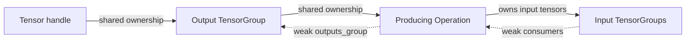

# Tensor graph internals

This directory implements the graph representation and construction helpers
behind the public [Tensor API](../tensor.h). Tensor expressions retain their
upstream graph through shared ownership. Backend code can then traverse that
graph, inspect operation extensions, and lower it into an executable runtime.

Start with [graph.h](graph.h) for the data model, then
[arithmetic_helpers.h](arithmetic_helpers.h) for expression construction and
[graph_traversal.cc](graph_traversal.cc) for execution ordering. Concrete
lowering lives in [backends](../backends), and runtime execution lives in
[runners](../runners).

## Directory structure

| File | Responsibility |
| --- | --- |
| [graph.h](graph.h), [graph.cc](graph.cc) | Tensor groups, operations, metadata, quantization records, graph accessors, error tensors, backend extensions, and `OpDebugger`. |
| [arithmetic_helpers.h](arithmetic_helpers.h) | Connects operation inputs and outputs, validates input tensors, registers mixins, and implements the common elementwise construction path. |
| [mixin.h](mixin.h) | Defines `TensorMixin`, `OpMixin`, and registration interfaces for backend behavior attached to tensor expressions. |
| [shape.h](shape.h), [shape.cc](shape.cc) | Implements `BroadcastShapes()` for aligning ranks and combining compatible singleton dimensions. |
| [graph_traversal.h](graph_traversal.h), [graph_traversal.cc](graph_traversal.cc) | Builds an operation execution plan from selected output tensors using depth-first traversal and cycle detection. |
| [graph_probe.h](graph_probe.h), [graph_probe.cc](graph_probe.cc) | Associates reachable produced tensors with operation/output index pairs and generated probe names. |
| [compile.h](compile.h) | Prototype callable tracing and `CompiledRunner` adapter, including a dummy backend implementation. |
| [type_id.h](type_id.h) | Compile-time type-name extraction and hashing for explicit type identification and checked casts. |
| [fp16.h](fp16.h) | IEEE FP16/FP32 conversion helpers and a `bit_cast` compatibility implementation. |
| [utils.h](utils.h) | Recognizes comparison operations by name and fills spans with random values from a seeded generator. |
| [matchers.h](matchers.h) | Test-only `testing::litert::AlignmentIs` matcher for pointers, integer addresses, and unique pointers. |
| [BUILD](BUILD) | Declares the libraries and unit tests described below. Targets have public default visibility; `:matchers` is test-only. |

## Graph representation and lifetime

The graph is assembled through connected objects rather than a central graph
builder. `graph::Tensor` identifies one output as a shared `TensorGroup` and an
index into that group's `tensor_infos` vector. Equality and hashing use this
identity, so equal names, shapes, or data do not make two tensors the same
graph value.



Keeping an output tensor alive preserves its group, its producer, and all
upstream inputs. Outputs of one operation share a group and therefore share
their lifetime. Reverse links use weak pointers: an operation does not keep
its output group alive, and an input tensor does not keep its consumers alive.
`GetOutputs()` can consequently fail after an operation's output group has
expired, even if the operation itself is still retained elsewhere.

`TensorInformation` stores a name, type, shape, optional shared `Buffer`,
optional quantization parameters, and weak consumer links. Quantization
records support per-channel affine and blockwise metadata. Attaching a buffer
retains the buffer object; ownership of its memory follows the concrete
[buffer implementation](../buffer.h).

`TensorGroup::status` records construction errors for the whole group.
`ErrorTensor()` creates a group carrying an error with no valid tensor entries.
Use `GetStatus()` or status-returning accessors such as `GetInfo()` before
reading metadata. Validation checks for a group, its stored status, and a valid
index. Names and buffers are optional: their getters return `NotFound` when
absent. Creation locations are recorded with
[source_location](../utils/source_location.h) for later diagnostics.

## Constructing operations and attaching backends

Public operations in [arithmetic.h](../arithmetic.h) use the helpers here to
build graph structure. The common `ElementwiseOp()` path performs these steps:

1. Check the input tensors' statuses and create the operation.
2. Register supported backend mixins for the requested tensor tags.
3. Add input tensors to the operation and register its weak consumer links.
4. Create an output group, or append another output to the existing group.
5. Infer the broadcast shape and output type, require matching input types,
   and emit an operation debug record when enabled.

`BroadcastShapes()` aligns shapes from the trailing dimensions. Equal
dimensions and dimensions of size one are compatible; incompatible dimensions
return `InvalidArgument`. It is a broadcasting helper, so operation-specific
shape requirements still belong in the operation implementation.

`graph::OpMixin<Op, Tag>` specializes backend behavior for an operation and tag.
`RegisterMixins()` attaches only specializations derived from
`graph::BackendExtension`, allowing unsupported specializations to be absent.
Each operation owns its extensions and exposes `GetExtension<T>()` for lookup
by type ID. [The XNNPACK arithmetic backend](../backends/xnnpack/arithmetic.h)
shows concrete specializations. The tuple-based `RegisterMixin()` machinery
in `mixin.h` provides another registration path for a supplied operation set.

When adding an operation, preserve input/consumer and producer/output links,
propagate the caller's source location, validate inputs before dereferencing
their metadata, and represent construction failures as error tensors. Keep
backend API calls in the backend extension rather than the graph helpers.

## Traversal, probing, and diagnostics

`GetExecutionPlan(outputs)` recursively visits each output's producer and its
input producers, appending an operation after its dependencies. Shared
dependencies appear once, unreachable operations are omitted, and a cycle
returns `Internal`. The returned operation pointers borrow the graph's
lifetime; retain the output handles while using the plan. Ordering follows
the supplied output order and each operation's input order. Failed producer
lookups are skipped, so traversal does not replace tensor-status validation.

`GraphProbe` uses an execution plan to assign each reachable produced tensor a
`StableTensorId` pair of operation index and output index. It returns a map
from these IDs to names such as `probe_Add_0`. Producerless inputs/constants
are omitted, and probing does not execute operations or collect tensor data.
Plan failures are logged and leave an empty result. The constructor accepts
an unordered output map, so IDs and generated names should be interpreted
within that traversal rather than persisted as universal graph identifiers.

`graph::OpDebugger::DebugOp()` logs operation names, input/output metadata, and
the recorded creation location. Enable it through the Bazel flag
`--define OP_DEBUGGER=true`, which defines `LITERT_OP_DEBUGGER_ENABLED` for the
graph library. Without that definition, logging is disabled and
`OpDebugger::Enabled()` returns false.

`internal::TypeId::Get<T>()` hashes a normalized compiler-derived type name
after applying `std::decay_t`; `GetExact<T>()` preserves the supplied type.
Operations, extensions, buffers, and quantization records use these IDs for
explicit type checks. Names are extracted differently for Clang, GCC, and
MSVC, and some template types differ across compilers. Treat the IDs as
implementation identifiers rather than portable serialization keys.

## Compile wrapper prototype

`compile<BackendRunner>(callable, tensors...)` in `compile.h` calls the supplied
function once to trace its outputs, flattens inputs and outputs into tensor
handles, constructs a backend runner, and returns a callable `CompiledRunner`.
The helpers support individual tensors, structures exposing a `tensors()` map,
and tuple output flattening. Structure inputs are flattened in sorted map-key
order to make placeholder assignment consistent.

The backend contract is specific to this prototype:

| Backend API | Use |
| --- | --- |
| Constructor receiving placeholder and output handle vectors | Receives the traced graph endpoints. |
| `BuildModel()` | Called once during `compile()`. |
| `SetInput(name, tensor)` | Binds each invocation's inputs using placeholder names. |
| `Run()` | Executes the traced graph. |
| `GetOutputBuffer(name)` | Supplies buffers to attach to the retained traced output tensors. |

This interface differs from the handle-based API of
[NnpackRunner](../runners/common_nnpack/runner.h). The header includes
`DummyBackendRunner`, and its tests exercise dummy adapters rather than a real
XNNPACK runtime. Currently `compile()` ignores `BuildModel()` errors,
invocation checks input-binding and execution statuses with `ABSL_CHECK_OK`,
and unsuccessful output-buffer lookups leave the traced outputs unchanged.
Account for these behaviors when developing an adapter or extending error
handling. Returned tensors refer to the traced outputs and attached buffers;
they do not imply a copy of each invocation's results.

## Tests and build targets

| Test | Coverage |
| --- | --- |
| [graph_test.cc](graph_test.cc) | Group creation, metadata access, buffers, invalid handles and indices, and quantization type checks/casts. |
| [graph_traversal_test.cc](graph_traversal_test.cc) | Linear and branching graphs, shared dependencies, multiple outputs, unreachable operations, empty roots, and cycles. |
| [type_id_test.cc](type_id_test.cc) | Type-name extraction, selected type distinctions, equality, and decay of qualifiers/references. |
| [compile_test.cc](compile_test.cc) | Callable traits and tracing with individual tensors and structures using dummy runners. |
| [op_debugger_test.cc](op_debugger_test.cc) | Creation-time logs and multi-output operation logging when the graph debugger is enabled. |

Run these commands from the repository root; `bazelisk` can be used in place
of `bazel`:

```sh
# Build graph construction and inspection libraries.
bazelisk build //tensor/internal:graph \
  //tensor/internal:arithmetic_helpers \
  //tensor/internal:graph_traversal \
  //tensor/internal:graph_probe \
  //tensor/internal:compile

# Run the ordinary unit tests.
bazelisk test //tensor/internal:graph_test \
  //tensor/internal:graph_traversal_test \
  //tensor/internal:type_id_test \
  //tensor/internal:compile_test --test_output=errors

# Enable logging in the graph library as well as the test.
bazelisk test //tensor/internal:op_debugger_test \
  --define OP_DEBUGGER=true --test_output=errors
```

The debugger tests skip when the graph library has logging disabled; a define
applied only to the test source is insufficient. There are no dedicated test
targets here for `shape`, `graph_probe`, `fp16`, or `matchers`. Add focused
coverage in the relevant existing test or a new BUILD test target when
extending those components.
