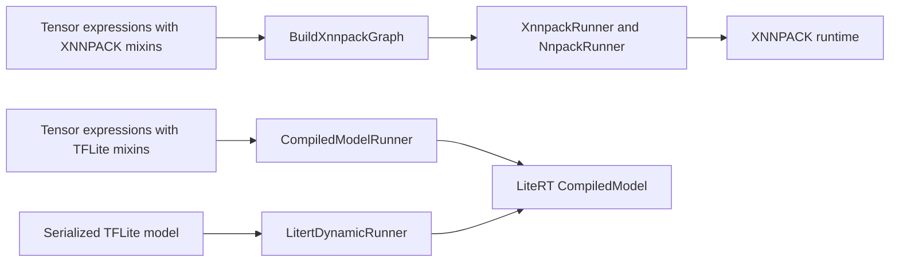

# Tensor runners

Runners connect [Tensor API](../README.md) graphs or serialized models to an
execution runtime. They bind inputs and outputs, manage runtime resources, and
execute models repeatedly. This directory contains two independent families:
direct XNNPACK execution through `NnpackRunner`, and LiteRT compiled-model
adapters. They use the tensor and buffer abstractions but have different graph,
binding, and lifecycle APIs.

## Components and runner choices

| Directory | Responsibility and when to use it |
| --- | --- |
| [common_nnpack](common_nnpack/README.md) | `NnpackRunner` is the abstract base for direct runtime adapters. It owns graph metadata and external buffers, implements shape and buffer management, and coordinates backend hooks. Start here for shared execution policy or another adapter using this lifecycle. |
| [xnnpack](xnnpack/README.md) | `XnnpackRunner` derives from `NnpackRunner` and executes tensor expressions directly with XNNPACK on CPU. It owns a runtime and threadpool and accepts a borrowed weights cache. Start with its [example](xnnpack/README.md#example) to run a small graph. |
| [litert](litert/README.md) | Header-based adapters execute through LiteRT's `CompiledModel`. Use `CreateLambdaRunner` or `CreateStaticRunner` for authored TFLite graphs, and `LitertDynamicRunner` for existing model files or bytes and signature selection. The package also provides `LitertBuffer` and feedback-loop wiring. |

Graph construction and operator lowering live in [backends](../backends/README.md).
The public expression and storage interfaces are [tensor.h](../tensor.h) and
[buffer.h](../buffer.h). The runners here manage execution; backend conversion
determines which operations a graph can contain.

## From a graph to an invocation



For direct XNNPACK execution, `XnnpackRunner::Create(outputs)` lowers the
requested outputs and their dependencies and owns the resulting graph.
Configure threads and the weights cache before `PrepareRuntime()` or the first
`Run()`: preparation creates the executable runtime lazily, and the setters do
not rebuild it. Bind inputs using the original tensor handles. Lookup uses
tensor identity, so a different tensor with the same name is not the same input.

Every direct runner `Run()` propagates input shapes, reshapes the runtime,
queries output shapes, allocates or grows owning outputs, binds locked buffers,
and invokes synchronously. Later runs reuse the runtime while repeating shape
and buffer setup. `ReshapeInput()` supports backend-compatible shape changes;
it changes runner metadata rather than the original tensor handle. See the
[shared lifecycle](common_nnpack/README.md#execution-lifecycle) for the exact
ordering and error behavior.

For LiteRT execution, the lambda/static factories construct a tensor graph,
serialize it, and compile it during construction by default. The authoring
lambda runs once; later `Run()` calls execute the compiled model. A deferred
`CompiledModelRunner` build allows explicit compilation and graph probes.
`LitertDynamicRunner::Create` instead loads and compiles an existing model and
allocates buffers for its signatures. Its name refers to model loading; the
wrapper does not expose input resizing. Configure LiteRT's `Environment` and
`Options` before compilation.

LiteRT adapters address I/O by names or indices. The compiled/lambda convenience
API uses signature 0; the dynamic adapter accepts explicit signatures and
defaults to the first one. The usual workflow is `SetInput`, `Run`, then
`GetOutput`. Optional feedback swaps configured input/output buffer handles
before subsequent invocations. `Reset` restores the initial buffer orientation
and first-run state; it does not clear tensor contents. See the
[LiteRT guide](litert/README.md) for binding, probing, and feedback details.

## Storage and lifetime rules

Both families can copy data or share existing storage, but binding semantics
depend on the overload and buffer implementation:

- Direct runner sequence/span inputs normally borrow read-only memory;
  `SetInputAsCopy` creates owning storage. Borrowed memory must remain valid
  while used, and borrowed views cannot grow automatically. Growing an owning
  input through `ReshapeInput` requires repopulating it. Output reads can include
  retained allocation capacity after a shape shrink; use the current graph
  metadata for the logical extent.
- LiteRT runners share storage through `LitertBuffer`/`TensorBuffer` handles.
  The compiled runner can also temporarily bind caller-owned byte spans, while
  the dynamic runner's byte-span setter copies. Keep the `Environment` alive;
  the compiled runner also retains its `Options` by reference. Keep model bytes
  alive when using the dynamic runner's borrowed byte-span factory.
- Reading a locked or shared buffer does not snapshot its contents. Keep the
  access object and any externally owned memory alive while reading, and copy
  results needed independently of later invocations. Coordinate access to
  mutable runner state and shared buffers across callers.

The leaf guides specify the remaining allocation, lock, and error-recovery
constraints for each API.

## Relationship to the optimized Gemma4 runner

The [native Gemma4 example](../examples/gemma4/native/README.md) uses the same
Tensor API and XNNPACK backend with a separate
[`StageRunner`](../examples/gemma4/native/stage_runner.h) derived from
`NnpackRunner`. It coordinates borrowed threadpools, weights caches, and shared
workspace across stages. Its active INT8 KV handling, compact INT2 constants,
and staged prefill/decode live under the example's `native/` directory.
The general `XnnpackRunner` here owns its pool and exposes no shared-workspace
parameter; model-specific optimization work belongs in that example.

## Where to make changes

| Change | Starting point |
| --- | --- |
| Direct-runner buffer validation, growth, or execution order | [common_nnpack/runner.cc](common_nnpack/runner.cc) and its identity-backend tests. |
| XNNPACK runtime creation, flags, threadpool, or cache integration | [xnnpack/runner.h](xnnpack/runner.h), [runner.cc](xnnpack/runner.cc), and runtime-specific tests. |
| Another adapter with the direct-runner lifecycle | Implement the [backend hook contract](common_nnpack/README.md#backend-implementation-contract), graph conversion, and shared test-suite traits. |
| Authored LiteRT graph construction, compilation, or probes | [lambda_model_runner.h](litert/lambda_model_runner.h) and [compiled_model_runner.h](litert/compiled_model_runner.h). |
| Loaded-model or signature behavior | [litert_dynamic_runner.h](litert/litert_dynamic_runner.h). |
| LiteRT buffer ownership or feedback behavior | [litert_buffer.h](litert/litert_buffer.h) and both compiled/dynamic runner implementations, with coverage in the LiteRT leaf tests. |
| Operator support or lowering | The appropriate [backend](../backends/README.md). |

The [shared runner suite](common_nnpack/runner_test_suite.h) exercises complete
expressions through concrete runners. The separate
[backend numerical framework](../backends/testing/README.md) tests operators
through a `TestBackendBridge`; choose the layer corresponding to the behavior
being changed.

## Build and test

The root [BUILD](BUILD) groups packages and defines no runner target. Child
BUILD files define the implementation libraries and these tests:

| Bazel target | Coverage |
| --- | --- |
| `//tensor/runners/common_nnpack:runner_test` | Shared buffer, shape, move, and lifecycle behavior with an identity backend and injected errors. |
| `//tensor/runners/xnnpack:runner_test` | Shared numerical suite on XNNPACK plus runtime flags, profiling, and moves. |
| `//tensor/runners/litert:lambda_model_runner_test` | CPU lambda/static construction, loading from memory, binary inputs, and feedback/reset behavior. |
| `//tensor/runners/litert:litert_buffer_test` | Host storage access, packed byte size, and buffer type conversion. |

From the LiteRT repository root, follow the repository's
[build instructions](../../g3doc/instructions/BUILD_INSTRUCTIONS.md), then run:

```bash
mkdir -p .bazelisk-cache .cache .bazel-output
XDG_CACHE_HOME="$PWD/.cache" BAZELISK_HOME="$PWD/.bazelisk-cache" \
  bazelisk --output_base="$PWD/.bazel-output" test \
  //tensor/runners/common_nnpack:runner_test \
  //tensor/runners/xnnpack:runner_test \
  //tensor/runners/litert:lambda_model_runner_test \
  //tensor/runners/litert:litert_buffer_test \
  --test_output=errors
```

The common runner library is visible within `//tensor` and its subpackages;
the concrete XNNPACK and LiteRT libraries are public. The common typed suite
is a test-only library instantiated by the XNNPACK test executable.

For focused Linux and Android testing with `ANDROID_HOME`, the
[standalone build guide](../standalone/README.md) covers the common and direct
XNNPACK runner tests. That build excludes the LiteRT compiled-model adapters;
use the Bazel targets above for their tests. The
[top-level tensor README](../README.md) links the wider build and model
validation workflows.
