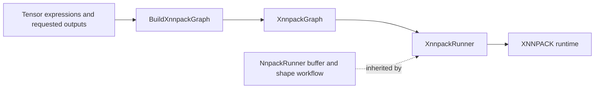

# XNNPACK tensor runner

`litert::tensor::XnnpackRunner` executes Tensor API expression graphs on the CPU
using XNNPACK. It connects the shared runner's input/output and shape workflow
to the XNNPACK runtime API. Graph construction and operator lowering live in
[the XNNPACK backend](../../backends/xnnpack/README.md); the inherited execution
and buffer contracts live in [common_nnpack](../common_nnpack/README.md).

## Files and responsibilities

| File | Responsibility |
| --- | --- |
| [runner.h](runner.h) | Factory and graph-taking constructor, runtime flags, threadpool and weights-cache configuration, move operations, resource accessors and backend hooks. |
| [runner.cc](runner.cc) | Creates the runtime, propagates shapes, binds locked external buffers and invokes XNNPACK. |
| [runner_test.cc](runner_test.cc) | Instantiates shared numerical tests for XNNPACK and tests runtime-flag propagation through lazy creation, repeated runs and moves. |
| [BUILD](BUILD) | Defines the public `:runner` library and `:runner_test` target. |

The runner owns a [XnnpackGraph](../../backends/xnnpack/graph.h), whose shared
[NnpackGraph](../../backends/common_nnpack/graph.h) base stores tensor-to-value
mappings, runtime shape metadata and retained constant storage. Tensor handles
identify graph values throughout the input/output API.

## From expressions to execution



1. `Create(outputs, runtime_flags = 0)` calls
   [BuildXnnpackGraph](../../backends/xnnpack/conversion.cc), which initializes
   XNNPACK once, discovers dependencies and lowers supported operations.
   Unbuffered leaves become external inputs; requested outputs become external
   outputs. Constants retain their backing storage in the graph. The explicit
   constructor instead takes an already-built `unique_ptr<XnnpackGraph>`.
2. Configure threads and the optional weights cache, then bind external inputs.
   Graph creation has not created an executable runtime: `runtime()` is null.
3. `PrepareRuntime()` creates the runtime once with `xnn_create_runtime_v3()`.
   It passes the subgraph, borrowed weights cache, owned threadpool and the
   constructor's runtime flags. `Run()` calls preparation lazily when needed.
   Preparation alone does not reshape the runtime or bind input/output buffers.
4. Each `Run()` propagates input shapes, checks input storage, reshapes the
   runtime, queries output shapes and allocates or grows owning output buffers.
   It locks external buffers, binds their addresses, invokes XNNPACK and keeps
   those locks alive until the synchronous invocation returns.
5. Read the output, update inputs or supported input shapes, and call `Run()`
   again. The executable runtime is reused. A runner's mutable shapes and
   bindings are intended for sequential use.

The inherited sequence is implemented in
[NnpackRunner::Run](../common_nnpack/runner.cc). Its backend hooks map to these
XNNPACK calls:

| Hook | XNNPACK API |
| --- | --- |
| `CreateRuntime()` | `xnn_create_runtime_v3()` |
| `SetExternalValueShape()` | `xnn_reshape_external_value()` |
| `ReshapeRuntime()` | `xnn_reshape_runtime()` |
| `GetExternalValueShape()` | `xnn_get_external_value_shape()` |
| `SetupExternalValues()` | `xnn_setup_runtime_v2()` |
| `InvokeRuntime()` | `xnn_invoke_runtime()` |

## Configuration and ownership

**Configure threads and the weights cache before `PrepareRuntime()` or the
first `Run()`.** The setters do not rebuild a prepared runtime.

- The runner owns its `pthreadpool_t`. The default count is one, represented by
  a null pool. `SetNumThreads(n)` destroys any previous pool and creates one for
  `n > 1`. Changing it after preparation can invalidate the pool pointer retained
  by the runtime; it is not a supported way to reconfigure an existing runtime.
- `SetWeightsCache()` stores a borrowed `xnn_weights_cache_t`. The caller creates
  and finalizes it and keeps it alive through every runner that uses it. When
  sharing a cache, prepare all runtimes that must add packed weights before
  finalizing it according to the cache provider's rules.
- `runtime_flags` default to zero, are passed through at runtime creation and
  have no setter. `runtime_flags()` reports them. Diagnostic flags such as
  `XNN_FLAG_SLOW_CONSISTENT_ARITHMETIC` and `XNN_FLAG_BASIC_PROFILING` depend on
  the selected XNNPACK revision and graph; they do not promise cross-platform
  numerical equality. Use a newly constructed runner to change flags.
- The runner is movable and non-copyable. Moves transfer graph/buffer state,
  the prepared runtime, runtime flags, the borrowed cache pointer and ownership
  of the threadpool. The source's pool pointer is cleared. The runtime is owned
  by a `unique_ptr` with an `xnn_delete_runtime()` deleter; the runner destroys
  its pool. Accessors expose borrowed handles, not ownership transfers.

## Inputs, shapes and outputs

The public buffer APIs come from [NnpackRunner](../common_nnpack/runner.h):

| API | Contract |
| --- | --- |
| `SetInput(tensor, sequence)` | Checks element type and exact current byte count, then retains a non-owning view. The deleted temporary-sequence overload helps prevent dangling inputs. |
| `SetInputAsCopy(tensor, sequence)` | Performs the same checks and copies into owning storage. The byte-span `SetInput()` overload also accepts `copy_data = true`. |
| `SetInput(tensor, external_tensor)` | Adopts the source tensor's shape and buffer after type/storage checks; retains shared ownership of the buffer object. |
| `ReshapeInput(tensor, shape)` | Updates runner metadata. Existing owning storage can grow; the original tensor handle's shape is unchanged. |
| `WriteInput(tensor, offset_bytes, data)` | Writes into an existing mutable input buffer with bounds checks. A default non-owning input view is read-only to this API. |
| `SetOutput(tensor, bytes)` | Binds caller-owned writable storage with an exact current byte count. Without this call, `Run()` allocates output storage. |
| `ReadOutput()` / `ReadOutputAs<T>()` | Returns locked output storage, with an additional element-type check for the typed overload. |

Keep memory backing non-owning views alive while bound and used. After an input
shape grows, rebind a view to sufficient storage before running; non-owning
buffers cannot grow automatically. Growing owning storage through
`ReshapeInput()` can replace its allocation without preserving data, so populate
it again before invocation.

Output allocations can retain capacity after shapes shrink, and `ReadOutput()`
locks the entire buffer. Use the graph's `Lookup(tensor)` result and
`graph().values()[index].info.shape` for the current logical extent. Copy results
that must survive later runs, which may overwrite or replace output storage.
See the [shared runner's buffer notes](../common_nnpack/README.md) for details.

## Example

For a simple addition, the following function uses owned input storage and
returns `{10.5f, 20.5f}`:

```cpp
#include <vector>

#include "absl/status/statusor.h"
#include "tensor/arithmetic.h"
#include "tensor/backends/xnnpack/arithmetic.h"
#include "tensor/runners/xnnpack/runner.h"
#include "tensor/utils/macros.h"

namespace litert::tensor {
absl::StatusOr<std::vector<float>> EvaluateAdd() {
  using XnnTensor = Tensor<XnnpackMixinTag>;
  XnnTensor input({.type = Type::kFP32, .shape = {2}});
  XnnTensor bias({.type = Type::kFP32,
                 .shape = {2},
                 .buffer = std::vector<float>{0.5f, 0.5f}});
  XnnTensor output = Add(input, bias);
  LRT_TENSOR_ASSIGN_OR_RETURN(auto runner, XnnpackRunner::Create({output}));
  runner.SetNumThreads(2);
  LRT_TENSOR_RETURN_IF_ERROR(
      runner.SetInputAsCopy(input, std::vector<float>{10.f, 20.f}));
  LRT_TENSOR_RETURN_IF_ERROR(runner.Run());
  LRT_TENSOR_ASSIGN_OR_RETURN(auto values, runner.ReadOutputAs<float>(output));
  return std::vector<float>(values.begin(), values.end());
}
}  // namespace litert::tensor
```

## Relationship to the optimized Gemma4 runner

The [Gemma4 native example](../../examples/gemma4/native/README.md) builds on the
same Tensor API, backend and shared `NnpackRunner` workflow. Its separate
[StageRunner](../../examples/gemma4/native/stage_runner.h) borrows a caller-owned
pool, weights cache and optional workspace, and creates runtimes with
`xnn_create_runtime_v4()`. Multiple serialized stages can reuse that workspace.

`XnnpackRunner` in this directory uses `xnn_create_runtime_v3()` and owns its own
pool; it exposes no shared-workspace parameter. Active INT8 KV handling, compact
INT2 model constants, staged prefill/decode and their resource coordination are
implemented under the example's `native/` directory. Choose that example's APIs
when changing those model-specific optimizations.

## Errors and tests

[runner_test.cc](runner_test.cc) has three XNNPACK-specific runtime-flag tests:
flags reach lazy creation and repeated runs, survive a move before preparation,
and replace a prepared destination's configuration during move assignment.
The tests check numerical outputs and query XNNPACK profiling information to
verify that flags reached the runtime, rather than only checking stored fields.

It also instantiates the [shared typed suite](../common_nnpack/runner_test_suite.h)
for arithmetic, FC/BMM, convolution, resize and shape operators, constants,
external inputs, runtime moves, owning-buffer growth and undersized-view errors.
[Common-runner tests](../common_nnpack/runner_test.cc) separately cover buffer
ownership, mutable writes, shape metadata and backend failure propagation.
Backend errors are converted by [XnnStatusToAbsl](../../backends/xnnpack/utils.h)
into `InternalError` with the XNNPACK status and API label. Missing or un-lockable
external buffers are reported as `FailedPrecondition` by this adapter.

The labels below are defined in the corresponding BUILD files. From the LiteRT
root, follow the
[build instructions](../../../g3doc/instructions/BUILD_INSTRUCTIONS.md) and run:

```sh
mkdir -p .bazelisk-cache .cache .bazel-output
XDG_CACHE_HOME="$PWD/.cache" BAZELISK_HOME="$PWD/.bazelisk-cache" \
  bazelisk --output_base="$PWD/.bazel-output" build \
  //tensor/runners/xnnpack:runner
XDG_CACHE_HOME="$PWD/.cache" BAZELISK_HOME="$PWD/.bazelisk-cache" \
  bazelisk --output_base="$PWD/.bazel-output" test \
  //tensor/runners/xnnpack:runner_test \
  //tensor/runners/common_nnpack:runner_test --test_output=errors
```

For the focused CMake configuration, dependencies, Android SDK/NDK setup and
phone test launcher, use the [standalone instructions](../../standalone/README.md).
Its test targets are `litert_tensor_xnnpack_runner_test` and
`litert_tensor_common_runner_test`. After configuring and building the host tree:

```sh
ctest --test-dir .native-tensor-build/host \
  -R '^litert_tensor_(xnnpack|common)_runner_test$' --output-on-failure
```

Put XNNPACK runtime API integration changes here, shared lifecycle/buffer changes
in `common_nnpack`, and operator lowering changes in `backends/xnnpack`. Extend the shared typed
suite for behavior common to runners and this directory's tests for XNNPACK
runtime configuration.
